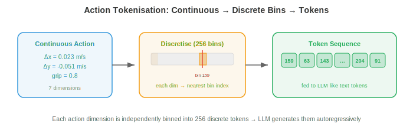
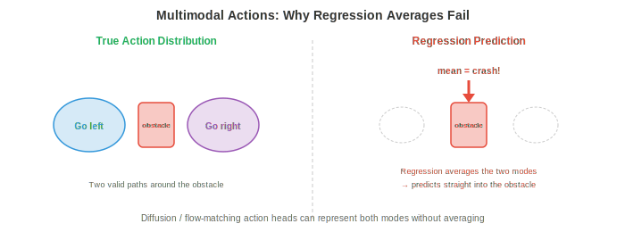

# Модели «зрение-язык-действие» (Vision-Language-Action Models)

*Модели «зрение-язык-действие» (VLA) объединяют зрение, понимание языка и выполнение действий в единую нейронную сеть. В этом файле рассматриваются архитектура VLA, токенизация действий, RT-2, Octo, OpenVLA, стратегии предобучения, обобщающая способность, модели, не зависящие от воплощения (embodiment-agnostic), и бенчмарки.*

- В предыдущих файлах мы рассматривали восприятие (ощущение мира) и обучение роботов (управление телом). Традиционно это были отдельные пайплайны: модуль восприятия обнаруживает объекты, языковой модуль интерпретирует команды, а модуль управления генерирует действия. Каждый модуль проектировался, обучался и отлаживался независимо.

- **Модели «зрение-язык-действие» (VLA)** объединяют этот пайплайн в одну нейронную сеть. Модель принимает на вход изображения (зрение), инструкцию на естественном языке (язык) и выдает команды управления (действие). Одна модель, end-to-end.

- Это следует той же тенденции к унификации, которую мы видели в главе 10: подобно тому, как мультимодальные модели объединили понимание зрения и языка в одной архитектуре, VLA расширяют это на физические действия. Идея заключается в том, что язык предоставляет естественный и гибкий интерфейс для постановки задач («возьми красную чашку и поставь её на полку»), а крупные предобученные модели «зрение-язык» уже понимают как изображения, так и инструкции.

## От «зрения-языка» к действиям

- Вспомните из главы 10, что **модели «зрение-язык» (VLM)**, такие как LLaVA и Flamingo, принимают на вход изображение и текст, а на выходе выдают текст. Они понимают сцены, отвечают на вопросы и следуют инструкциям — всё это на языке.

- VLA задаются вопросом: что, если на выходе будет не текст, а **действия робота**? Вместо генерации фразы «Красная чашка находится с левой стороны стола», модель генерирует последовательность команд управления, которые перемещают манипулятор, чтобы захватить эту чашку.

- Ключевая архитектурная идея состоит в том, что действия можно представить в виде токенов, точно так же, как слова. Если VLM генерирует язык токен за токеном, используя предсказание следующего токена, то VLA генерирует токены действий таким же образом. Трансформеру в принципе неважно, означает ли выходной токен «чашка» или «переместить захват на 2 см вперед».

- Это переформулирует управление роботом как задачу моделирования последовательностей, с которой трансформеры справляются превосходно (глава 7). Модель обучается отображению: (визуальное наблюдение, языковая инструкция) $\to$ (последовательность токенов действий).

## Архитектура VLA


- Типичная VLA состоит из трех компонентов:

    - **Визуальный энкодер**: преобразует изображения с камеры в визуальные токены. Обычно это предобученный ViT (глава 8) или энкодер SigLIP (глава 10). Изображение разбивается на патчи, каждый из которых встраивается (embedded) как токен, точно так же, как в стандартных визуальных трансформерах.

    - **Бэкенд языковой модели**: предобученная LLM (например, LLaMA, PaLM), которая обрабатывает чередующуюся последовательность визуальных и языковых токенов. Именно здесь происходит рассуждение: модель понимает «возьми **красную** чашку», обращая внимание как на инструкцию, так и на визуальные признаки.

    - **Голова действий (action head)**: отображает выходные данные LLM в действия робота. Это может быть простой MLP, который отображает последнее скрытое состояние в непрерывные значения действий, или схема токенизации, преобразующая действия в дискретные токены, предсказываемые существующим словарем LLM.

- Архитектура выглядит следующим образом:

$$\text{Image} \xrightarrow{\text{ViT}} \text{visual tokens} \quad + \quad \text{Instruction} \xrightarrow{\text{tokeniser}} \text{language tokens} \quad \xrightarrow{\text{LLM}} \quad \text{action tokens}$$

- Визуальные и языковые токены конкатенируются (или чередуются) и подаются в бэкенд трансформера, который авторегрессионно генерирует токены действий. Это та же архитектура, что и у VLM (глава 10), но выходной модальностью является действие, а не текст.

## Токенизация действий

- Действия робота непрерывны: скорости суставов, положения рабочего органа, ширина захвата. Их необходимо преобразовать в дискретные токены, чтобы LLM могла их генерировать.



- Простейший подход — **равномерная дискретизация**. Каждая размерность действия делится на $N$ корзин (bins), охватывающих диапазон допустимых значений. Например, если скорость по оси x варьируется от -0.1 до 0.1 м/с и мы используем 256 корзин, каждая корзина представляет $\frac{0.2}{256} \approx 0.8$ мм/с. Значение действия отображается на индекс ближайшей корзины, который становится токеном.

- При 7 размерностях действия (6 степеней свободы + захват) и 256 корзинах для каждой, словарь действий содержит $7 \times 256 = 1792$ токена. Они добавляются к существующему текстовому словарю LLM. Модель генерирует по одному токену действия на каждую размерность, авторегрессионно, точно так же, как при генерации слов.

- **Чанкинг действий (action chunking)** предсказывает сразу несколько будущих временных шагов, а не одно действие. Если размер чанка равен $H$, модель выдает $H \times d$ токенов (где $d$ — размерность действия). Это критически важно для плавных, темпорально согласованных движений. Предсказание по одному шагу может привести к «дерганому» поведению, поскольку каждое предсказание независимо. Чанкинг заставляет модель планировать короткую траекторию, улавливая временную структуру.

- Более сложные подходы используют **обучаемую токенизацию** через VQ-VAE (глава 10). Энкодер VQ-VAE отображает последовательность непрерывных действий в последовательность дискретных индексов кодовой книги, а декодер восстанавливает непрерывные действия из этих индексов. Затем LLM генерирует индексы кодовой книги вместо равномерно распределенных значений. Это аналогично тому, как токенизаторы изображений (глава 10) сжимают визуальную информацию в компактный дискретный код.

## Ключевые модели VLA

- **RT-2** (Robotic Transformer 2, Google DeepMind) была первой крупномасштабной VLA. Она берет предобученную VLM (PaLM-E или PaLI-X, до 55 млрд параметров) и дообучает её на данных демонстраций роботов. Действия представлены в виде текстовых строк: последовательность токенов «1 128 91 241 5 101 127» кодирует 7-мерное действие (каждое число — это индекс корзины).

- RT-2 продемонстрировала замечательное свойство: **эмерджентные способности** (emergent capabilities) VLM-бэкенда переносятся в робототехнику. Модель способна следовать инструкциям, включающим концепции, которые она никогда не видела в данных роботов (например, «перемести банан в страну, название которой начинается на А» требует распознавания визуальных объектов + знаний о мире + выполнения действия). Понимание языка и визуальное мышление VLM «достаются бесплатно».

- Ограничение RT-2 заключается в том, что модель была обучена на данных от одного робота (конкретный манипулятор с конкретным захватом). Она не обладает способностью к обобщению на другие типы роботов.

- **Octo** (Калифорнийский университет в Беркли) — это VLA с открытым исходным кодом, **не зависящая от воплощения** (embodiment-agnostic), разработанная для работы с различными робототехническими платформами. Ключевые инновации:

    - **Диффузионная голова действий** (diffusion action head) вместо авторегрессионного предсказания токенов. Голова действий принимает выходные данные трансформера и генерирует действия с помощью процесса шумоподавления (глава 8). Это естественным образом позволяет работать с мультимодальными распределениями действий (см. диаграмму ниже), где существует несколько допустимых способов выполнения задачи.



    - **Гибкие пространства наблюдений и действий**: Octo использует специализированные токенизаторы для различных конфигураций роботов. Модель была предварительно обучена на датасете Open X-Embodiment, который содержит демонстрации от 22 различных типов роботов.

    - **Эффективная дообучение (fine-tuning)**: Octo можно дообучить для нового робота всего на 100 демонстрациях, что делает её практичной для лабораторий с ограниченным объемом данных.

- **OpenVLA** (Стэнфорд, Калифорнийский университет в Беркли) использует подход дообучения существующей VLM с открытым исходным кодом (на базе Llama) для робототехники. В ней используется бэкенд с 7 млрд параметров, унифицированная токенизация действий (256 корзин на размерность) и обучение на данных Open X-Embodiment. Её сильная сторона — простота: архитектура представляет собой стандартную VLM с токенами действий, добавленными в словарь, что упрощает обучение и развертывание с использованием существующей инфраструктуры LLM.

- **$\pi_0$** (Physical Intelligence) представляет собой передовой уровень (state of the art). Она использует предварительно обученный VLM-бэкенд с головой действий на основе **flow matching** (глава 8). Flow matching генерирует действия путем обучения векторного поля скоростей, которое переносит шум в распределения действий, создавая плавные и временно согласованные траектории. $\pi_0$ продемонстрировала поразительную общность, выполняя задачи на различных роботах, включая бимануальную манипуляцию и управление ловкими манипуляторами.

## Рецепты предварительного обучения

- VLA получают огромную выгоду от предварительно обученных VLM-бэкендов, которые уже понимают визуальные сцены и язык. Пайплайн обучения обычно состоит из следующих этапов:

    1. **Предварительное обучение VLM**: обучение (или использование готовой) vision-language модели на миллиардах пар «изображение-текст» из интернета (CLIP, SigLIP, обучение в стиле LLaVA, как описано в главе 10).

    2. **Совместное обучение на данных роботов**: дообучение VLM на смеси интернет-данных и данных демонстраций роботов. Интернет-данные предотвращают катастрофическое забывание визуальных и языковых навыков, в то время как данные роботов обучают генерации действий. Соотношение смеси имеет значение: слишком много данных роботов ухудшает понимание языка, слишком мало — не позволяет выучить действия.

    3. **Дообучение под конкретную задачу**: опциональное дообучение на демонстрациях для конкретной задачи или робота, часто с использованием LoRA (глава 10), чтобы сохранить количество обучаемых параметров небольшим.

- Объем данных роботов на порядки меньше, чем интернет-данных. VLM может быть предварительно обучена на миллиардах изображений, но крупнейшие датасеты роботов (Open X-Embodiment) содержат лишь миллионы кадров для всех типов роботов вместе взятых. Эта нехватка данных — причина, по которой критически важно начинать с предварительно обученной VLM: визуальные и языковые представления переносятся, и из ограниченных данных роботов нужно выучить только отображение в действия.

## Обобщение

- Главное обещание VLA — это **обобщение**: выполнение задач, не виденных во время обучения, с объектами, не виденными ранее, в средах, не виденных ранее, и следование инструкциям, не виденным ранее.

- VLA обобщают по нескольким осям:

    - **Новые объекты**: VLM-бэкенд распознает объекты благодаря предварительному обучению на интернет-данных. Если модель знает, как выглядит «отвертка» по изображениям из сети, она может манипулировать ею, даже если ни одна демонстрация робота не включала отвертку.

    - **Новые инструкции**: композиционное понимание языка позволяет модели следовать новым комбинациям известных концепций. «Положи синий блок на зеленый блок» сработает, даже если при обучении показывали только складывание красных блоков, потому что модель понимает прилагательные цвета из языкового предварительного обучения.

    - **Новые среды**: до определенной степени VLA переносятся между визуальными доменами (разные столы, освещение, фоны), так как vision-энкодер предварительно обучен на разнообразных изображениях из сети. Но у этого есть пределы: робот, обученный в лаборатории, может испытывать трудности на загроможденной кухне.

    - **Новые воплощения**: это самая сложная ось. Разные роботы имеют разные пространства действий (углы сочленений против скоростей рабочего органа), разные сенсоры (запястные камеры против камер сверху) и разные физические возможности. Модели, не зависящие от воплощения, такие как Octo и $\pi_0$, решают эту проблему с помощью гибких токенизаторов и предварительного обучения на множестве типов роботов.

- Обобщение оценивается на **отложенных задачах** (held-out tasks): робота просят выполнить задачи, которым он никогда не обучался. Успешность 50–80% на новых задачах считается сильным результатом по сравнению с >90% на задачах из обучающей выборки. Разрыв сокращается по мере масштабирования моделей и роста датасетов роботов.

## Модели, не зависящие от воплощения

- Отрасль движется в сторону концепции **одна модель — много роботов**. Вместо обучения отдельной политики для каждого робота, одна VLA управляет множеством воплощений.

- Это требует решения проблемы **несоответствия пространств действий**. 7-осевой манипулятор с параллельным захватом имеет 7 размерностей действия. Бимануальная установка — 14. Четвероногий робот — 12. Гуманоид — 30+. Токенизация действий должна быть достаточно гибкой, чтобы справиться со всем этим.

- Решения включают:
    - **Дополнение векторов действий (Padded action vectors)**: использование наибольшего пространства действий и дополнение меньших пространств нулями.
    - **Головы действий для каждого воплощения (Per-embodiment action heads)**: общий трансформерный бэкенд с отдельными небольшими MLP для каждого типа робота.
    - **Нормализованные представления действий (Normalised action representations)**: выражение всех действий в общей системе координат (например, скорость рабочего органа в мировой системе координат), чтобы разные роботы, совершающие схожие движения рабочим органом, использовали одни и те же токены действий.

- Общий бэкенд обучается общему пониманию визуальных данных и языка, а также базовым стратегиям манипуляции (приближение сверху, выравнивание относительно объекта, закрытие захвата). Компонентам, специфичным для конкретного воплощения, остается лишь перевести эти высокоуровневые стратегии в конкретные команды управления приводами.

## Бенчмарки и оценка

- Оценка VLA (Vision-Language-Action models) представляет собой уникальную сложность, поскольку требует проведения экспериментов с физическими роботами (или высокоточной симуляции).

- **SIMPLER** (Simulated Manipulation Policy Evaluation for Robot learning) предоставляет стандартизированные симулированные среды для сравнения производительности VLA без использования физического оборудования. Он хорошо коррелирует с показателями успеха в реальных условиях и обеспечивает воспроизводимость бенчмаркинга.

- **Оценка в реальных условиях** остается «золотым стандартом». Типовой протокол:
    1. Определение набора задач с четкими критериями успеха (объект достиг целевой позиции, выбран правильный объект, задача выполнена в пределах временного лимита).
    2. Проведение $N$ попыток для каждой задачи (обычно 10–50).
    3. Отчет о показателе успеха с доверительными интервалами.
    4. Включение отложенных (на которых модель не обучалась) задач для измерения способности к обобщению.

- Датасет и бенчмарк **Open X-Embodiment** агрегируют данные роботов из 22 организаций для множества робототехнических платформ. Он предоставляет стандартизированный формат для обмена демонстрациями и общую среду оценки для переноса навыков между различными воплощениями.

## Задачи по программированию (используйте CoLab или ноутбук)

1. Реализуйте токенизацию действий: дискретизируйте непрерывные действия в корзины и восстановите их. Наблюдайте за ошибкой квантования как функцией от количества корзин.
```python
import jax.numpy as jnp

# Continuous action: 7 dimensions (6 DoF + gripper)
action_true = jnp.array([0.023, -0.051, 0.012, 0.1, -0.03, 0.005, 0.8])
action_min = jnp.array([-0.1, -0.1, -0.1, -0.5, -0.5, -0.5, 0.0])
action_max = jnp.array([ 0.1,  0.1,  0.1,  0.5,  0.5,  0.5, 1.0])

for n_bins in [16, 64, 256, 1024]:
    # Tokenise: map continuous value to bin index
    normalised = (action_true - action_min) / (action_max - action_min)
    tokens = jnp.clip((normalised * n_bins).astype(int), 0, n_bins - 1)

    # Detokenise: map bin index back to continuous value
    reconstructed = (tokens + 0.5) / n_bins * (action_max - action_min) + action_min

    error = jnp.linalg.norm(action_true - reconstructed)
    print(f"bins={n_bins:4d}  tokens={tokens}  error={error:.6f}")
```

2. Смоделируйте объединение действий в чанки (action chunking) в сравнении с пошаговым предсказанием. Сгенерируйте плавную траекторию, добавьте шум к пошаговым предсказаниям и сравните с предсказанием на основе чанков.
```python
import jax
import jax.numpy as jnp
import matplotlib.pyplot as plt

# Ground truth smooth trajectory (e.g., reaching motion)
t = jnp.linspace(0, 2 * jnp.pi, 100)
gt_x = jnp.sin(t)
gt_y = 1 - jnp.cos(t)

# Single-step: each prediction has independent noise
rng = jax.random.PRNGKey(42)
noise_ss = jax.random.normal(rng, (100, 2)) * 0.05
single_step = jnp.stack([gt_x, gt_y], axis=1) + noise_ss
# Cumulative drift from single-step errors
single_step_cumulative = jnp.cumsum(noise_ss, axis=0) * 0.3 + jnp.stack([gt_x, gt_y], axis=1)

# Chunked (chunk_size=10): noise is correlated within chunks, smoother
chunk_size = 10
rng2 = jax.random.PRNGKey(7)
chunks = []
for i in range(0, 100, chunk_size):
    chunk_noise = jax.random.normal(jax.random.fold_in(rng2, i), (2,)) * 0.05
    chunk = jnp.stack([gt_x[i:i+chunk_size], gt_y[i:i+chunk_size]], axis=1)
    chunks.append(chunk + chunk_noise)
chunked = jnp.concatenate(chunks, axis=0)

plt.figure(figsize=(8, 4))
plt.plot(gt_x, gt_y, "k-", linewidth=2, label="Ground truth")
plt.plot(single_step_cumulative[:, 0], single_step_cumulative[:, 1],
         "r-", alpha=0.7, label="Single-step (drifts)")
plt.plot(chunked[:, 0], chunked[:, 1], "b-", alpha=0.7, label="Chunked (stable)")
plt.legend(); plt.axis("equal"); plt.grid(True)
plt.title("Action Chunking vs Single-Step Prediction")
plt.show()
```

3. Визуализируйте, как распределение действий VLA может быть мультимодальным. Используйте простую 2D-смесь гауссиан, чтобы показать, почему головы действий на основе диффузии или flow-matching предпочтительнее регрессии.
```python
import jax
import jax.numpy as jnp
import matplotlib.pyplot as plt

# Two valid ways to reach around an obstacle: left or right
rng = jax.random.PRNGKey(0)
k1, k2 = jax.random.split(rng)

mode1 = jax.random.normal(k1, (200, 2)) * 0.15 + jnp.array([-1.0, 0.5])
mode2 = jax.random.normal(k2, (200, 2)) * 0.15 + jnp.array([ 1.0, 0.5])
samples = jnp.concatenate([mode1, mode2])

# Regression predicts the mean = average of modes (invalid!)
mean_pred = samples.mean(axis=0)

plt.figure(figsize=(6, 5))
plt.scatter(samples[:, 0], samples[:, 1], s=5, alpha=0.5, label="True action distribution")
plt.plot(*mean_pred, "rx", markersize=15, markeredgewidth=3, label="Regression mean (invalid!)")
plt.plot(-1, 0.5, "g^", markersize=12, label="Mode 1 (go left)")
plt.plot(1, 0.5, "b^", markersize=12, label="Mode 2 (go right)")
plt.legend(); plt.grid(True)
plt.title("Multimodal Actions: Why Regression Fails")
plt.xlabel("Action dim 1"); plt.ylabel("Action dim 2")
plt.show()
```
