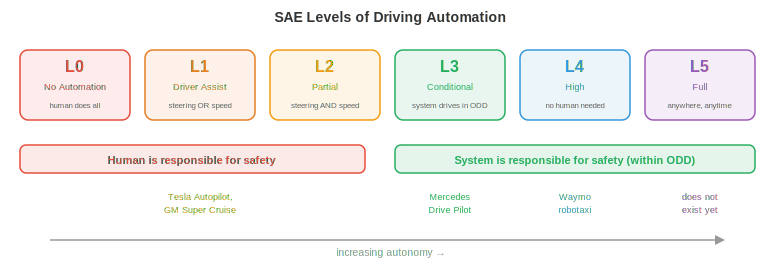

# Беспилотные автомобили

*Беспилотные автомобили — это наиболее коммерчески развитые автономные системы, объединяющие в себе функции восприятия, прогнозирования, планирования и управления в рамках одного транспортного средства. В этом файле рассматриваются стек технологий автономного вождения, HD-карты, прогнозирование движения, планирование, сквозное (end-to-end) вождение, симуляция, стандарты безопасности и уровни автономности.*

- Беспилотные автомобили — это, пожалуй, самая сложная задача робототехники, которую пытаются решить в широком масштабе. В отличие от заводского робота, работающего в контролируемой среде, беспилотный автомобиль должен справляться с открытым миром: непредсказуемыми водителями, пешеходами, переходящими дорогу в неположенном месте, зонами дорожных работ, возникающими за одну ночь, и погодой, меняющейся ежеминутно.

- Ставки здесь также исключительно высоки. Беспилотный автомобиль движется на скоростях шоссе среди уязвимых участников дорожного движения. Допуск на ошибки, критически важные для безопасности, практически равен нулю.

## Стек технологий автономного вождения

- Классическая архитектура беспилотного автомобиля представляет собой **модульный пайплайн** из четырех этапов, каждый из которых передает данные следующему:

$$\text{Perception} \to \text{Prediction} \to \text{Planning} \to \text{Control}$$


- **Восприятие (Perception)** (рассматривается в файле 1 этой главы) обрабатывает необработанные данные сенсоров, преобразуя их в структурированное представление сцены: обнаруженные объекты с их 3D-координатами, скоростями и классами; дорожная разметка; сигналы светофоров; границы проезжей части.

- **Прогнозирование (Prediction)** предсказывает, как другие агенты (транспортные средства, пешеходы, велосипедисты) будут двигаться в будущем. Получая текущее состояние сцены, модуль прогнозирования выводит траектории для каждого агента на определенный временной горизонт (обычно 3–8 секунд в будущее).

- **Планирование (Planning)** определяет действия управляемого автомобиля (ego vehicle): какой путь выбрать, когда перестроиться, когда уступить дорогу, когда ускориться или затормозить. Оно использует спрогнозированную сцену и формирует траекторию для автомобиля, которая является безопасной, комфортной и обеспечивает движение к пункту назначения.

- **Управление (Control)** преобразует запланированную траекторию в команды для исполнительных механизмов: угол поворота руля, газ и тормоз. Это самый нижний уровень, переводящий абстрактную траекторию в физическое движение.

- Модульная конструкция имеет очевидные инженерные преимущества: каждый модуль можно разрабатывать, тестировать и улучшать независимо. Однако у нее есть и недостатки: ошибки распространяются по цепочке (пропущенный объект остается невидимым для планировщика), а информация теряется на каждом интерфейсе (планировщик видит ограничивающие рамки, а не богатые данные сенсоров, которые их породили).

## HD-карты

- **Карты высокого разрешения (HD-карты)** — это детализированные, точные до сантиметра цифровые карты, которые кодируют структуру дороги: границы полос, связность полос (какая полоса с какой соединяется на перекрестке), расположение дорожных знаков, ограничения скорости, места расположения пешеходных переходов и высоту дорожного покрытия.

- HD-карты предоставляют мощное априорное распределение для задачи вождения. Модулю восприятия не нужно каждый кадр заново обнаруживать границы полос; ему достаточно локализовать автомобиль на карте и убедиться, что реальность соответствует сохраненной структуре. Это значительно упрощает планирование.

- Создание HD-карт требует специализированных геодезических автомобилей, оснащенных высококлассными LiDAR, камерами и RTK-GPS. Карты должны поддерживаться и обновляться по мере изменения дорог. Это дорого и не поддается легкому масштабированию на все дороги мира.

- **Вождение без карт (Mapless driving)** (также называемое «онлайн-картографированием») направлено на устранение зависимости от заранее созданных HD-карт. Вместо этого автомобиль строит локальную карту в режиме реального времени на основе данных своих сенсоров. Модели, такие как **MapTR** и **MapTRv2**, используют архитектуры трансформеров для предсказания векторизованных элементов карты (осевых линий полос, границ дорог, пешеходных переходов) непосредственно из изображений с камер, выводя полилинии в виде упорядоченных последовательностей точек.

- Подход без использования карт жертвует точностью карты ради масштабируемости: автомобиль может нанести на карту любую дорогу, по которой он может проехать. Но это требует, чтобы система восприятия была достаточно надежной для обнаружения всей релевантной дорожной структуры в реальном времени, включая сложные перекрестки, съезды с шоссе и зоны дорожных работ.

- На практике многие системы используют гибридный подход: облегченная карта с грубой топологией дорог (от существующих картографических провайдеров), дополняемая в реальном времени данными сенсоров автомобиля.

## Прогнозирование движения

- Прогнозирование того, куда направятся другие участники дорожного движения, — одна из самых сложных подзадач в области беспилотных автомобилей. Люди непредсказуемы, намерения скрыты, а пространство возможных вариантов будущего быстро разветвляется.

- Входными данными для модели прогнозирования является **контекст сцены**: позиции и скорости всех обнаруженных агентов за недавнее прошлое (обычно 1–2 секунды истории), а также статический контекст (геометрия полос, сигналы светофоров, границы дорог).

- Выходными данными является набор **спрогнозированных траекторий** для каждого агента, обычно охватывающих 3–8 секунд в будущем. Поскольку будущее неопределенно, хорошие модели прогнозирования выдают несколько возможных траекторий с соответствующими вероятностями, а не одну точечную оценку.

- **Прогнозирование траектории** как задача регрессии: предсказать будущие координаты $(x, y)$ каждого агента в дискретные моменты времени. Функция потерь обычно представляет собой минимальную среднюю ошибку смещения (minADE) по $K$ предсказанным траекториям:

$$\text{minADE}_K = \min_{k \in \{1, \ldots, K\}} \frac{1}{T} \sum_{t=1}^{T} \| \hat{\mathbf{p}}_t^{(k)} - \mathbf{p}_t \|_2$$

- Это метрика «лучший из $K$»: модель получает зачет, если любая из ее $K$ предсказаний близка к эталонной разметке. Это стимулирует создание разнообразных, мультимодальных прогнозов.

- **Модель социальных сил** описывает поведение пешеходов как динамическую систему, где каждый человек испытывает притягивающие силы (к своей цели) и отталкивающие силы (от других пешеходов и препятствий). Ускорение человека $i$ равно:

$$\mathbf{a}_i = \frac{\mathbf{v}_i^{\text{desired}} - \mathbf{v}_i}{\tau} + \sum_{j \neq i} \mathbf{f}_{ij}^{\text{repulsive}} + \sum_{\text{walls}} \mathbf{f}_{\text{wall}}$$

- Это система дифференциальных уравнений, аналогичная уравнению динамики робота из файла 2 этой главы. Модель элегантна, но опирается на вручную настроенные параметры сил и с трудом справляется со сложными взаимодействиями между множеством агентов.

- **Графовые нейронные сети (GNN)** для прогнозирования моделируют сцену в виде графа: каждый агент является узлом, а ребра представляют пространственные отношения (близость, совместное использование полосы). Передача сообщений между узлами фиксирует взаимодействия: «этот автомобиль уступает дорогу пешеходу» или «эти два транспортных средства перестраиваются в одну и ту же полосу».

- Современные архитектуры прогнозирования (например, **MTR**, **QCNet**) используют модели на основе трансформеров, которые совместно учитывают историю агента, контекст карты и взаимодействия между агентами. Агенты обращают внимание на релевантные признаки карты (своя текущая полоса, предстоящие перекрестки) и на других агентов (автомобиль впереди, пешеход на переходе) с помощью кросс-внимания. Результатом является набор гипотез траекторий, генерируемых авторегрессионно или с помощью смеси моделей.

- **Прогнозирование с учетом цели** сначала предсказывает, куда, скорее всего, направится агент (набор целевых точек-кандидатов, таких как конечные точки полос или выезды с перекрестков), а затем предсказывает траекторию для достижения каждой цели. Это разбивает задачу на «куда» (дискретно, управляемо) и «как» (непрерывный путь при заданной цели), делая задачу мультимодального прогнозирования более решаемой.

## Планирование

- Получив предсказанную сцену, планировщик должен сформировать траекторию для эго-автомобиля. Это задача оптимизации с ограничениями: найти траекторию, которая является безопасной, комфортной, эффективной и законной.

- **Планировщики на основе правил** кодируют поведение вождения как набор правил «если-то»: «если пешеход на переходе — уступить», «если дистанция до впереди идущего автомобиля менее 2 секунд — не менять полосу», «если приближаешься к красному сигналу светофора — замедлиться до остановки у стоп-линии». Эти правила интерпретируемы и поддаются проверке, но они становятся громоздкими для сложных сценариев (тысячи правил, множество граничных случаев, взаимодействия между правилами).

- **Планировщики на основе оптимизации** формулируют вождение как оптимизацию траектории. Траектория эго-автомобиля параметризуется (например, как последовательность состояний $(x, y, \theta, v)$ на будущих временных шагах) и минимизируется целевая функция:

$$\min_{\boldsymbol{\xi}} \underbrace{w_1 \cdot J_{\text{progress}}(\boldsymbol{\xi})}_{\text{get to destination}} + \underbrace{w_2 \cdot J_{\text{comfort}}(\boldsymbol{\xi})}_{\text{smooth ride}} + \underbrace{w_3 \cdot J_{\text{safety}}(\boldsymbol{\xi})}_{\text{avoid collisions}}$$

$$\text{subject to: } \text{kinematic constraints, speed limits, lane boundaries}$$

- Компонент прогресса штрафует за отклонения от желаемого маршрута. Компонент комфорта штрафует за высокое боковое ускорение, рывок (производная ускорения) и резкое руление, поскольку пассажиры ощущают их. Компонент безопасности штрафует за близость к другим агентам, используя предсказанные траектории для оценки риска столкновения.

- Это оптимизация с ограничениями (глава 3): минимизация функции стоимости при наличии ограничений в виде неравенств. Веса $w_1, w_2, w_3$ позволяют найти компромисс между конкурирующими целями (агрессивное вождение быстрее, но менее комфортно и менее безопасно).

- **Планировщики на основе обучения** используют нейронные сети, обученные на данных о вождении человеком, для генерации траекторий. Модель наблюдает за сценой и напрямую выдает запланированную траекторию, неявно изучая сложные компромиссы на примерах экспертного вождения человека.

- Преимущество заключается в том, что поведение человека при вождении фиксируется целостно, включая тонкие, трудноформализуемые аспекты: насколько агрессивно перестраиваться, когда продвинуться вперед на перекрестке, сколько места оставить велосипедисту. Недостатком является та же проблема сдвига распределения из обучения с подражанием (файл 2): модель может вести себя непредсказуемо в ситуациях, которые недостаточно представлены в обучающих данных.

## Сквозное (End-to-End) вождение

- **Сквозное вождение** полностью устраняет модульные границы. Одна нейронная сеть принимает необработанные данные датчиков (изображения с камер, облака точек LiDAR) и напрямую выдает команды управления (руль, газ, тормоз) или запланированную траекторию. Отсутствуют отдельные модули восприятия, прогнозирования или планирования.

- Привлекательность заключается в том, что вся система совместно оптимизируется для конечной задачи (безопасное вождение), поэтому информация не теряется на границах модулей. Модуль восприятия учится извлекать именно те признаки, которые нужны планировщику, а не общие детекции объектов, которые могут не учитывать детали, важные для задачи.

- **UniAD** (Unified Autonomous Driving) — это знаковая сквозная архитектура. Она обрабатывает изображения с нескольких камер через BEV-энкодер, а затем применяет каскад модулей на основе трансформеров: отслеживание, онлайн-картографирование, прогнозирование движения, прогнозирование занятости и планирование. Хотя в ней есть внутренние модули, все они дифференцируемы и обучаются совместно сквозным образом, при этом функция потерь планирования распространяется (backpropagation) через всю сеть.

- Модуль планирования в UniAD генерирует будущие путевые точки эго-автомобиля, обращая внимание на предсказанные BEV-признаки, предсказанные траектории агентов и предсказанную занятость. Это многомерное цепное правило (глава 3) в действии: градиенты текут от функции потерь планирования обратно к энкодеру изображений, сообщая признакам восприятия, как стать более полезными для планирования.

- Более современные сквозные подходы используют архитектуры в стиле VLA (файл 3 этой главы). Модели, такие как **DriveVLM**, принимают изображения с камер и навигационную инструкцию (или маршрут) и создают действия по вождению, используя VLM-бэкенд. Это приносит преимущества крупномасштабного предварительного обучения (визуальное понимание, рассуждение) непосредственно в стек вождения.

- Напряженность в сквозном вождении связана с **интерпретируемостью**. Модульная система может сообщить: «Я обнаружил пешехода в точке (x, y) и предсказал, что он перейдет дорогу» — режим отказа диагностируем. Сквозная система — это «черный ящик», который выдает угол поворота руля. Когда она дает сбой, диагностировать причину сложно, что является серьезной проблемой для сертификации безопасности.

## Мировые модели для вождения

- **Мировая модель** учится предсказывать будущее состояние сцены вождения, исходя из текущего состояния и действий эго-автомобиля: $p(s_{t+1} \mid s_t, a_t)$ (как представлено в главе 10). В вождении это означает генерацию реалистичных будущих кадров или BEV-разметок: «если я ускорюсь и поверну налево, сцена будет выглядеть так через 3 секунды».

- Мировые модели (world models) предоставляют две мощные возможности для беспилотного вождения:

    - **Планирование на основе воображения**: вместо того чтобы совершать действие и смотреть, что произойдет, планировщик может «вообразить» несколько вариантов траекторий, проигрывая их через мировую модель, оценить каждую из них с точки зрения безопасности и комфорта и выбрать лучшую. Это обучение с подкреплением на основе модели (model-based RL, рассматривается в файле 2 этой главы), примененное к вождению.

    - **Обучаемая симуляция**: мировая модель, обученная на реальных данных вождения, по сути является симулятором, управляемым данными. Она генерирует реалистичные сценарии (включая редкие граничные случаи) без ручного труда по созданию симулятора вручную. Важно, что она улавливает статистические закономерности реального вождения: как на самом деле ведут себя другие водители, как меняется освещение, как дождь влияет на видимость.

- **GAIA-1** (Wayve) — это генеративная мировая модель для вождения. Получая последовательность прошлых кадров с камер и действий автомобиля, она авторегрессионно генерирует будущие видеокадры. В ней используется архитектура видеодиффузии, обусловленная входными данными о действиях. Модель учится генерировать правдоподобное будущее: транспортные средства, соблюдающие правила дорожного движения, пешеходов, идущих по тротуарам, и светофоры, переключающиеся корректно — всё это возникает из обучающих данных, а не из запрограммированных правил.

- **DriveDreamer** и **GenAD** используют схожий подход, но работают в пространстве BEV (вид сверху), а не в пространстве пикселей. Прогнозирование будущих компоновок BEV более компактно, чем генерация полных видеокадров (подобно тому, как DreamerV3 в робототехнике выполняет прогнозирование в латентном пространстве, а не в пиксельном, как обсуждалось в файле 2). Мировая модель BEV предсказывает, где будут находиться все агенты, как будет выглядеть структура дороги и где есть свободное пространство, а планировщик использует это напрямую.

- **Нейронная симуляция с замкнутым контуром** (neural closed-loop simulation) использует мировые модели для замены симуляторов, созданных вручную, при тестировании. Имея в качестве отправной точки реальный лог вождения, мировая модель генерирует то, что произошло бы, если бы автомобиль совершил другое действие. Это позволяет проводить контрфактическую оценку: «что, если бы я затормозил на 0,5 секунды позже?», без необходимости физически воссоздавать сценарий.

- Связь с фреймворком **JEPA** (глава 10) здесь естественна. Мировым моделям вождения не нужно предсказывать будущее с точностью до пикселя (точные значения RGB каждого пикселя). Им нужно предсказывать аспекты, важные для планирования: где находятся агенты, с какой скоростью они движутся, где есть свободное пространство. Прогнозирование в пространстве эмбеддингов (в стиле JEPA) фиксирует эти семантически значимые свойства, не тратя ресурсы на нерелевантные визуальные детали, такие как точные текстуры облаков.

- Основная проблема — **точность на длинном горизонте**. Мировые модели накапливают ошибки с течением времени: небольшая ошибка во втором кадре смещает все последующие. Для вождения горизонт прогнозирования в 3 секунды полезен для тактических решений (стоит ли мне перестраиваться сейчас?), но горизонт в 30 секунд (необходимый для стратегических решений, таких как планирование маршрута) остается ненадежным. Текущие исследования смягчают это с помощью повторной привязки (периодического сброса модели с использованием реальных наблюдений) и оценки неопределенности (пометки моментов, когда прогнозы становятся ненадежными).

## Симуляция

- Тестирование беспилотного автомобиля на реальных дорогах необходимо, но недостаточно. Опасные сценарии (почти аварийные ситуации, граничные случаи) редки, поэтому тестирование по пройденному километражу неэффективно. Автомобилю потребовалось бы проехать сотни миллионов миль, чтобы статистически доказать безопасность, что неосуществимо.

- **Симуляция** обеспечивает неограниченное, контролируемое и безопасное тестирование. Сценарии, которые редко встречаются в реальном мире (ребенок, выбегающий на дорогу, разрыв шины, внезапное препятствие), можно протестировать миллионы раз в симуляции.

- **CARLA** — это симулятор вождения с открытым исходным кодом, построенный на движке Unreal Engine. Он предоставляет реалистичные городские среды, динамическую погоду, дорожных агентов и симуляцию датчиков (камеры, LiDAR, радар). Исследователи используют CARLA для обучения агентов вождения на основе RL и оценки алгоритмов восприятия.

- **nuPlan** (Motional) — это бенчмарк планирования с замкнутым контуром. В отличие от оценки с разомкнутым контуром (воспроизведение записанных данных и сравнение вывода планировщика с фактической траекторией водителя-человека), оценка с замкнутым контуром позволяет решениям планировщика влиять на симуляцию: если планировщик решает сменить полосу, симуляция развивается соответствующим образом. Это проверяет реактивное поведение, а не просто сходство траекторий.


- Различие между оценкой с **разомкнутым контуром** (open-loop) и **замкнутым контуром** (closed-loop) критически важно:

    - Разомкнутый контур: воспроизведение записанного сценария, вычисление того, насколько вывод модели похож на действия водителя-человека. Это легко настроить, но вводит в заблуждение: модель, которая всегда предсказывает «ехать прямо», может иметь низкую ошибку на шоссе, но разбилась бы на первом же повороте.

    - Замкнутый контур: действия модели изменяют состояние симуляции, и симуляция развивается в ответ. Это проверяет способность модели исправлять собственные ошибки и реагировать на динамические ситуации. Это гораздо дороже, но намного информативнее.

- **Генерация сценариев** создает тестовые случаи, которые нагружают систему. Состязательные сценарии (внезапное торможение автомобиля, пешеход, спрятавшийся за припаркованной машиной) генерируются путем оптимизации ситуаций, в которых система беспилотного вождения работает хуже всего. Это связано с состязательным обучением (adversarial training) в машинном обучении (глава 6): поиском входных данных, которые максимизируют функцию потерь.

## Безопасность

- Безопасность в беспилотном вождении регулируется инженерными стандартами, а не только метриками машинного обучения.

- **ISO 26262** (Функциональная безопасность) — это автомобильный стандарт для критически важных с точки зрения безопасности электронных систем. Он определяет **уровни полноты безопасности автомобиля (ASIL)** от A (самый низкий) до D (самый высокий), основанные на тяжести, вероятности воздействия и управляемости потенциальных опасностей. Компоненты восприятия и планирования системы беспилотного вождения обычно соответствуют уровню ASIL-D, самому высокому, что требует тщательной верификации, избыточности и отказоустойчивого проектирования.

- **SOTIF** (Безопасность предполагаемой функциональности, ISO 21448) касается другого класса опасностей: не аппаратных сбоев (которые покрывает ISO 26262), а ситуаций, когда система работает согласно проекту, но всё равно приводит к небезопасному результату. Модель восприятия, которая ошибочно классифицирует белый грузовик как небо (реальный инцидент), — это проблема SOTIF: оборудование работает нормально, но ограничение алгоритма создает опасность.

- **Операционная проектная область (Operational Design Domain, ODD)** определяет условия, в которых должна работать система автономного вождения: конкретные географические зоны, типы дорог (только автомагистрали, городские дороги или и то, и другое), погодные условия (отсутствие сильного снегопада), скоростные диапазоны и время суток. Эксплуатация вне ODD не допускается: если система не способна справляться со снегом, она не должна двигаться во время снегопада.

- Проектирование **отказоустойчивости (fail-safe)** и **отказобезопасности (fail-operational)**:
    - Отказоустойчивость (fail-safe): при обнаружении неисправности система переходит в безопасное состояние (например, съезжает на обочину и останавливается). Это минимальное требование.
    - Отказобезопасность (fail-operational): система продолжает безопасно функционировать, несмотря на неисправность, за счет использования дублирующих компонентов. Автономный автомобиль с дублирующими системами рулевого управления, торможения и вычислений может пережить отказ одного компонента и продолжить движение до безопасного места.

- **Избыточность (redundancy)** имеет фундаментальное значение. Критически важные сенсоры восприятия дублируются: несколько камер, перекрывающих поля зрения друг друга, LiDAR и радар, предоставляющие независимые измерения глубины, две вычислительные платформы, работающие на одном и том же программном обеспечении. Если какой-либо отдельный компонент выходит из строя, остальные предоставляют достаточную информацию для безопасного вождения.

## Уровни автономности



- Стандарт **SAE J3016** определяет шесть уровней автоматизации вождения, от 0 (без автоматизации) до 5 (полная автоматизация):

    - **Уровень 0 (Без автоматизации)**: человек делает всё. Система может выдавать предупреждения (о выезде из полосы), но не управляет транспортным средством.

    - **Уровень 1 (Помощь водителю)**: система управляет либо рулевым управлением, либо скоростью, но не тем и другим одновременно. Адаптивный круиз-контроль (поддерживает скорость и дистанцию) или система удержания в полосе (сохраняет положение автомобиля по центру полосы) относятся к 1-му уровню.

    - **Уровень 2 (Частичная автоматизация)**: система одновременно управляет и рулевым управлением, и скоростью, но человек должен постоянно следить за дорогой и быть готовым взять управление на себя. Tesla Autopilot, GM Super Cruise и большинство современных функций «автопилота» относятся ко 2-му уровню. Человек по-прежнему является ответственным водителем.

    - **Уровень 3 (Условная автоматизация)**: система управляет автомобилем и следит за окружающей обстановкой, но только в определенных условиях (ODD). Человек может отвлечься, но должен быть готов взять управление на себя, когда система подаст запрос (с временным буфером, обычно более 10 секунд). Mercedes Drive Pilot (на определенных автомагистралях, при скорости ниже 60 км/ч) — первая сертифицированная система 3-го уровня.

    - **Уровень 4 (Высокая автоматизация)**: система управляет автомобилем и справляется со всеми ситуациями в рамках своего ODD, вмешательство человека не требуется. Если система сталкивается с ситуацией вне своего ODD, она может безопасно остановиться самостоятельно. Сервис роботакси Waymo работает на 4-м уровне в определенных географических зонах.

    - **Уровень 5 (Полная автоматизация)**: система управляет автомобилем везде, где может проехать человек, в любых условиях. Руль и педали не требуются. Такого уровня пока не существует.

- Ключевое различие заключается в том, **кто несет ответственность за безопасность**. На уровнях 0–2 ответственность несет человек. На уровнях 3–5 ответственность несет система (в пределах своего ODD). Это имеет серьезные юридические, страховые и этические последствия.

- Текущее состояние отрасли представляет собой сочетание 2-го уровня (широко распространен), 3-го уровня (начало внедрения) и 4-го уровня (ограниченное географическое внедрение). 5-й уровень остается долгосрочной исследовательской целью.

## Задачи по программированию (используйте CoLab или ноутбук)

1. Реализуйте простой планировщик оптимизации траектории. Заданы начальная позиция, цель и препятствие; найдите наиболее плавный путь без столкновений с помощью градиентного спуска.
```python
import jax
import jax.numpy as jnp
import matplotlib.pyplot as plt

# Trajectory: N waypoints, each (x, y)
N = 20
start = jnp.array([0.0, 0.0])
goal = jnp.array([10.0, 0.0])
obstacle = jnp.array([5.0, 0.0])
obs_radius = 1.5

# Initialise: straight line from start to goal
waypoints_init = jnp.linspace(start, goal, N)

def cost(waypoints):
    wp = jnp.concatenate([start[None], waypoints, goal[None]], axis=0)

    # Smoothness: penalise acceleration (second differences)
    accel = wp[2:] - 2 * wp[1:-1] + wp[:-2]
    smooth_cost = jnp.sum(accel ** 2)

    # Obstacle avoidance: penalise proximity
    dists = jnp.linalg.norm(wp - obstacle, axis=1)
    collision_cost = jnp.sum(jnp.maximum(0, obs_radius + 0.5 - dists) ** 2)

    return 10 * smooth_cost + 100 * collision_cost

grad_cost = jax.grad(cost)

# Optimise the interior waypoints
waypoints = waypoints_init[1:-1]
lr = 0.01
for _ in range(500):
    g = grad_cost(waypoints)
    waypoints = waypoints - lr * g

# Plot
full_path = jnp.concatenate([start[None], waypoints, goal[None]], axis=0)
theta = jnp.linspace(0, 2 * jnp.pi, 100)

plt.figure(figsize=(10, 4))
plt.plot(full_path[:, 0], full_path[:, 1], "b.-", label="Optimised path")
plt.plot(waypoints_init[:, 0], waypoints_init[:, 1], "r--", alpha=0.5, label="Initial (straight)")
plt.fill(obstacle[0] + obs_radius * jnp.cos(theta),
         obstacle[1] + obs_radius * jnp.sin(theta), alpha=0.3, color="red", label="Obstacle")
plt.plot(*start, "go", markersize=10); plt.plot(*goal, "g*", markersize=15)
plt.legend(); plt.axis("equal"); plt.grid(True)
plt.title("Trajectory Optimisation: Smooth Collision-Free Path")
plt.show()
```

2. Смоделируйте модель прогнозирования движения с постоянной скоростью и сравните её с эталонной разметкой для поворачивающего автомобиля.
```python
import jax.numpy as jnp
import matplotlib.pyplot as plt

# Ground truth: vehicle turning right
dt = 0.1
T = 40  # 4 seconds
v = 10.0  # m/s
omega = 0.3  # rad/s (turning rate)

# True trajectory (constant turn rate)
t = jnp.arange(T) * dt
theta = omega * t
gt_x = (v / omega) * jnp.sin(theta)
gt_y = (v / omega) * (1 - jnp.cos(theta))

# Constant velocity prediction from t=0
# Assumes the car continues straight at its current heading
obs_steps = 10  # observe first 1 second
vx0 = v * jnp.cos(theta[obs_steps - 1])
vy0 = v * jnp.sin(theta[obs_steps - 1])
pred_t = jnp.arange(T - obs_steps) * dt
pred_x = gt_x[obs_steps - 1] + vx0 * pred_t
pred_y = gt_y[obs_steps - 1] + vy0 * pred_t

plt.figure(figsize=(8, 6))
plt.plot(gt_x[:obs_steps], gt_y[:obs_steps], "ko-", label="Observed")
plt.plot(gt_x[obs_steps:], gt_y[obs_steps:], "g-", linewidth=2, label="True future")
plt.plot(pred_x, pred_y, "r--", linewidth=2, label="Constant velocity prediction")
plt.legend(); plt.axis("equal"); plt.grid(True)
plt.xlabel("x (m)"); plt.ylabel("y (m)")
plt.title("Constant Velocity Prediction vs Turning Vehicle")
plt.show()
```

3. Реализуйте простой планировщик на основе правил, который выбирает между удержанием полосы и остановкой в зависимости от обнаруженных препятствий.

```python
import jax.numpy as jnp

def rule_based_planner(ego_speed, obstacles, speed_limit=13.9):
    """
    Simple rule-based planner.
    ego_speed: current speed (m/s)
    obstacles: list of (distance, speed) tuples for vehicles ahead
    speed_limit: max allowed speed (m/s), default ~50 km/h

    Returns: (target_speed, action_label)
    """
    min_following_distance = 2.0 * ego_speed  # 2-second rule
    emergency_distance = 5.0  # metres

    if not obstacles:
        return speed_limit, "cruise"

    # Find closest obstacle ahead
    closest_dist, closest_speed = min(obstacles, key=lambda o: o[0])

    if closest_dist < emergency_distance:
        return 0.0, "EMERGENCY STOP"
    elif closest_dist < min_following_distance:
        # Match speed of vehicle ahead
        target = min(closest_speed, speed_limit)
        return target, "following"
    else:
        return speed_limit, "cruise"

# Test scenarios
scenarios = [
    (13.9, [], "Empty road"),
    (13.9, [(30.0, 10.0)], "Slower car ahead"),
    (13.9, [(3.0, 0.0)], "Stopped car very close"),
    (13.9, [(50.0, 13.9)], "Car ahead at same speed"),
]

for speed, obs, desc in scenarios:
    target, action = rule_based_planner(speed, obs)
    print(f"{desc:30s}  →  {action:15s} target_speed={target:.1f} m/s ({target*3.6:.0f} km/h)")
```
