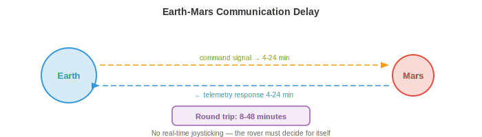
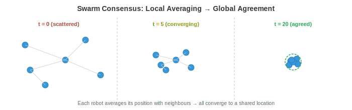
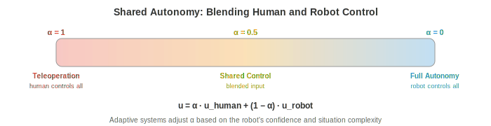

# 空间与极端环境机器人学

*空间和极端环境机器人学把自主性推向极限，在那里通信延迟、辐射和未结构化地形要求机器人自己思考。本文件涵盖行星漫游车、在轨服务、通信受限的自主性、抗辐射计算、水下机器人、搜救、集群机器人和人机交互。*

- 在本章中，我们研究的 autonomous system 都在相对温和的环境中运行：有车道标线的道路、有平整地面的仓库、有已知物体类别的厨房。但机器人学最具影响力的一些应用是在人类无法前往、或人类在场代价极高的环境中：火星表面、深海海底、核灾难现场和燃烧的建筑。

- 这些**极端环境**共享共同挑战：通信受限或延迟、地形未结构化且不可预测、硬件必须在恶劣条件下存活、且附近没有人能在出问题时修复。机器人必须是真正自主的，而不仅仅是"有人盯着屏幕的自主"。

## 空间机器人学

- 空间是终极极端环境。没有空气、温度在 -170°C 到 +120°C 之间摆动、辐射轰击电子设备、援助远在数百万公里之外。空间机器人必须异常可靠、节能且自主。

- **Planetary rover（行星漫游车）**是探索其他世界表面的移动机器人。NASA 的火星车（Spirit、Opportunity、Curiosity、Perseverance）是最著名的例子。每一代都比上一代更自主。



- 根本约束是**通信延迟**。火星按无线电距离为 4-24 分钟（取决于轨道位置），所以往返通信需 8-48 分钟。漫游车无法被实时操纵。如果它遇到一块岩石，它不能向地球求助并等待回应。它必须自行决定。

- 早期漫游车（Spirit、Opportunity）严重依赖人在环的 planning：人类研究图像、规划路径、上传命令、漫游车执行。一个驾驶周期耗时整个火星日（sol）。漫游车每个 sol 大约可行进 50-100 米。

- Curiosity 和 Perseverance 上的 **AutoNav**（Autonomous Navigation，自主导航）大幅提升了自主性。漫游车使用 stereo camera 构建局部 3D 地图（回顾第 8 章的 stereo 深度），评估地形可通行性（坡度、粗糙度、岩石大小），并使用带可通行性代价图的基于网格的 planner 规划安全路径。漫游车在人类团队睡觉时自主驾驶，把每日行进距离提升到 100+ 米。

- 火星车上的 perception 流程受抗辐射处理器限制，这些处理器比消费级硬件慢几个数量级（下文讨论）。算法必须计算上节约：经典 stereo matching 而非深度神经网络，简单的代价图 planner 而非学习型策略。

- **Orbital servicing（在轨服务）**涉及机器人在轨道上检查、修理、加注或使卫星脱轨。随着太空日益拥挤，这是一个不断增长的领域。**OSAM-1**（NASA）和商业企业（Astroscale、Northrop Grumman MEV）等任务使用机械臂和对接机构服务卫星。

- 挑战在于**近距离操作**：服务航天器必须接近目标卫星（可能翻滚、不合作、且无对接接口）并在微重力下进行精确 manipulation。基于视觉的位姿估计（从 camera 图像确定目标的 3D 位置和姿态）至关重要。这使用第 8 章的技术：特征检测、PnP（Perspective-n-Point）求解，以及最近的基于深度学习的位姿估计器。

- **Satellite inspection（卫星检查）**使用小型航天器对其他卫星进行目视检查以发现损坏或异常。检查器必须自主地在目标周围导航、避免碰撞、并从最佳视角捕获高分辨率图像。这是一个 planning 问题：找到覆盖所有检查点同时满足燃料约束、光照条件和避障的轨迹。

## 通信约束

- 在空间中，通信受光速、可用带宽和轨道几何限制（火星背面的漫游车没有中继卫星就无法与地球通信）。

- 这些约束从根本上改变了自主性架构。在地球上，机器人可以把 HD 视频流到云服务器、在 GPU 集群上推理、并在毫秒内接收命令。在空间，机器人必须在板上做一切。

- **高延迟**意味着机器人必须在没有实时人类指导的情况下规划并行动。自主软件必须处理常规操作、检测异常、并响应危害而无需等待人类输入。这需要鲁棒的车载状态估计、故障检测和 contingency planning。

- **有限带宽**意味着机器人无法传输原始 sensor 数据。一张高分辨率图像可能好几兆字节，但火星到地球的直连数据率只有几千比特每秒（通过轨道中继更高但仍有限）。机器人必须激进压缩数据、优先排序要发送的数据，并在本地做大部分决策。

- **通信窗口**是间歇的。火星车只能在特定轨道几何期间与地球通信，通常每个 sol 通过中继卫星几小时。在这些窗口之外，漫游车完全靠自己。

- 对 AI 的含义是**车载自主性**必须高度可靠。系统需要检测出问题（一个轮子卡住、sensor 失效、前方地形不可通行）、决定安全响应，并继续运行直到下一个通信窗口可以汇报并接收更新指令。

## 抗辐射计算

- 空间充满电离辐射：宇宙射线、太阳粒子事件和行星磁场中捕获的辐射。高能粒子可以在内存中翻转位（**single-event upset, SEU，单粒子翻转**）、永久损坏晶体管（**total ionising dose, TID，总电离剂量**）或在电路中引起破坏性闩锁。

- **Radiation-hardened (rad-hard)（抗辐射）**处理器设计用来承受这种环境。它们使用更大的晶体管几何、冗余逻辑（三模冗余：每个电路三份副本对输出投票）和专门的制造工艺。代价是性能：最先进的抗辐射处理器可能提供 200 MIPS，而消费级 GPU 每秒数十亿次运算。

- **RAD750**（BAE Systems）驱动了 Curiosity 和许多其他航天器。它运行在 200 MHz、约 400 MIPS 处理能力，相当于 1990 年代中期的台式电脑。Perseverance 使用类似级别的处理器。在这样的硬件上运行现代神经网络（数百万参数、数十亿次乘加运算）是不可行的。

- **Model compression（模型压缩）**变得至关重要。第 6 章的技术（quantisation、pruning、knowledge distillation）用于把神经网络压缩到极端计算预算内。在笔记本 GPU 上毫秒级运行的模型在抗辐射处理器上可能需要数分钟，或者根本装不进内存。

- 一种替代方法使用**商用现货（commercial off-the-shelf, COTS）**处理器配以软件中的辐射缓解：纠错码、看门狗定时器、周期性内存清洗和优雅降级策略。一些现代任务采用这种方法以换取更强大的计算，代价是增加的软件复杂性和风险。

- 未来的行星任务正在探索 **FPGA** 和专门的 AI 加速器，它们可以在抗辐射的同时提供比传统抗辐射 CPU 显著更多的计算，可能首次实现车载深度学习。

## 未结构化地形中的自主导航

- 在地球上，道路是平整的、标线清晰的、已测绘的。在火星、月球或灾难现场，没有道路。地形是未结构化的：岩石、坡度、沙地、裂缝，以及可能无法支撑机器人重量的表面。

- **Terrain classification（地形分类）**评估每块地面是否可安全通行。特征包括坡度（从 3D 重建）、粗糙度（表面法向量的方差）、岩石密度和土壤类型。经典方法从 stereo 深度图计算这些特征；现代方法在视觉和几何特征上使用学习型分类器。

- **Visual-inertial odometry (VIO)（视觉惯性里程计）**通过跨 camera 帧跟踪视觉特征并与 IMU 测量融合来估计机器人运动。这是适应极端条件的核心 SLAM 组件（第 8 章）。在火星上，VIO 必须处理：无特征的沙地（可跟踪的视觉特征少）、严酷光照（极端阴影）和有限计算。

- 估计使用 **Extended Kalman Filter (EKF)（扩展卡尔曼滤波）**或因子图优化融合视觉和惯性数据。状态向量包括位置、速度、姿态和 IMU 偏差。预测步使用 IMU 积分：

$$\mathbf{x}_{t+1} = f(\mathbf{x}_t, \mathbf{u}_t)$$

- 其中 $\mathbf{u}_t$ 是 IMU 测量（加速度和角速度）。更新步使用视觉特征观测修正预测。这是贝叶斯估计（第 5 章）：IMU 提供先验，视觉观测更新信念。

- **Hazard avoidance（危险规避）**在行星着陆期间至关重要。当航天器向表面下降时，它必须使用车载 camera 或 LiDAR 实时识别安全着陆区。NASA 在 Perseverance 上的 **Terrain Relative Navigation (TRN)** 系统在下降期间把车载 camera 图像与预装的轨道地图比较以确定位置，然后避开危险地形。这使其能降落在 Jezero 陨石坑——一个科学上丰富但地形危险的地点，对以往任务来说风险太高。

## 水下机器人学

- 深海和外太空一样陌生： crushing 压力（全海深 1000+ 大气压）、近乎零能见度、无 GPS、通信受限。水下机器人对海洋科学、海上基础设施检查、深海采矿和搜索行动至关重要。

- **AUV**（Autonomous Underwater Vehicle，自主水下航行器）无缆运行，自带电源和计算。它们遵循预编程的测量模式或使用车载智能适应发现。AUV 用于海底测绘、管道检查和环境监测。

- **ROV**（Remotely Operated Vehicle，遥控航行器）通过电缆系到水面船只，由电缆提供电源和通信。它们用于需要实时人控的任务：深海 manipulation、施工和修理。系缆消除了通信约束但限制了航程并增加了操作复杂性。

- **Acoustic communication（声学通信）**是水下主要通信方法（无线电波在水中迅速衰减）。声学调制解调器在几公里范围内实现 1-10 kbps 的数据率，相比之下陆地无线电为每秒千兆比特。这比火星通信更受限，迫使 AUV 高度自主。

- **Underwater SLAM** 尤为挑战。声纳提供距离测量但角分辨率差且噪声大（来自海底和表面的多径反射）。Camera 只在极短距离工作（清水中几米，浑浊水中更短）。基于特征的视觉 SLAM（第 8 章）必须适应水下场景独特的视觉特性：颜色衰减（红光最先被吸收）、后向散射，以及产生明亮光斑和深阴影的人工照明。

- 没有 GPS 的导航使用 **dead reckoning（航位推算）**（积分来自多普勒速度计 DVL 的速度，DVL 通过声学多普勒频移测量相对海底的速度），辅以偶尔浮出水面获取 GPS 修正或来自水面应答器的声学定位。这与仅 IMU 导航有相同的漂移问题：小速度误差在长任务中累积。

## 搜救机器人学

- 地震、建筑坍塌或工业事故后，机器人可以进入对人类救援者太危险的空间：结构不稳定的建筑、有毒环境、火灾或密闭空间。

- 要求是：快速部署（分钟级而非小时级）、在 GPS 拒止环境中运行（建筑内、地下）、穿越墙壁和瓦砾的鲁棒通信，以及能在高度杂乱、部分坍塌、有碎片、灰尘和光照差的空间中导航的能力。

- **Multi-robot coordination（多机器人协调）**在搜救中很有价值，因为一组机器人能比单个机器人更快覆盖大面积区域。挑战是协调：机器人必须划分搜索区域、避免重复劳动，并共享发现。

- **Frontier-based exploration（基于边界的探索）**把机器人分配到已探索和未探索空间的边界（"frontier"）。每个机器人导航到最近的未探索 frontier、建图，然后继续。中央或分布式 planner 把 frontier 分配给机器人以最小化总探索时间。这是一个覆盖优化问题。

- 穿越瓦砾的通信不可靠。机器人可能与操作员和彼此失去联系。系统必须对间歇通信鲁棒：每个机器人应能独立运行、构建自己的局部地图并做自己的决策，然后在通信恢复时合并信息。

## 集群机器人学

- **Swarm robotics（集群机器人学）**使用大量简单、低成本的机器人，通过局部交互实现复杂的集体行为。没有单个机器人有能力，但集群整体能完成任何个体都无法完成的任务。

- 灵感来自生物集群：蚂蚁用身体搭桥、蜜蜂集体决定巢址、鱼群通过协调运动逃避捕食者。每种情况下，简单的局部规则（跟随邻居、避免碰撞、朝食物移动）产生复杂的全局行为。

- **Decentralised control（去中心化控制）**意味着没有中央指挥。每个机器人遵循相同的局部规则，只对邻居和直接环境做出反应。全局行为从这些局部交互中**涌现**。这使集群固有鲁棒：如果一个机器人失效，集群继续运行。没有单点失效。

- **Consensus algorithm（共识算法）**使集群能通过仅局部通信就集体决策达成一致（如朝哪个方向移动、优先执行哪个任务）。简单的共识协议让每个机器人把它的值与邻居取平均：

$$x_i(t+1) = \frac{1}{|N_i| + 1} \left( x_i(t) + \sum_{j \in N_i} x_j(t) \right)$$



- 其中 $N_i$ 是机器人 $i$ 的邻居集合。这反复迭代直到所有机器人收敛到相同值（全局平均）。收敛速率取决于通信 graph 的拓扑，特别是其代数连通性（graph 拉普拉斯矩阵的第二小特征值，联系到第 2 章的特征值）。


- **Flocking algorithm（集群算法）**（Reynolds 规则）用每个机器人三条简单规则产生协调的群体运动：
    - **Separation（分离）**：避开过近的邻居（避免碰撞）。
    - **Alignment（对齐）**：朝邻居平均朝向转（朝相同方向移动）。
    - **Cohesion（凝聚）**：朝邻居平均位置转（与群体保持在一起）。

- 每条规则是对机器人速度的向量贡献。这些向量的加权和产生自然主义的集群行为。这是向量的线性组合（第 1 章），权重控制每种行为的相对重要性。

- 集群机器人学的应用包括环境监测（在大范围分布 sensor）、精准农业（协调无人机喷洒作物）、建造（机器人共同组装结构）和搜索行动（高效覆盖大区域）。

## 人机交互

- 大多数现实世界 autonomous system 与人类并行运行，而非孤立运行。人机之间的交互——如何沟通、共享 control 和建立信任——与机器人的技术能力同样重要。



- **Shared autonomy（共享自主）**融合人和机器人 control。不是完全遥操作（人控制一切）或完全自主（机器人控制一切），共享自主让人提供高层意图，机器人处理低层执行。例如，人可能指向一个物体并说"捡起那个"，机器人自主规划抓取和臂部运动。

- 数学上，共享自主可以建模为人类输入 $\mathbf{u}_h$ 和机器人自主动作 $\mathbf{u}_r$ 的混合：

$$\mathbf{u} = \alpha \mathbf{u}_h + (1 - \alpha) \mathbf{u}_r$$

- 其中 $\alpha \in [0, 1]$ 是混合参数。当 $\alpha = 1$ 时，人完全控制（遥操作）。当 $\alpha = 0$ 时，机器人完全自主。自适应共享自主根据情况调整 $\alpha$：机器人自信时更多接管，不确定或情况新颖时让出控制。

- **Teleoperation（遥操作）**对超出当前自主能力的任务仍然重要。人类操作员远程控制机器人，通过机器人 camera 观察场景。挑战是**latency（延迟）**：即使 100ms 延迟也使遥操作困难，而空间中的多秒延迟使精细 manipulation 几乎不可能。预测显示（显示机器人预测的未来状态）和虚拟夹具（防止操作员命令危险动作的软件引导）有助于补偿。

- **Trust calibration（信任校准）**是确保人类对机器人有恰当信任的问题：不能太多（过度信任导致懈怠和需要干预时不干预）、也不能太少（信任不足导致不必要干预和未充分利用）。信任应校准到机器人的实际能力：在它处理得好的情况信任它，在接近其能力边缘的情况保持怀疑。

- 研究表明，信任受以下因素影响：机器人的透明度（它是否解释决策？）、可靠性（它失效是可预测的还是随机的？）和沟通（它是否表达不确定性？）。一个说"我对这是一条安全路径有 40% 把握，要继续吗？"的机器人比一个默默向前开的机器人能让人做出更好的决策。

- 机器人运动中的 **Legibility（可读性）**指机器人以向附近人类传达其意图的方式运动。如果机器人伸手去拿物体，它的路径应在到达之前就使目标物体显而易见。这涉及规划最大化观察者早期推断目标能力的轨迹，可以形式化为最大化给定观察到的部分轨迹时真目标的后验概率：

$$\pi^* = \arg\max_\pi P(G \mid \xi_{0:t})$$

- 其中 $G$ 是目标，$\xi_{0:t}$ 是到目前为止观察到的轨迹。这使用贝叶斯推理（第 5 章）：观察者对可能目标有先验，机器人的轨迹提供更新该信念的证据。

## 编程任务（使用 CoLab 或 notebook）

1. 模拟一个集群机器人对目标位置达成一致的共识算法。从随机初始位置开始，观察收敛。
```python
import jax
import jax.numpy as jnp
import matplotlib.pyplot as plt

n_robots = 10
rng = jax.random.PRNGKey(0)
positions = jax.random.uniform(rng, (n_robots, 2), minval=-5, maxval=5)

# Communication graph: each robot talks to its 3 nearest neighbours
def get_neighbours(positions, k=3):
    dists = jnp.linalg.norm(positions[:, None] - positions[None, :], axis=-1)
    # For each robot, find k nearest (excluding self)
    neighbours = jnp.argsort(dists, axis=1)[:, 1:k+1]
    return neighbours

history = [positions.copy()]

for step in range(30):
    neighbours = get_neighbours(positions)
    new_positions = jnp.zeros_like(positions)
    for i in range(n_robots):
        nbr_pos = positions[neighbours[i]]
        new_positions = new_positions.at[i].set(
            (positions[i] + nbr_pos.sum(axis=0)) / (len(neighbours[i]) + 1)
        )
    positions = new_positions
    history.append(positions.copy())

# Plot convergence
fig, axes = plt.subplots(1, 3, figsize=(15, 4))
for ax, step_idx, title in zip(axes, [0, 10, 29], ["Initial", "Step 10", "Final"]):
    h = history[step_idx]
    ax.scatter(h[:, 0], h[:, 1], s=50)
    ax.set_xlim(-6, 6); ax.set_ylim(-6, 6)
    ax.set_aspect("equal"); ax.grid(True); ax.set_title(title)
plt.suptitle("Swarm Consensus: Robots Converge to Agreement")
plt.tight_layout()
plt.show()
```

2. 实现 Reynolds 的集群规则（separation、alignment、cohesion）并模拟集群一起移动。
```python
import jax
import jax.numpy as jnp
import matplotlib.pyplot as plt

n = 30
rng = jax.random.PRNGKey(1)
k1, k2 = jax.random.split(rng)
pos = jax.random.uniform(k1, (n, 2), minval=-5, maxval=5)
vel = jax.random.uniform(k2, (n, 2), minval=-0.5, maxval=0.5)

dt = 0.1
separation_radius = 1.0
neighbour_radius = 3.0

trajectories = [pos.copy()]

for _ in range(200):
    new_vel = jnp.zeros_like(vel)
    for i in range(n):
        diffs = pos - pos[i]
        dists = jnp.linalg.norm(diffs, axis=1)

        # Neighbours within radius (exclude self)
        nbr_mask = (dists < neighbour_radius) & (dists > 0)
        sep_mask = (dists < separation_radius) & (dists > 0)

        # Separation: steer away from very close neighbours
        if sep_mask.any():
            sep = -diffs[sep_mask].sum(axis=0)
        else:
            sep = jnp.zeros(2)

        # Alignment: match average velocity of neighbours
        if nbr_mask.any():
            align = vel[nbr_mask].mean(axis=0) - vel[i]
        else:
            align = jnp.zeros(2)

        # Cohesion: steer toward average position of neighbours
        if nbr_mask.any():
            cohesion = pos[nbr_mask].mean(axis=0) - pos[i]
        else:
            cohesion = jnp.zeros(2)

        new_vel = new_vel.at[i].set(vel[i] + 1.5 * sep + 0.5 * align + 0.3 * cohesion)

    # Limit speed
    speeds = jnp.linalg.norm(new_vel, axis=1, keepdims=True)
    vel = jnp.where(speeds > 2.0, new_vel / speeds * 2.0, new_vel)
    pos = pos + vel * dt
    trajectories.append(pos.copy())

# Plot snapshots
fig, axes = plt.subplots(1, 3, figsize=(15, 4))
for ax, idx, title in zip(axes, [0, 50, 199], ["Start", "Step 50", "Step 200"]):
    p = trajectories[idx]
    v = vel if idx == 199 else jnp.zeros_like(vel)
    ax.scatter(p[:, 0], p[:, 1], s=20, c="blue")
    ax.set_aspect("equal"); ax.grid(True); ax.set_title(title)
    lim = max(abs(p).max() + 1, 6)
    ax.set_xlim(-lim, lim); ax.set_ylim(-lim, lim)
plt.suptitle("Reynolds' Flocking: Separation + Alignment + Cohesion")
plt.tight_layout()
plt.show()
```

3. 模拟共享自主混合：人提供带噪声的方向输入，机器人的自主系统提供到目标的平滑路径。用不同 alpha 值混合它们。
```python
import jax
import jax.numpy as jnp
import matplotlib.pyplot as plt

goal = jnp.array([10.0, 5.0])
pos = jnp.array([0.0, 0.0])
dt = 0.1

rng = jax.random.PRNGKey(3)

fig, axes = plt.subplots(1, 3, figsize=(15, 4))
for ax, alpha in zip(axes, [1.0, 0.5, 0.0]):
    pos = jnp.array([0.0, 0.0])
    path = [pos.copy()]

    for step in range(150):
        # Robot autonomy: smooth path to goal
        direction = goal - pos
        u_robot = direction / (jnp.linalg.norm(direction) + 1e-6) * 1.0

        # Human input: roughly correct direction but noisy
        noise = jax.random.normal(jax.random.fold_in(rng, step), (2,)) * 0.5
        u_human = u_robot + noise

        # Blend
        u = alpha * u_human + (1 - alpha) * u_robot
        pos = pos + u * dt
        path.append(pos.copy())

        if jnp.linalg.norm(pos - goal) < 0.3:
            break

    path = jnp.stack(path)
    ax.plot(path[:, 0], path[:, 1], "b-", alpha=0.7)
    ax.plot(*goal, "r*", markersize=15)
    ax.plot(0, 0, "go", markersize=10)
    ax.set_title(f"α={alpha:.1f} ({'human' if alpha==1 else 'robot' if alpha==0 else 'shared'})")
    ax.set_xlim(-1, 12); ax.set_ylim(-3, 8)
    ax.set_aspect("equal"); ax.grid(True)

plt.suptitle("Shared Autonomy: Blending Human and Robot Control")
plt.tight_layout()
plt.show()
```
