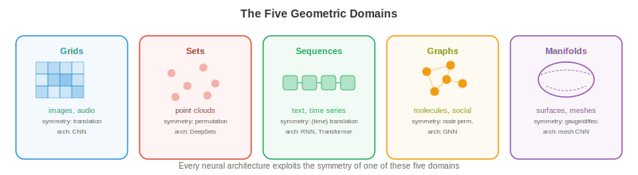

# 几何深度学习

*几何深度学习是一个统一框架，揭示 CNN、transformer 和 GNN 都是同一原理的不同实例：利用对称性。本文件涵盖对称群、群作用、不变性、等变性、五大几何域以及尺度分离*

- 在本书中，我们已经学习了许多架构：用于图像的 CNN（第 8 章）、用于语言的 transformer（第 7 章），以及用于序贯决策的 RL 策略（第 6 章）。它们看起来像是为完全不同问题设计的完全不同模型。但其中存在更深的模式。

- **几何深度学习**揭示，所有这些架构都是同一个思想的实例：构建尊重数据**对称性**的网络。CNN 利用图像中的平移对称性。transformer 利用序列中的置换对称性（attention 不依赖绝对位置）。GNN 利用 graph 中的置换对称性。一旦你看清这一点，这些架构的动物园就变成了一个单一、连贯的框架。

## 对称性与群

- 对象的**对称性**是使其保持不变的变换。正方形有 8 个对称：4 个旋转（0°、90°、180°、270°）和 4 个反射。圆形有无限多个：绕其中心的任意旋转。关键洞见在于，对称性告诉你什么是不重要的，而知道什么不重要性对学习而言至关重要。

- 用 ML 的术语来说：如果一个任务具有对称性，那么无论模型看到的是输入的哪个"版本"，都应给出相同答案。无论猫出现在图像左上角还是右下角，猫检测器都应正常工作。这就是平移对称性。

- 对称性被形式化为**群**。群 $G$ 是一组变换，具有四条性质：

    - **封闭性**：组合两个变换得到集合中的另一个变换。旋转 90° 再旋转 90° 得到 180°，它也在集合中。
    - **结合律**：$(g_1 \circ g_2) \circ g_3 = g_1 \circ (g_2 \circ g_3)$。分组顺序无关紧要（回顾第 2 章矩阵乘法的结合律）。
    - **单位元**：存在一个"什么都不做"的变换 $e$，使得 $e \circ g = g \circ e = g$。
    - **逆元**：每个变换都有一个撤销操作：$g \circ g^{-1} = e$。

- 这些与向量空间（第 1 章）的公理相同，只不过对象是变换而非向量。这种联系是深刻的：群作用于向量空间，而这种作用正是神经网络必须尊重的。

- 深度学习中出现的关键群：

    - **平移群** $(\mathbb{R}^n, +)$：平移图像或信号。这是 CNN 利用的对称性。
    - **对称群** $S_n$：$n$ 个元素的所有置换。这是 GNN 和 transformer 利用的对称性（重排 node 或 token 不应改变结果）。
    - **旋转群** $SO(n)$：$n$ 维空间中的所有旋转。$SO(2)$ 是平面中的旋转，$SO(3)$ 是 3D 中的旋转（对分子和 3D 视觉任务至关重要）。
    - **欧氏群** $E(n)$：所有旋转、反射和平移。物理空间的对称性。
    - **特殊欧氏群** $SE(n)$：旋转和平移（不含反射）。刚体运动的对称性。

- **群作用**描述群如何变换数据。若 $G$ 是一个群，$X$ 是数据空间，作用 $\rho: G \times X \to X$ 将每个群元素 $g$ 和数据点 $x$ 映射到变换后的点 $\rho(g, x)$。对于图像，平移群通过平移像素坐标来作用。对于 graph，对称群通过重新标记 node 来作用。

## 不变性与等变性

- 给定一个对称群，函数可以以两种重要方式与之关联：

- 函数 $f$ 对群 $G$ **不变**（invariant），是指当输入被变换时输出不变：

$$f(\rho(g, x)) = f(x) \quad \text{for all } g \in G$$

- 例：平移图像时，图像的总亮度不变。图像分类应当是平移不变的："猫"这一类别与猫所处的位置无关。

- 函数 $f$ 对 $G$ **等变**（equivariant），是指变换输入会以相应方式变换输出：

$$f(\rho_{\text{in}}(g, x)) = \rho_{\text{out}}(g, f(x)) \quad \text{for all } g \in G$$

- 例：若将图像向右平移 5 个像素，CNN 中的特征图也向右平移 5 个像素。convolution 操作是平移等变的：它保持空间关系。目标检测应当是等变的：如果猫移动了，边界框也应随之移动。


- 这种区分很重要：**中间层**通常应当是等变的（为下游层保留结构），而**最终输出**应当是不变的（答案不应依赖于变换）。CNN 通过堆叠等变 convolution 层，最后施加全局池化（不变的）来实现这一点。

- 将等变性内建到架构中远比从数据中学习它高效。一个带权重共享的平移等变 CNN 所需参数远少于必须独立学习"位置 (10,10) 的猫"和"位置 (200,150) 的猫"的全连接网络。对称性约束以指数方式缩小了假设空间。

## 五大几何域

- 几何深度学习识别出**五个基本数据域**，每个都有自己的对称群。每种神经网络架构都可理解为在利用其中一个域的对称性。



- **1. 网格（欧氏数据）**：图像、音频频谱、体数据。底层结构是具有平移对称性的规则网格。该群是平移群（可能加上旋转和反射）。利用此对称性的架构是 **CNN**：convolution 恰好是对平移等变的操作。跨空间位置的权重共享是平移等变性的具体体现。

- **2. 集合（无序集合）**：点云、粒子系统。对称性是置换不变性：元素顺序无关紧要。架构是 **DeepSets**（以及第 8 章的 PointNet）：对每个元素施加共享函数，然后用置换不变操作（sum、mean 或 max）进行 aggregation。形式上，$f(\{x_1, \ldots, x_n\}) = \phi\left(\sum_i \psi(x_i)\right)$。

- **3. 序列（有序数据）**：文本、时间序列。序列是 1D 的网格，但有一个转折：对称性更为微妙。绝对位置可能重要也可能不重要。RNN 自回归地处理序列。带位置编码的 transformer 可以 attend 到任意位置，其 self-attention 在加入位置编码之前对置换是等变的。这正是 transformer 泛化良好的原因：它们从置换等变出发，只加入刚好够的位置结构。

- **4. Graph（关系数据）**：社交网络、分子、知识 graph。对称性是 node 的置换：重新标记 node 不应改变 graph 的性质。架构是 **GNN**：在相连的 node 之间进行 message passing，使用不依赖 node 顺序的共享函数。这是本章余下部分的重点。

- **5. 流形与网格**：曲面、3D 形状。对称性包括微分同胚（光滑变形）。架构使用内蕴算子（如 Laplace-Beltrami），这些算子由曲面几何本身定义，与曲面如何嵌入空间无关。这联系到微分几何，并与形状分析、球面气候建模以及蛋白质表面分析相关。

- 这一框架的力量在于统一。CNN 是在网格 graph 上运行的 GNN。transformer 是在全连接 graph 上运行的 GNN。DeepSets 是没有 edge 的 GNN。将它们视为同一原理的不同实例指导了新架构的设计：识别数据的对称性，构建尊重它的网络。

## 尺度分离与粗化

- 现实世界数据具有多尺度结构。图像具有细粒度纹理（像素级）、局部模式（边缘、角点）、对象部件（车轮、窗户）和全局结构（整个场景）。分子具有原子级特征、官能团和整体分子形状。

- **尺度分离**是指这些细节层次可以分层处理的原理：先捕捉局部结构，然后逐步 aggregation 为更粗的表示。这就是**粗化**（coarsening）或**池化**（pooling）。

- 在 CNN 中，池化层（max pooling、average pooling）对空间分辨率下采样，迫使更高层捕捉更大尺度的模式。在感受野视图（第 8 章）中，更深的层"看到"更多图像。这就是尺度分离的体现。

- 在 graph 中，粗化意味着将若干 node 聚成簇形成"supernode"，产生一个保留本质结构的更小 graph。这是 graph pooling，将在文件 3 中详述。其与图像池化的类比是直接的：降低分辨率同时保留重要特征。

- 在序列中，层次化处理（如 句子 → 段落 → 文档）在不同时间或语义尺度上捕捉结构。Swin Transformer（第 8 章）通过其移位窗口层次将这一思想应用于图像。

- 数学上，粗化定义了一个**越来越抽象的表示层次**：

$$x \xrightarrow{\text{local features}} h^{(1)} \xrightarrow{\text{coarsen}} h^{(2)} \xrightarrow{\text{coarsen}} \cdots \xrightarrow{\text{global}} y$$

- 在每一层，表示对该层的对称群等变。最终的全局表示是不变的，在不受无关变换影响的情况下捕捉输入的本质。

- 这种层次正是深度网络在结构化数据上优于浅层网络的原因：每层增加一级抽象，多层等变层的组合从简单的局部特征构建出复杂的不变特征。

## 编程任务（使用 CoLab 或 notebook）

1. 验证 convolution 的平移等变性。对图像施加 convolution，然后平移图像再做 convolution。验证两个输出互为平移版本。
```python
import jax
import jax.numpy as jnp

# 1D signal and a simple filter
signal = jnp.array([0, 0, 0, 1, 2, 3, 2, 1, 0, 0, 0], dtype=float)
kernel = jnp.array([1, 0, -1], dtype=float)

# Convolve then shift
conv_result = jnp.convolve(signal, kernel, mode="same")
shifted_signal = jnp.roll(signal, 3)
conv_shifted = jnp.convolve(shifted_signal, kernel, mode="same")
shifted_conv = jnp.roll(conv_result, 3)

print(f"Conv then shift:  {shifted_conv}")
print(f"Shift then conv:  {conv_shifted}")
print(f"Equivariant: {jnp.allclose(shifted_conv, conv_shifted, atol=1e-5)}")
```

2. 验证 DeepSets 风格 aggregation 的置换不变性。对集合中每个元素施加共享函数，对结果求和，验证输出与元素顺序无关。
```python
import jax
import jax.numpy as jnp

# A "set" of 4 vectors (order should not matter)
x = jnp.array([[1.0, 2.0], [3.0, 4.0], [5.0, 6.0], [7.0, 8.0]])

# Simple shared function: element-wise square
psi = lambda v: v ** 2

# Aggregate by sum
def deepsets(points):
    return jnp.sum(jax.vmap(psi)(points), axis=0)

# Original order
result1 = deepsets(x)

# Permuted order
perm = jnp.array([2, 0, 3, 1])
result2 = deepsets(x[perm])

print(f"Original order:  {result1}")
print(f"Permuted order:  {result2}")
print(f"Invariant: {jnp.allclose(result1, result2)}")
```

3. 探索群结构。验证 2D 旋转矩阵构成一个群，检查封闭性、结合律、单位元和逆元。
```python
import jax.numpy as jnp

def rot2d(theta):
    return jnp.array([[jnp.cos(theta), -jnp.sin(theta)],
                       [jnp.sin(theta),  jnp.cos(theta)]])

R1 = rot2d(jnp.pi / 6)
R2 = rot2d(jnp.pi / 4)
R3 = rot2d(jnp.pi / 3)

# Closure: product of two rotations is a rotation
R12 = R1 @ R2
print(f"Closure (det=1, orthogonal): det={jnp.linalg.det(R12):.4f}, "
      f"R^T R = I: {jnp.allclose(R12.T @ R12, jnp.eye(2), atol=1e-5)}")

# Associativity
print(f"Associative: {jnp.allclose((R1 @ R2) @ R3, R1 @ (R2 @ R3), atol=1e-5)}")

# Identity
I = rot2d(0.0)
print(f"Identity: {jnp.allclose(R1 @ I, R1, atol=1e-5)}")

# Inverse
R1_inv = rot2d(-jnp.pi / 6)
print(f"Inverse: {jnp.allclose(R1 @ R1_inv, jnp.eye(2), atol=1e-5)}")
```
