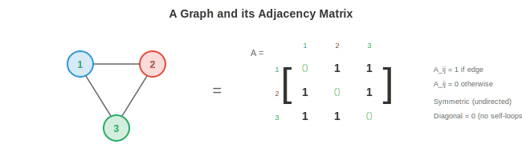
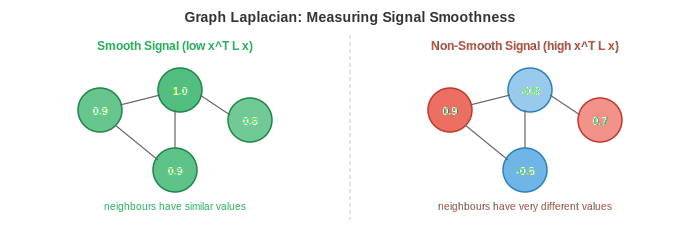

# Теория графов

*Теория графов предоставляет математический язык для описания отношений между сущностями. В этом файле рассматриваются узлы, ребра, матрицы смежности, типы графов, степень и связность, лапласиан графа, спектральная теория графов и реальные приложения графов. Мы более глубоко погрузимся в графы в главах, посвященных чистой информатике.*

- До сих пор в этой книге данные располагались на регулярных структурах: векторы в $\mathbb{R}^n$ (глава 1), матрицы как сетки чисел (глава 2), изображения как сетки пикселей (глава 8), последовательности как упорядоченные списки (глава 7). Однако многие системы реального мира являются **нерегулярными**: социальная сеть не имеет сеточной структуры, молекула не имеет порядка слева направо, а дорожная сеть не укладывается аккуратно в строки и столбцы.

- **Графы** — это математический инструмент для представления таких нерегулярных реляционных структур. Граф фиксирует **сущности** (узлы) и **отношения** (ребра) между ними. Как только данные представлены в виде графа, мы можем применить к ним принципы геометрического глубокого обучения из файла 1 для обучения на них.

## Узлы, ребра и смежность

- **Граф** $G = (V, E)$ состоит из множества **узлов** (или вершин) $V = \{v_1, v_2, \ldots, v_n\}$ и множества **ребер** $E \subseteq V \times V$, соединяющих пары узлов.

- Узлы представляют сущности: людей, атомы, города, веб-страницы, нейроны. Ребра представляют отношения: дружбу, химические связи, дороги, гиперссылки, синапсы.

- **Матрица смежности** $A$ — это матричное представление графа. Для графа с $n$ узлами $A$ представляет собой матрицу $n \times n$, где $A_{ij} = 1$, если существует ребро от узла $i$ к узлу $j$, и $A_{ij} = 0$ в противном случае.

- Например, для треугольного графа (3 узла, все соединены) матрица имеет вид:

```math
A = \begin{bmatrix} 0 & 1 & 1 \\ 1 & 0 & 1 \\ 1 & 1 & 0 \end{bmatrix}
```



- Диагональ равна нулю, поскольку узлы не соединены сами с собой (по умолчанию нет петель). Матрица смежности является прямым применением булевых матриц, которые мы изучали в главе 2: каждый элемент представляет собой бинарное отношение.

- Матрица смежности полностью кодирует структуру графа. Матричные операции над $A$ выявляют свойства графа: $A^2_{ij}$ подсчитывает количество путей длины 2 между узлами $i$ и $j$ (вспомните умножение матриц из главы 2: каждый элемент — это сумма произведений по промежуточным узлам). В более общем случае $A^k_{ij}$ подсчитывает количество путей длины $k$.

- Каждый узел может нести **вектор признаков** $\mathbf{x}_i \in \mathbb{R}^d$. Для социальной сети это может быть информация из профиля пользователя. Для молекулы он кодирует тип атома, заряд и другие свойства. Полный набор признаков узлов представляет собой матрицу $X \in \mathbb{R}^{n \times d}$, где каждая строка — это признаки одного узла.

- Ребра также могут нести признаки: тип связи в молекулах, расстояние в пространственных графах, тип отношений в графах знаний. **Признак ребра** для ребра $(i, j)$ — это вектор $\mathbf{e}_{ij} \in \mathbb{R}^{d_e}$.

## Типы графов

- **Неориентированный граф** имеет симметричные ребра: если $i$ соединен с $j$, то $j$ соединен с $i$. Матрица смежности симметрична: $A = A^T$ (симметричная матрица, глава 2). Дружба и химические связи являются неориентированными.

- **Ориентированный граф** (орграф) имеет ребра с направлением: ребро от $i$ к $j$ не подразумевает ребро от $j$ к $i$. Матрица смежности асимметрична. Подписки в Twitter, веб-гиперссылки и сети цитирований являются ориентированными.

- **Взвешенный граф** присваивает числовой вес каждому ребру. Матрица смежности содержит вещественные значения вместо бинарных: $A_{ij} = w_{ij}$. Расстояния в дорожной сети, сила корреляции в связях мозга и частота взаимодействий в социальных сетях являются взвешенными.

- **Двудольный граф** имеет два непересекающихся множества узлов, причем ребра существуют только между множествами (но не внутри них). Пользователи и продукты образуют двудольный граф: пользователи оценивают продукты, но пользователи не оценивают пользователей. Матрица смежности двудольного графа имеет блочную структуру:

```math
A = \begin{bmatrix} 0 & B \\ B^T & 0 \end{bmatrix}
```

- где $B$ — матрица смежности двудольного графа между двумя множествами узлов.

- **Мультиграф** допускает наличие нескольких ребер между одной и той же парой узлов и/или петель. Графы знаний обычно являются мультиграфами: две сущности могут иметь несколько отношений (например, «родился в», «живет в», «работает в»).

- **Гиперграф** обобщает ребра, соединяя более двух узлов одновременно. **Гиперребро** соединяет множество узлов, представляя отношения более высокого порядка. Научная статья, написанная в соавторстве пятью людьми, является гиперребром, соединяющим пять узлов-авторов.

- **Полный граф** $K_n$ имеет ребро между каждой парой узлов. Это графовый аналог полносвязного слоя, и именно эта структура используется в трансформерах (каждый токен учитывает каждый другой токен).

## Степень, пути и связность

- **Степень** узла — это количество ребер, соединенных с ним. В неориентированном графе степень узла $i$ равна $d_i = \sum_j A_{ij}$. Узлы с высокой степенью — это «хабы» с большим количеством связей.

- **Матрица степеней** $D$ — это диагональная матрица со степенями на диагонали: $D_{ii} = d_i$. Эта матрица встречается повсеместно в теории графов и формулах GNN.

- **Путь** между двумя узлами — это последовательность ребер, соединяющих их. **Кратчайший путь** (или геодезическая линия) между $i$ и $j$ — это путь с наименьшим количеством ребер (или наименьшим общим весом во взвешенном графе). **Алгоритм Дейкстры** находит кратчайшие пути за время $O((|V| + |E|) \log |V|)$.

- Граф является **связным**, если существует путь между каждой парой узлов. Если нет, он имеет несколько **компонент связности**: изолированные подграфы без ребер между ними.

- **Диаметр** графа — это самый длинный из кратчайших путей между любой парой узлов. Он измеряет, насколько «рассредоточен» граф. Социальные сети имеют знаменитые малые диаметры («шесть рукопожатий»).

- **Цикл** — это путь, который начинается и заканчивается в одном и том же узле. Граф без циклов называется **деревом**. Деревья — это простейшие связные графы: $n$ узлов и ровно $n-1$ ребро.

- **Центральность** измеряет важность узла. **Степенная центральность** — это просто степень узла. **Центральность по посредничеству** подсчитывает, сколько кратчайших путей проходит через узел. **Собственная центральность** определяет важность на основе важности соседей узла, что приводит к уравнению для собственного вектора $A\mathbf{x} = \lambda \mathbf{x}$ (глава 2). Алгоритм PageRank от Google — это вариант собственной центральности для ориентированных графов.

## Графовый лапласиан

- **Графовый лапласиан** — это, пожалуй, самая важная матрица в теории графов. Он определяется как:

$$L = D - A$$

- где $D$ — матрица степеней, а $A$ — матрица смежности. Для нашего примера с треугольником:

```math
L = \begin{bmatrix} 2 & 0 & 0 \\ 0 & 2 & 0 \\ 0 & 0 & 2 \end{bmatrix} - \begin{bmatrix} 0 & 1 & 1 \\ 1 & 0 & 1 \\ 1 & 1 & 0 \end{bmatrix} = \begin{bmatrix} 2 & -1 & -1 \\ -1 & 2 & -1 \\ -1 & -1 & 2 \end{bmatrix}
```

- Лапласиан обладает замечательными свойствами:

    - Он всегда **симметричен** и **положительно полуопределен** (вспомните главу 2: все собственные значения $\geq 0$). Для любого вектора $\mathbf{x}$:

$$\mathbf{x}^T L \mathbf{x} = \sum_{(i,j) \in E} (x_i - x_j)^2$$



    - Эта квадратичная форма измеряет, насколько сильно сигнал $\mathbf{x}$ на графе изменяется вдоль ребер. Если соседние узлы имеют схожие значения, $\mathbf{x}^T L \mathbf{x}$ мало. Если они сильно различаются, оно велико. Лапласиан измеряет **гладкость** сигналов на графе.

    - Наименьшее собственное значение всегда равно 0, а соответствующий собственный вектор $\mathbf{1} = [1, 1, \ldots, 1]^T$ (константный сигнал не имеет вариации). Количество нулевых собственных значений равно количеству компонент связности.

    - Второе наименьшее собственное значение $\lambda_2$ — это **алгебраическая связность** (значение Фидлера). Оно измеряет степень связности графа: $\lambda_2 = 0$ означает, что граф несвязен, большое значение $\lambda_2$ означает, что граф сильно связан.

- **Нормализованный лапласиан** масштабируется с помощью степеней узлов:

$$\hat{L} = D^{-1/2} L D^{-1/2} = I - D^{-1/2} A D^{-1/2}$$

- Эта нормализация гарантирует, что свойства лапласиана не зависят от абсолютного масштаба степеней узлов. Член $D^{-1/2} A D^{-1/2}$ представляет собой **симметрично нормализованную матрицу смежности** и напрямую входит в формулу GCN (файл 3).

## Спектральная теория графов

- Собственные значения и собственные векторы графового лапласиана определяют **спектр** графа и служат графовым аналогом преобразования Фурье.

- В классической обработке сигналов преобразование Фурье разлагает сигнал на частотные компоненты (синусы и косинусы). На графе роль этих частотных базисов играют собственные векторы лапласиана. Собственные векторы с малым собственным значением меняются медленно по графу (низкая частота, гладкость), в то время как собственные векторы с большим собственным значением меняются быстро (высокая частота, осцилляции).

- **Графовое преобразование Фурье (GFT)** сигнала $\mathbf{x}$ на графе имеет вид:

$$\hat{\mathbf{x}} = U^T \mathbf{x}$$

- где $U$ — матрица собственных векторов лапласиана (вспомните разложение по собственным векторам из главы 2: $L = U \Lambda U^T$). Обратное преобразование: $\mathbf{x} = U \hat{\mathbf{x}}$.

- **Графовая свёртка** в спектральной области — это поточечное умножение в частотной области, точно так же, как свёртка в пространственной области соответствует умножению в области Фурье (теорема о свёртке из главы 8):

$$g_\theta \star \mathbf{x} = U \left( (U^T g_\theta) \odot (U^T \mathbf{x}) \right) = U \, \text{diag}(\hat{g}_\theta) \, U^T \mathbf{x}$$

- Фильтр $\hat{g}_\theta$ является обучаемой функцией от собственных значений. Это основа спектральных GNN, которые мы упростим до практического GCN в файле 3.

- Вычислительным узким местом является разложение $L$ по собственным векторам, которое требует $O(n^3)$ операций для графа с $n$ узлами. Это непрактично для больших графов (миллионы узлов). Полиномиальные аппроксимации (полиномы Чебышёва) позволяют полностью избежать разложения по собственным векторам, и именно эта аппроксимация ведет напрямую к GCN.

## Детекция сообществ

- Многие реальные графы обладают **структурой сообществ**: кластерами плотно связанных узлов с редкими связями между кластерами. В социальных сетях это группы друзей, в биологических сетях — функциональные модули, в сетях цитирования — области исследований.

- **Спектральная кластеризация** использует собственные векторы лапласиана для поиска сообществ. Идея: выполнить эмбеддинг каждого узла, используя $k$ наименьших нетривиальных собственных векторов $L$, а затем применить k-means (глава 6) в этом пространстве эмбеддингов. Узлы одного сообщества в спектральном эмбеддинге оказываются близко друг к другу.

- Это работает, потому что вектор Фидлера (собственный вектор для $\lambda_2$) естественным образом разделяет граф на две группы: узлы с положительными значениями и узлы с отрицательными значениями, разрезая граф по самым редким связям. Более высокие собственные векторы позволяют уточнить это разделение на большее число групп.

- **Модулярность** $Q$ измеряет качество разбиения на сообщества. Она сравнивает количество ребер внутри сообществ с ожидаемым количеством в случайном графе:

$$Q = \frac{1}{2|E|} \sum_{ij} \left( A_{ij} - \frac{d_i d_j}{2|E|} \right) \delta(c_i, c_j)$$

- где $c_i$ — принадлежность узла $i$ к сообществу, а $\delta$ равно 1, если узлы находятся в одном сообществе. $Q$ варьируется от $-0.5$ до $1$, причем более высокие значения указывают на более выраженную структуру сообществ.

## Реальные графы

- **Социальные сети**: узлы — это люди, ребра — дружба или взаимодействия. Facebook содержит миллиарды узлов и сотни миллиардов ребер. Такие графы обычно разрежены (у каждого человека сотни друзей, а не миллиарды), обладают свойствами «тесного мира» (короткая средняя длина пути) и имеют степенное распределение (несколько хабов с миллионами связей).

- **Молекулярные графы**: узлы — это атомы, ребра — химические связи. Каждый атом имеет признаки (тип элемента, заряд, гибридизация), а каждое ребро — свои признаки (одинарная, двойная, тройная, ароматическая связь). Молекулярные графы небольшие (от десятков до сотен узлов), но обладают сложной структурой. Предсказание свойств молекул на основе структуры графа — одно из важнейших применений GNN.

- **Графы знаний**: узлы — это сущности (люди, места, концепты), ребра — типизированные отношения («родился в», «столица», «является экземпляром»). Графы знаний лежат в основе поисковых систем, рекомендательных систем и систем ответов на вопросы. Обычно это ориентированные мультиграфы, содержащие миллионы сущностей и миллиарды отношений.

- **Сети цитирований**: узлы — это научные статьи, ребра — цитирования (ориентированные). Кластеризация позволяет выявить исследовательские сообщества. Признаки узлов включают название, аннотацию и год публикации.

- **Сети белковых взаимодействий**: узлы — это белки, ребра указывают на физические взаимодействия или функциональные ассоциации. Изучение таких графов помогает определять мишени для лекарств и механизмы заболеваний.

- **Дорожные сети и транспорт**: узлы — это перекрестки, ребра — сегменты дорог с весами, соответствующими расстоянию или времени. Алгоритмы поиска кратчайшего пути на таких графах лежат в основе навигационных систем. Прогнозирование движения в беспилотных автомобилях (глава 11) представляет взаимодействия агентов в виде графов.

## Задачи по программированию (используйте CoLab или ноутбук)

1. Постройте небольшой граф в виде матрицы смежности и вычислите базовые свойства: степень каждого узла, количество путей длины 2 и связность графа.
```python
import jax.numpy as jnp

# A simple graph: 5 nodes
# 0-1, 0-2, 1-2, 2-3, 3-4
A = jnp.array([[0, 1, 1, 0, 0],
               [1, 0, 1, 0, 0],
               [1, 1, 0, 1, 0],
               [0, 0, 1, 0, 1],
               [0, 0, 0, 1, 0]], dtype=float)

# Degree
degrees = A.sum(axis=1)
print(f"Degrees: {degrees}")

# Paths of length 2
A2 = A @ A
print(f"Paths of length 2 (node 0 to 3): {int(A2[0, 3])}")

# Connected? Check if A^(n-1) has all nonzero entries
An = jnp.linalg.matrix_power(A + jnp.eye(5), 4)  # (A+I)^4 for reachability
connected = jnp.all(An > 0)
print(f"Connected: {connected}")
```

2. Вычислите матрицу Лапласа графа и её собственные значения. Убедитесь, что наименьшее собственное значение равно 0, а соответствующий собственный вектор является константой.
```python
import jax.numpy as jnp

A = jnp.array([[0, 1, 1, 0, 0],
               [1, 0, 1, 0, 0],
               [1, 1, 0, 1, 0],
               [0, 0, 1, 0, 1],
               [0, 0, 0, 1, 0]], dtype=float)

D = jnp.diag(A.sum(axis=1))
L = D - A

eigenvalues, eigenvectors = jnp.linalg.eigh(L)
print(f"Eigenvalues: {eigenvalues}")
print(f"Smallest eigenvector: {eigenvectors[:, 0]}")
print(f"Fiedler value (algebraic connectivity): {eigenvalues[1]:.4f}")

# Verify: x^T L x measures smoothness
x = jnp.array([1.0, 1.0, 1.0, -1.0, -1.0])  # two groups
smoothness = x @ L @ x
print(f"Smoothness of two-group signal: {smoothness:.2f}")
```

3. Выполните спектральную кластеризацию на графе с двумя сообществами. Вложите узлы в пространство признаков, используя вектор Фидлера, и разделите их по знаку.
```python
import jax.numpy as jnp
import matplotlib.pyplot as plt

# Two communities of 5 nodes each, weakly connected
A = jnp.zeros((10, 10))
# Community 1: nodes 0-4 (dense)
for i in range(5):
    for j in range(i+1, 5):
        A = A.at[i, j].set(1).at[j, i].set(1)
# Community 2: nodes 5-9 (dense)
for i in range(5, 10):
    for j in range(i+1, 10):
        A = A.at[i, j].set(1).at[j, i].set(1)
# One bridge edge
A = A.at[2, 7].set(1).at[7, 2].set(1)

D = jnp.diag(A.sum(axis=1))
L = D - A
eigenvalues, eigenvectors = jnp.linalg.eigh(L)

# Fiedler vector (2nd smallest eigenvalue)
fiedler = eigenvectors[:, 1]
communities = (fiedler > 0).astype(int)

print(f"Fiedler vector: {fiedler}")
print(f"Clusters: {communities}")

plt.bar(range(10), fiedler, color=["#3498db" if c == 0 else "#e74c3c" for c in communities])
plt.xlabel("Node"); plt.ylabel("Fiedler vector value")
plt.title("Spectral Clustering via Fiedler Vector")
plt.show()
```
