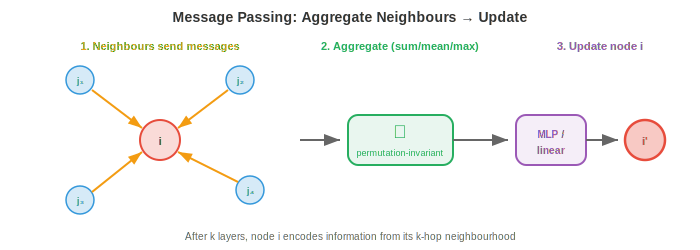
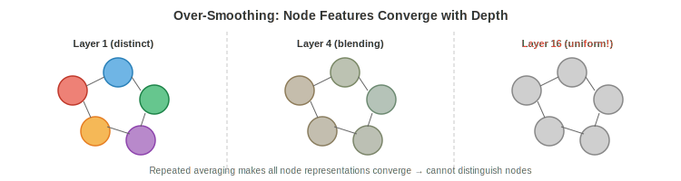

# Графовые нейронные сети

*Графовые нейронные сети обучаются на данных с графовой структурой путем передачи сообщений между связанными узлами. В этом файле рассматриваются фреймворк передачи сообщений, GCN, GraphSAGE, GIN, проблема пересглаживания (over-smoothing), графовый пулинг и задачи на уровне узлов/ребер/графов — основные архитектуры, лежащие в основе прогнозирования свойств молекул, анализа социальных сетей и рекомендательных систем.*

- В предыдущих файлах мы заложили математический фундамент: геометрическое глубокое обучение (файл 1) учит нас использовать симметрии, а теория графов (файл 2) дает нам язык узлов, ребер и смежности. Теперь мы построим нейронные сети, которые работают непосредственно с графами.

- Основная проблема: графовые данные **нерегулярны**. В отличие от изображений (фиксированная сетка) или последовательностей (фиксированный порядок), графы имеют переменное количество узлов, переменную связность и отсутствие канонического порядка узлов. Нейронная сеть для графов должна справляться со всем этим, оставаясь при этом перестановочно-эквивариантной (переименование узлов не должно менять выходные данные).

## Фреймворк передачи сообщений

- Почти все GNN следуют одному и тому же рецепту, называемому **передачей сообщений** (также известной как агрегация окрестностей). Идея проста и элегантна: каждый узел обновляет свое представление, собирая информацию от своих соседей.

- На каждом слое $l$ каждый узел $i$ выполняет три действия:

    1. **Сообщение**: каждый сосед $j$ узла $i$ вычисляет сообщение $\mathbf{m}_{j \to i}$ на основе своих текущих признаков.
    2. **Агрегация**: узел $i$ собирает все входящие сообщения и объединяет их с помощью перестановочно-инвариантной функции (сумма, среднее или максимум).
    3. **Обновление**: узел $i$ объединяет агрегированное сообщение со своими собственными признаками для создания нового представления.

- Формально:

$$\mathbf{m}_i^{(l)} = \bigoplus_{j \in \mathcal{N}(i)} \phi^{(l)}\left(\mathbf{h}_i^{(l)}, \mathbf{h}_j^{(l)}, \mathbf{e}_{ij}\right)$$

$$\mathbf{h}_i^{(l+1)} = \psi^{(l)}\left(\mathbf{h}_i^{(l)}, \mathbf{m}_i^{(l)}\right)$$

- где $\mathcal{N}(i)$ — множество соседей узла $i$, $\bigoplus$ — перестановочно-инвариантная агрегация (сумма, среднее, максимум), $\phi$ — функция сообщения, $\psi$ — функция обновления, а $\mathbf{e}_{ij}$ — необязательный признак ребра.



- Агрегация $\bigoplus$ должна быть перестановочно-инвариантной (порядок обработки соседей не имеет значения), чтобы гарантировать, что вся функция в целом является перестановочно-эквивариантной. Это напрямую реализует принцип симметрии из файла 1.

- После $k$ слоев передачи сообщений представление каждого узла кодирует информацию из его **$k$-шаговой окрестности**: всех узлов, достижимых в пределах $k$ ребер. Слой 1 видит непосредственных соседей, слой 2 — соседей соседей и так далее. Именно так локальная информация распространяется для формирования глобального понимания.

- Рецептивное поле GNN растет с глубиной, точно так же, как рецептивное поле CNN растет с количеством слоев (глава 8). Но в отличие от CNN на регулярных сетках, форма рецептивного поля варьируется для каждого узла в зависимости от топологии графа.

## Графовая сверточная сеть (GCN)

- **GCN** (Kipf & Welling, 2017) — это базовая архитектура GNN. Она упрощает спектральную графовую свертку (из файла 2) до элегантной и эффективной формулы.

- Начиная со спектральной свертки $g_\theta \star \mathbf{x} = U \, \text{diag}(\hat{g}_\theta) \, U^T \mathbf{x}$, Кипф и Веллинг аппроксимируют спектральный фильтр полиномом Чебышева первого порядка, что позволяет полностью избежать вычисления собственного разложения. После упрощения послойное обновление принимает вид:

$$H^{(l+1)} = \sigma\left(\hat{A} H^{(l)} W^{(l)}\right)$$

- где:
    - $H^{(l)} \in \mathbb{R}^{n \times d}$ — матрица признаков узлов на слое $l$
    - $W^{(l)} \in \mathbb{R}^{d \times d'}$ — обучаемая матрица весов
    - $\hat{A} = \tilde{D}^{-1/2} \tilde{A} \tilde{D}^{-1/2}$ — симметрично нормализованная матрица смежности с петлями
    - $\tilde{A} = A + I$ добавляет петли (чтобы каждый узел также получал свое собственное сообщение)
    - $\tilde{D}$ — матрица степеней для $\tilde{A}$
    - $\sigma$ — нелинейная функция активации (ReLU, как в главе 6)

- Умножение матриц $\hat{A} H^{(l)}$ — это шаг агрегации: для каждого узла вычисляется взвешенное среднее признаков его соседей (плюс его собственные, благодаря петле). Матрица весов $W^{(l)}$ — это обучаемое преобразование, общее для всех узлов. Активация добавляет нелинейность.

- Это удивительно просто: всего лишь умножение матриц, за которым следует обученное линейное отображение и активация. Весь слой GCN можно записать одной строкой кода. Нормализация с помощью $\tilde{D}^{-1/2}$ предотвращает доминирование узлов с большим количеством соседей: сообщения узлов с высокой степенью масштабируются вниз.

- Во фреймворке передачи сообщений GCN использует:
    - Сообщение: $\phi(\mathbf{h}_j) = \mathbf{h}_j$ (просто отправка своих признаков)
    - Агрегация: нормализованная сумма (взвешенная по степени)
    - Обновление: линейное преобразование + активация

## GraphSAGE

- GCN является **трансдуктивной**: она требует наличия полного графа во время обучения и не может работать с новыми, ранее не виденными узлами. Если в социальной сети появляется новый пользователь, GCN необходимо переобучать на всем графе. **GraphSAGE** (Hamilton et al., 2017) решает эту проблему с помощью **индуктивного** подхода.

- Ключевая идея — **выборка окрестностей**: вместо использования всех соседей выбирается подмножество фиксированного размера. Это делает вычисления независимыми от структуры всего графа и позволяет обобщать результаты на новые узлы и графы.

- Обновление GraphSAGE для узла $i$:

$$\mathbf{h}_i^{(l+1)} = \sigma\left(W^{(l)} \cdot \text{CONCAT}\left(\mathbf{h}_i^{(l)}, \text{AGG}\left(\{\mathbf{h}_j^{(l)} : j \in \mathcal{S}(i)\}\right)\right)\right)$$

- где $\mathcal{S}(i)$ — **выбранное** подмножество соседей (например, случайная выборка 10 из 500 соседей). Операция CONCAT явно отделяет собственные признаки узла от агрегированных признаков соседей, позволяя сети изучать различные преобразования для «себя» и для «окрестности».

- GraphSAGE поддерживает несколько функций агрегации:
    - **Mean (среднее)**: $\text{AGG} = \frac{1}{|\mathcal{S}|} \sum_{j \in \mathcal{S}} \mathbf{h}_j$ (простая и эффективная)
    - **LSTM**: подача выборки соседей в LSTM (однако это вводит зависимость от порядка, что в некоторой степени нарушает инвариантность к перестановкам)
    - **Pool (пулинг)**: $\text{AGG} = \max(\{\sigma(W_{\text{pool}} \mathbf{h}_j + \mathbf{b})\})$ (нелинейное преобразование с последующим взятием максимума)

- Стратегия выборки делает GraphSAGE масштабируемым для очень больших графов. Обучение использует мини-батчи узлов: для каждого целевого узла выбирается $k_1$ соседей на 1-м слое, затем $k_2$ соседей для каждого из них на 2-м слое. При $k_1 = k_2 = 10$ и 2 слоях дерево вычислений каждого узла содержит не более $10 \times 10 = 100$ узлов, независимо от размера графа.

## Graph Isomorphism Network (GIN)

- Различные архитектуры GNN обладают разной **выразительной мощностью**: способностью различать структурно разные графы. GCN и GraphSAGE, несмотря на свою эффективность на практике, имеют доказуемые ограничения в том, какие структуры графов они могут различать.

- Теоретическим инструментом для измерения выразительности GNN является **тест Вайсфейлера-Лемана (WL)** — классический алгоритм проверки изоморфизма графов (того, являются ли два графа структурно идентичными). Тест WL итеративно уточняет метки узлов, хешируя метку каждого узла вместе с мультимножеством меток его соседей.

- **GIN** (Xu et al., 2019) спроектирована так, чтобы быть такой же выразительной, как тест WL, что делает её самой мощной GNN с передачей сообщений (в рамках теоретических ограничений передачи сообщений). Ключевая идея: функция агрегации должна быть **инъективной** на мультимножествах (разные мультимножества признаков соседей должны давать разные агрегированные значения).

- Агрегация суммой инъективна на мультимножествах (сумма $\{1, 1, 2\}$ дает 4, как и $\{1, 3\}$, но для векторов признаков с достаточным количеством размерностей суммы разных мультимножеств в общем случае различны). Среднее и максимум не являются инъективными: среднее не может отличить $\{1, 1\}$ от $\{2, 2\}$, а максимум не может отличить $\{1, 2, 3\}$ от $\{1, 1, 3\}$.

- Обновление GIN выглядит так:

$$\mathbf{h}_i^{(l+1)} = \text{MLP}^{(l)}\left((1 + \epsilon^{(l)}) \cdot \mathbf{h}_i^{(l)} + \sum_{j \in \mathcal{N}(i)} \mathbf{h}_j^{(l)}\right)$$

- где $\epsilon$ — обучаемый скаляр (или фиксированный в 0), а MLP обеспечивает нелинейное инъективное отображение. Агрегация суммой сохраняет структуру мультимножества, а MLP может научиться различать любые два разных агрегированных значения.

## Чрезмерное сглаживание (Over-Smoothing)

- Серьезной проблемой в GNN является **чрезмерное сглаживание**: по мере увеличения количества слоев все представления узлов сходятся к одному и тому же значению, теряя способность различать разные узлы.



- Механизм интуитивно понятен. Каждый слой передачи сообщений усредняет признаки узла с признаками его соседей. После многих раундов усреднения каждый узел «увидел» (и смешался с) каждый другой узел в своей компоненте связности. Признаки становятся равномерным средним — это графовый эквивалент многократного размытия изображения до тех пор, пока оно не превратится в однотонный цвет.

- Формально, повторное применение нормализованной матрицы смежности $\hat{A}$ сходится к матрице ранга 1 (каждая строка становится пропорциональной стационарному распределению случайного блуждания по графу). Это та же сходимость, что и у степенного метода к доминирующему собственному вектору (глава 2).

- Чрезмерное сглаживание ограничивает GNN небольшой глубиной (обычно 2-4 слоя), в отличие от CNN и трансформеров, которые выигрывают от десятков или сотен слоев. Это означает, что каждый узел может видеть только ограниченную окрестность, что является проблемой для задач, требующих информации на больших расстояниях.

- Способы смягчения проблемы включают:
    - **Остаточные связи (residual connections)** (из ResNet, глава 8): $\mathbf{h}_i^{(l+1)} = \mathbf{h}_i^{(l+1)} + \mathbf{h}_i^{(l)}$, сохраняющие информацию с более ранних слоев.
    - **Jumping knowledge**: конкатенация или пулинг по вниманию представлений со всех слоев, а не только с последнего.
    - **DropEdge**: случайное удаление ребер во время обучения, замедляющее распространение информации.
    - **Графовые трансформеры** (файл 4): обход узкого места локальной передачи сообщений с помощью глобального внимания.

## Графовый пулинг

- Для **задач на уровне графа** (предсказание свойства всего графа, например, токсичности молекулы) нам нужно свернуть все представления узлов в один вектор уровня графа. Это **графовый пулинг**, графовый аналог глобального среднего пулинга в CNN (глава 8).

- Простейший подход — **readout**: применение инвариантной к перестановкам функции к набору всех признаков узлов:

$$\mathbf{h}_G = \text{READOUT}(\{\mathbf{h}_i^{(L)} : i \in V\}) = \sum_i \mathbf{h}_i^{(L)} \quad \text{or} \quad \frac{1}{|V|} \sum_i \mathbf{h}_i^{(L)} \quad \text{or} \quad \max_i \mathbf{h}_i^{(L)}$$

- Это агрегация DeepSets из файла 1, применяемая после последнего слоя GNN. Сумма сохраняет информацию о размере (граф со 100 узлами будет иметь большую сумму, чем граф с 10 узлами), в то время как среднее нормализует результат по размеру.

- **Иерархический пулинг** постепенно укрупняет граф, повторяя то, как CNN постепенно уменьшают размерность изображений. На каждом уровне группы узлов объединяются в «суперузлы»:

- **DiffPool** (дифференцируемый пулинг) обучает матрицу мягкого назначения $S^{(l)} \in \mathbb{R}^{n_l \times n_{l+1}}$, которая относит каждый узел к определенному кластеру:

$$X^{(l+1)} = S^{(l)T} H^{(l)}, \quad A^{(l+1)} = S^{(l)T} A^{(l)} S^{(l)}$$

- Матрица назначения предсказывается отдельной GNN, что делает кластеризацию дифференцируемой в рамках сквозного обучения. Это создает иерархию: исходный граф → укрупненный граф с меньшим количеством узлов → еще более крупный граф → один узел (представление графа).

- **TopKPool** использует более простой подход: обучение скалярной оценки для каждого узла, сохранение топ-$k$ узлов с наивысшими оценками и отбрасывание остальных. Это жесткий отбор (а не мягкое назначение), и он вычислительно дешевле, чем DiffPool.

## Гетерогенные графы

- Все графовые нейронные сети (GNN), рассмотренные до сих пор, предполагают использование **однородного графа** (homogeneous graph): один тип узлов, один тип ребер. Однако большинство графов в реальном мире являются **разнородными** (heterogeneous): они содержат несколько типов узлов и несколько типов ребер. Граф знаний содержит узлы «человек», «организация» и «локация», соединенные ребрами «работает в», «родился в» и «расположен в». Рекомендательная система содержит узлы «пользователь» и «объект», соединенные ребрами «купил», «просмотрел» и «оценил».

- Разнородный граф имеет **схему** (также называемую метаграфом), которая определяет допустимые типы узлов и типы ребер. Каждый тип ребра соединяет конкретный исходный тип с конкретным целевым типом. Например, «работает в» соединяет «Человек» → «Организация».

- **Реляционная GCN (R-GCN)** (Schlichtkrull et al., 2018) обрабатывает разнородные ребра, используя отдельную матрицу весов для каждого типа ребер:

$$\mathbf{h}_i^{(l+1)} = \sigma\left(\sum_{r \in \mathcal{R}} \sum_{j \in \mathcal{N}_r(i)} \frac{1}{|\mathcal{N}_r(i)|} W_r^{(l)} \mathbf{h}_j^{(l)} + W_0^{(l)} \mathbf{h}_i^{(l)}\right)$$

- где $\mathcal{R}$ — множество типов ребер, $\mathcal{N}_r(i)$ — множество соседей, соединенных с узлом $i$ через отношение $r$, а $W_r$ — матрица весов, специфичная для отношения $r$. Самопетля $W_0$ обрабатывает собственные признаки узла отдельно.

- Проблема: при наличии большого количества типов отношений количество параметров резко возрастает (одна матрица $d \times d$ на каждое отношение). R-GCN смягчает это с помощью **базисного разложения**: $W_r = \sum_{b=1}^{B} a_{rb} V_b$, где $V_b$ — общие базисные матрицы, а $a_{rb}$ — скалярные коэффициенты для каждого отношения. Это аналогично факторизации низкого ранга (глава 2): матрицы, специфичные для отношений, находятся в низкоразмерном подпространстве.

- **Разнородный графовый трансформер (HGT)** (Hu et al., 2020) применяет механизм внимания к разнородным графам. Ключевая идея заключается в том, что внимание должно зависеть как от типов узлов, так и от типа ребра, соединяющего их. HGT использует специфичные для типов матрицы проекции для запросов (queries), ключей (keys) и значений (values):

$$\text{Attention}(i, j) = \left(W_{\tau(i)}^Q \mathbf{h}_i\right)^T \cdot \frac{W_{\phi(i,j)}^{\text{ATT}}}{\sqrt{d}} \cdot \left(W_{\tau(j)}^K \mathbf{h}_j\right)$$

- где $\tau(i)$ — тип узла $i$, а $\phi(i,j)$ — тип ребра между ними. Это гарантирует, что модель по-разному учитывает различные типы отношений: статья, обращающая внимание на своих авторов, должна использовать другие веса внимания, нежели при обращении к своим источникам (ссылкам).

- **Методы на основе метапутей** определяют значимые пути через схему (например, «Автор» → «Статья» → «Автор» для соавторства) и агрегируют информацию вдоль этих путей. **HAN** (Heterogeneous Attention Network) применяет внимание на двух уровнях: внутри каждого метапути (какие соседи вдоль этого пути важны?) и между метапутями (какие паттерны отношений важны?).

## Предсказание ребер и дополнение графа знаний

- **Предсказание ребер** (link prediction) ставит вопрос: исходя из существующих ребер, какие отсутствующие ребра, скорее всего, существуют? Это основная задача для дополнения графа знаний (предсказание пропущенных фактов), рекомендаций (предсказание того, какие объекты понравятся пользователю) и анализа социальных сетей (предсказание будущих дружеских связей).

- **Методы на основе эмбеддингов** обучают вектор для каждой сущности и преобразование для каждого отношения, а затем оценивают потенциальные ребра по тому, насколько хорошо сущности и отношение сочетаются друг с другом:

- **TransE** моделирует отношения как сдвиги в пространстве эмбеддингов: если $(h, r, t)$ — допустимая тройка (головная сущность, отношение, хвостовая сущность), то $\mathbf{h} + \mathbf{r} \approx \mathbf{t}$. Функция оценки имеет вид $f(h, r, t) = -\|\mathbf{h} + \mathbf{r} - \mathbf{t}\|$. Интуитивно, вектор отношения «перемещает» головную сущность к хвостовой в пространстве эмбеддингов.

- **RotatE** моделирует отношения как повороты в комплексном пространстве: $\mathbf{t} = \mathbf{h} \circ \mathbf{r}$, где $\circ$ — поэлементное комплексное умножение, а $|\mathbf{r}_i| = 1$ (единичные комплексные числа — это повороты). Это позволяет моделировать паттерны симметрии, антисимметрии, инверсии и композиции, которые TransE моделировать не может.

- **ComplEx** использует комплексные эмбеддинги с эрмитовым скалярным произведением, что позволяет моделировать асимметричные отношения (если А — начальник Б, то Б не является начальником А).

- Предсказание ребер на основе GNN вычисляет эмбеддинги узлов с помощью передачи сообщений, а затем оценивает ребра, используя эмбеддинги конечных узлов. Это сочетает структурные рассуждения GNN с реляционным моделированием методов на основе эмбеддингов. Энкодер GNN улавливает структуру многошагового соседства, которую упускают методы с одиночными эмбеддингами.

## Типы задач

- GNN решают три категории задач:

- **Задачи на уровне узлов**: предсказание свойства для каждого узла. Примеры: классификация пользователей в социальной сети (бот или человек), предсказание функции каждого белка в сети взаимодействий, полуавтоматическая классификация узлов (разметка нескольких узлов, предсказание остальных). Выходными данными является эмбеддинг узла $\mathbf{h}_i^{(L)}$, пропущенный через классификатор.

- **Задачи на уровне ребер**: предсказание свойства для каждого ребра или предсказание того, существует ли ребро. Примеры: предсказание ребер (станут ли эти два пользователя друзьями?), дополнение графа знаний (существует ли это отношение между данными сущностями?), предсказание взаимодействия лекарственных средств. Выходные данные обычно используют эмбеддинги обоих конечных узлов: $\hat{y}_{ij} = f(\mathbf{h}_i, \mathbf{h}_j)$, где $f$ — это скалярное произведение, конкатенация + MLP или другая комбинация.

- **Задачи на уровне графа**: предсказание свойства для всего графа целиком. Примеры: предсказание свойств молекул (токсична ли эта молекула?), классификация графов (является ли эта социальная сеть сетью ботов?), генерация графов (проектирование молекулы с желаемыми свойствами). Выходные данные используют графовый пулинг для получения $\mathbf{h}_G$, который затем классифицируется или используется в регрессии.

## Задачи по программированию (используйте CoLab или ноутбук)

1. Реализуйте один слой GCN с нуля, используя нормализованную матрицу смежности. Примените его к небольшому графу и пронаблюдайте, как сглаживаются признаки узлов.
```python
import jax
import jax.numpy as jnp

# Graph: 5 nodes, simple chain with a branch
A = jnp.array([[0, 1, 0, 0, 0],
               [1, 0, 1, 0, 0],
               [0, 1, 0, 1, 1],
               [0, 0, 1, 0, 0],
               [0, 0, 1, 0, 0]], dtype=float)

# Add self-loops
A_hat = A + jnp.eye(5)
D_hat = jnp.diag(A_hat.sum(axis=1))
D_inv_sqrt = jnp.diag(1.0 / jnp.sqrt(A_hat.sum(axis=1)))
A_norm = D_inv_sqrt @ A_hat @ D_inv_sqrt

# Node features: one-hot identity
H = jnp.eye(5)

# Weight matrix (random initialisation)
rng = jax.random.PRNGKey(0)
W = jax.random.normal(rng, (5, 3)) * 0.5

# GCN layer: H' = ReLU(A_norm @ H @ W)
H_new = jax.nn.relu(A_norm @ H @ W)

print("Original features (one-hot):")
print(H)
print("\nAfter GCN layer:")
print(jnp.round(H_new, 3))
print("\nNotice: connected nodes now have similar representations")
```

2. Реализуйте передачу сообщений с агрегацией через сумму (в стиле GIN) и сравните её с агрегацией через среднее значение (в стиле GCN). Покажите, что сумма позволяет различать мультимножества, которые не может различить среднее значение.

```python
import jax.numpy as jnp

# Two different neighbourhood multisets that have the same mean
# Node A: neighbours have features [1, 1, 1, 1]  (four neighbours, all 1)
# Node B: neighbours have features [2, 2]          (two neighbours, all 2)

neighbours_A = jnp.array([[1.0], [1.0], [1.0], [1.0]])
neighbours_B = jnp.array([[2.0], [2.0]])

# Mean aggregation
mean_A = neighbours_A.mean(axis=0)
mean_B = neighbours_B.mean(axis=0)
print(f"Mean A: {mean_A}, Mean B: {mean_B}, Same: {jnp.allclose(mean_A, mean_B)}")

# Sum aggregation
sum_A = neighbours_A.sum(axis=0)
sum_B = neighbours_B.sum(axis=0)
print(f"Sum A:  {sum_A},  Sum B:  {sum_B},  Same: {jnp.allclose(sum_A, sum_B)}")
print("\nSum distinguishes these multisets; mean does not!")
```

3. Продемонстрируйте чрезмерное сглаживание (over-smoothing). Повторно применяйте нормализованную матрицу смежности и наблюдайте, как признаки узлов сходятся.

```python
import jax.numpy as jnp
import matplotlib.pyplot as plt

# Random graph
A = jnp.array([[0,1,1,0,0,0],
               [1,0,1,0,0,0],
               [1,1,0,1,0,0],
               [0,0,1,0,1,1],
               [0,0,0,1,0,1],
               [0,0,0,1,1,0]], dtype=float)

A_hat = A + jnp.eye(6)
D_inv_sqrt = jnp.diag(1.0 / jnp.sqrt(A_hat.sum(axis=1)))
A_norm = D_inv_sqrt @ A_hat @ D_inv_sqrt

# Initial features: distinct per node
H = jnp.array([[1,0], [0,1], [1,1], [-1,0], [0,-1], [-1,-1]], dtype=float)

distances = []
for k in range(20):
    H = A_norm @ H
    # Measure how distinct the features are (std across nodes)
    spread = jnp.std(H, axis=0).mean()
    distances.append(float(spread))

plt.plot(distances, "o-")
plt.xlabel("Number of message-passing rounds")
plt.ylabel("Feature spread (std across nodes)")
plt.title("Over-Smoothing: Features Converge with Depth")
plt.show()
```
