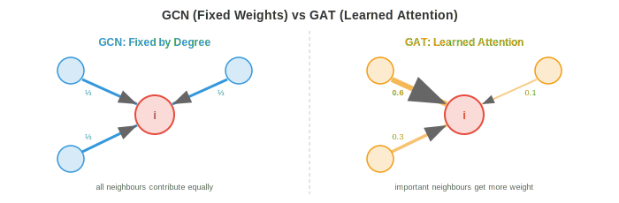

# Графовые сети внимания (Graph Attention Networks)

*Графовые сети внимания заменяют равномерную агрегацию соседей на обучаемые, зависящие от данных веса. В этом файле рассматриваются GAT, многоголовое графовое внимание, GATv2, графовые трансформеры, позиционное и структурное кодирование, а также масштабируемость.*

- В GCN (файл 3) каждый узел агрегирует признаки своих соседей, используя фиксированные веса, определяемые структурой графа (нормализованной матрицей смежности). Узел с тремя соседями придает каждому из них примерно равный вес ($\approx 1/3$). Однако не все соседи одинаково важны: сообщение от близкого коллеги должно значить больше, чем сообщение от дальнего знакомого.

- **Графовые сети внимания** решают эту задачу, обучаясь тому, **на каких соседей обращать внимание**, используя тот же механизм внимания, который лежит в основе трансформеров (глава 7). Вместо фиксированных весов, основанных на структуре, каждый узел вычисляет динамические оценки внимания к своим соседям, основанные на их содержимом.

## GAT: Графовая сеть внимания

- **GAT** (Veličković et al., 2018) вычисляет коэффициенты внимания между каждым узлом и его соседями. Для узла $i$ и соседа $j$:

$$e_{ij} = \text{LeakyReLU}\left(\mathbf{a}^T \left[W\mathbf{h}_i \| W\mathbf{h}_j\right]\right)$$

- где $W \in \mathbb{R}^{d' \times d}$ — общее линейное преобразование, $\|$ обозначает конкатенацию, а $\mathbf{a} \in \mathbb{R}^{2d'}$ — обучаемый вектор внимания. Оценка $e_{ij}$ измеряет, насколько важны признаки узла $j$ для узла $i$.

- Исходные оценки нормализуются по всем соседям с помощью функции softmax:

$$\alpha_{ij} = \text{softmax}_j(e_{ij}) = \frac{\exp(e_{ij})}{\sum_{k \in \mathcal{N}(i)} \exp(e_{ik})}$$

- Это гарантирует, что веса внимания в сумме дают 1 для окрестности каждого узла, точно так же, как внимание в трансформерах (глава 7). Обновленные признаки узла имеют вид:

$$\mathbf{h}_i' = \sigma\left(\sum_{j \in \mathcal{N}(i)} \alpha_{ij} W\mathbf{h}_j\right)$$



- Ключевое отличие от GCN: веса $\alpha_{ij}$ **обучаются на данных**, а не фиксируются структурой графа. Узел может научиться фокусироваться на наиболее информативных соседях, игнорируя шумные или нерелевантные.

- Обратите внимание, что внимание вычисляется только по ребрам (узел $i$ обращает внимание только на своих соседей $\mathcal{N}(i)$), а не по всем парам узлов. Это сохраняет вычислительную сложность пропорциональной количеству ребер, а не квадрату количества узлов.

## Многоголовое графовое внимание

- Как и в трансформерах (глава 7), **многоголовое внимание** запускает $K$ независимых механизмов внимания параллельно, каждый со своими параметрами $W^k$ и $\mathbf{a}^k$. Результаты конкатенируются (в промежуточных слоях) или усредняются (в финальном слое):

$$\mathbf{h}_i' = \Big\|_{k=1}^{K} \sigma\left(\sum_{j \in \mathcal{N}(i)} \alpha_{ij}^k W^k \mathbf{h}_j\right)$$

- Каждая «голова» может обращать внимание на разные аспекты окрестности: одна может фокусироваться на структурных признаках, другая — на семантическом сходстве. Это та же мотивация, что и у многоголового внимания в трансформерах: разные головы улавливают разные типы отношений.

- При $K$ головах и размерности выхода $d'$ для каждой из них, конкатенированный выход имеет размерность $K \times d'$. В финальном слое обычно используется усреднение вместо конкатенации для получения выхода фиксированного размера.

## GATv2: Исправление статического внимания

- Оригинальный GAT имеет тонкое ограничение: его функция внимания является **статической** (также называемой ранжирующей). Оценка внимания зависит от конкатенации $[W\mathbf{h}_i \| W\mathbf{h}_j]$, но поскольку вектор внимания $\mathbf{a}$ применяется после конкатенации, его можно разложить на два независимых компонента: $\mathbf{a}^T [W\mathbf{h}_i \| W\mathbf{h}_j] = \mathbf{a}_1^T W\mathbf{h}_i + \mathbf{a}_2^T W\mathbf{h}_j$.

- Это означает, что ранжирование соседей для заданного узла $i$ определяется исключительно признаками соседей $\mathbf{h}_j$ (слагаемое $\mathbf{a}_1^T W\mathbf{h}_i$ является константой для всех соседей узла $i$). Ранжирование внимания не зависит по-настоящему от признаков узла-запроса. Узел $i$ и узел $k$ будут ранжировать один и тот же набор соседей идентично, что ограничивает выразительную способность.

- **GATv2** (Brody et al., 2022) исправляет это, применяя нелинейность перед вектором внимания:

$$e_{ij} = \mathbf{a}^T \text{LeakyReLU}\left(W \left[\mathbf{h}_i \| \mathbf{h}_j\right]\right)$$

- Перенос LeakyReLU внутрь вычислений означает, что оценка внимания является нелинейной функцией совместных признаков и не может быть разложена на независимые слагаемые. Это делает внимание **динамическим**: ранжирование соседей теперь зависит от конкретного узла-запроса. GATv2 строго более выразителен, чем GAT, без дополнительных вычислительных затрат.

## Графовые трансформеры

- Стандартные GNN с передачей сообщений ограничены топологией графа: узел может обращать внимание только на своих прямых соседей. После $k$ слоев информация от соседей на расстоянии $k$ шагов смешивается через несколько этапов агрегации, теряя точность. Это локальное «бутылочное горлышко» (в сочетании с чрезмерным сглаживанием, файл 3) ограничивает способность улавливать долгосрочные зависимости.

- **Графовые трансформеры** преодолевают это ограничение, применяя **глобальное самовнимание** ко всем парам узлов, независимо от того, соединены ли они ребром. Каждый узел может обращать внимание на любой другой узел в рамках одного слоя, точно так же, как в стандартном трансформере (глава 7).

- Основная идея: рассматривать все узлы как токены и применять самовнимание трансформера:

$$\text{Attention}(Q, K, V) = \text{softmax}\left(\frac{QK^T}{\sqrt{d_k}}\right)V$$

- где $Q = XW_Q$, $K = XW_K$, $V = XW_V$ — проекции запросов, ключей и значений признаков узлов $X$ (точно так же, как в главе 7). Это GNN на полносвязном графе (полный граф $K_n$, файл 2).

- Проблема: полносвязный граф игнорирует реальную структуру графа. Информация о ребрах (кто с кем на самом деле соединен) теряется. Два подхода восстанавливают её:

- **Graphormer** (Ying et al., 2021) внедряет структуру графа в трансформер с помощью **смещающих слагаемых (bias terms)** в оценках внимания:

$$A_{ij} = \frac{(\mathbf{h}_i W_Q)(W_K^T \mathbf{h}_j^T)}{\sqrt{d_k}} + b_{\text{spatial}}(i, j) + b_{\text{edge}}(i, j)$$

- Пространственное смещение $b_{\text{spatial}}$ кодирует расстояние кратчайшего пути между узлами $i$ и $j$. Смещение ребра $b_{\text{edge}}$ кодирует признаки ребер вдоль кратчайшего пути. Кроме того, Graphormer использует **кодирование центральности** (centrality encoding), которое добавляет степень узла к его входному эмбеддингу, предоставляя модели информацию о структурной роли каждого узла.

- **GPS** (General, Powerful, Scalable Graph Transformer, Rampášek et al., 2022) объединяет локальную передачу сообщений (message passing) с глобальным вниманием в каждом слое:

$$\mathbf{h}_i' = \text{MLP}\left(\mathbf{h}_i^{\text{MPNN}} + \mathbf{h}_i^{\text{Attention}}\right)$$

- Каждый слой применяет как стандартную GNN (для локальной структуры), так и трансформер (для глобального контекста), а затем объединяет результаты. Это позволяет получить лучшее от обоих подходов: локальную структуру от передачи сообщений и долгосрочные зависимости от механизма внимания.

## Позиционное и структурное кодирование

- Трансформеры для последовательностей используют позиционное кодирование (глава 7) для внедрения информации о порядке. У графов нет канонического порядка, поэтому необходимы специфические для графов методы кодирования.

- **Кодирование на основе собственных векторов Лапласиана** использует собственные векторы графового лапласиана (файл 2) в качестве позиционных признаков. $k$ наименьших нетривиальных собственных векторов обеспечивают спектральное вложение графа: узлы, которые «близки» в графе, имеют схожие значения собственных векторов. Они конкатенируются с признаками узлов.

- Тонкий момент: собственные векторы Лапласиана имеют неоднозначность знака (если $\mathbf{u}$ — собственный вектор, то $-\mathbf{u}$ — тоже). Модель должна быть инвариантна к таким изменениям знака. Решения включают использование случайной смены знака в качестве аугментации данных во время обучения или обучение инвариантных к знаку преобразований.

- **Кодирование на основе случайных блужданий** вычисляет вероятность того, что случайное блуждание, начавшееся в узле $i$, вернется в узел $i$ через $k$ шагов, для $k = 1, 2, \ldots, K$. Эти вероятности кодируют локальную структурную информацию: узлы в плотных кластерах имеют высокие вероятности возврата, в то время как узлы в разреженных областях — низкие. Вероятность попадания $p_{ii}^{(k)} = (A_{\text{rw}}^k)_{ii}$, где $A_{\text{rw}} = D^{-1}A$ — матрица переходов случайного блуждания.

- **Кодирование степени узла** просто добавляет степень узла в качестве признака. Это удивительно эффективно, поскольку степень является сильным структурным сигналом: листовые узлы (степень 1), узлы-мосты и узлы-хабы ведут себя по-разному.

- Эти методы кодирования предоставляют структурную информацию, которой не хватает обычным трансформерам, позволяя графовым трансформерам превосходить стандартные GNN с передачей сообщений в задачах, требующих рассуждений на больших расстояниях.

## Масштабируемость

- Фундаментальная проблема масштабируемости GNN заключается в том, что графы могут содержать миллионы узлов и миллиарды ребер. Обучение GNN на полном графе требует хранения всех признаков узлов и всей матрицы смежности в памяти, что зачастую невозможно.

- **Обучение на мини-батчах** для GNN сложнее, чем для изображений или последовательностей, поскольку узлы взаимосвязаны. Наивная выборка батча узлов требует их соседей (слой 1), соседей их соседей (слой 2) и так далее. Этот **взрыв окрестностей** (neighbourhood explosion) означает, что батч из 1000 целевых узлов может потребовать миллионы узлов в вычислительном графе.

- **Выборка окрестностей** (в стиле GraphSAGE, файл 3) ограничивает этот взрыв путем выборки фиксированного количества соседей для каждого узла на каждом слое. При 2 слоях и 15 выборках на слой подграф каждого целевого узла содержит не более $15^2 = 225$ узлов, независимо от размера полного графа.

- **Cluster-GCN** (Chiang et al., 2019) разбивает граф на кластеры с помощью алгоритма кластеризации графов (например, METIS), а затем обучается на одном кластере за раз. Ребра внутри кластера плотные (большинство соседей находятся в том же кластере), поэтому подграф захватывает релевантную структуру. Межкластерные ребра обрабатываются путем периодического включения ребер между кластерами.

- **Масштабируемость графовых трансформеров** является более сложной задачей, поскольку глобальное внимание имеет сложность $O(n^2)$. Для графов с миллионами узлов полное внимание невозможно. Решения включают:
    - Разреженные паттерны внимания (учитывать только $k$ ближайших узлов в графе)
    - Линейные аппроксимации внимания
    - Комбинирование локальной передачи сообщений (дешево, $O(|E|)$) с глобальным вниманием на огрубленном графе (с меньшим количеством узлов)

## Временные и динамические графы

- Графы, которые мы изучали до сих пор, являются **статическими**: узлы, ребра и признаки зафиксированы. Однако многие реальные графы **эволюционируют во времени**: новые пользователи присоединяются к социальным сетям, финансовые транзакции создают ребра, транспортные потоки меняются в течение дня, а молекулярные взаимодействия флуктуируют.

- **Временной граф** дополняет каждое ребро меткой времени: $(i, j, t)$ означает, что узел $i$ взаимодействовал с узлом $j$ в момент времени $t$. Задача состоит в том, чтобы выучить представления, которые фиксируют как структуру графа, так и временную динамику.

- Существует две парадигмы:

- **Дискретно-временные динамические графы (DTDG)**: граф представляется как последовательность снимков $G_1, G_2, \ldots, G_T$, по одному на временной шаг. GNN обрабатывает каждый снимок, а RNN или механизм временного внимания фиксирует эволюцию между снимками. Это просто, но теряет мелкозернистую информацию о времени (события между снимками теряются) и требует выбора частоты создания снимков.

- **Непрерывно-временные динамические графы (CTDG)**: события моделируются как поток взаимодействий с метками времени. Каждое событие $(i, j, t)$ обновляет представления узлов $i$ и $j$ в точное время, когда оно происходит. Это сохраняет всю временную информацию.

- **Temporal Graph Network (TGN)** (Rossi et al., 2020) — ведущая архитектура CTDG. Каждый узел поддерживает **состояние памяти** $\mathbf{s}_i(t)$, которое обновляется всякий раз, когда узел участвует во взаимодействии:

$$\mathbf{s}_i(t^+) = \text{GRU}\left(\mathbf{s}_i(t^-), \; \mathbf{m}_i(t)\right)$$

- где $\mathbf{m}_i(t)$ — сообщение, вычисленное на основе взаимодействия (объединяющее признаки обоих узлов, признаки ребра и временное кодирование). GRU (глава 6) избирательно сохраняет и забывает прошлую информацию, позволяя памяти фиксировать долгосрочные паттерны, адаптируясь при этом к недавним событиям.

- **Временное кодирование (time encoding)** представляет прошедшее время с момента последнего взаимодействия в виде вектора признаков, аналогично позиционному кодированию в трансформерах (глава 7). Распространенный подход использует обучаемые признаки Фурье:

$$\Phi(t) = \left[\cos(\omega_1 t), \sin(\omega_1 t), \ldots, \cos(\omega_d t), \sin(\omega_d t)\right]$$

- Это дает модели богатое представление временных промежутков: «этот пользователь был активен 5 минут назад» и «3 месяца назад» эмбеддятся по-разному.

- **Временное графовое внимание (Temporal Graph Attention, TGAT)** применяет механизм самовнимания к временной окрестности узла: набору недавних взаимодействий, каждое из которых взвешивается как по релевантности признаков (как в GAT), так и по временной близости. Взаимодействия из далекого прошлого естественным образом получают меньший вес.

- Приложения включают детекцию мошенничества (аномальные паттерны транзакций в финансовых графах), прогнозирование трафика (предсказание заторов на основе исторических паттернов потоков), динамику социальных сетей (предсказание вирусного распространения контента) и предсказание взаимодействия лекарств во времени.

## Задачи по программированию (используйте CoLab или ноутбук)

1. Реализуйте один механизм внимания GAT с нуля. Вычислите веса внимания между узлом и его соседями и убедитесь, что они суммируются в 1.
```python
import jax
import jax.numpy as jnp

rng = jax.random.PRNGKey(0)
k1, k2, k3 = jax.random.split(rng, 3)

n_nodes, d_in, d_out = 5, 4, 3

# Random node features
H = jax.random.normal(k1, (n_nodes, d_in))

# Learnable parameters
W = jax.random.normal(k2, (d_in, d_out)) * 0.5
a = jax.random.normal(k3, (2 * d_out,)) * 0.5

# Adjacency (node 0 connects to 1, 2, 3)
neighbours_of_0 = [1, 2, 3]

# Transform features
Wh = H @ W  # (n_nodes, d_out)

# Compute attention scores for node 0
h_i = Wh[0]
scores = []
for j in neighbours_of_0:
    h_j = Wh[j]
    e_ij = jnp.dot(a, jnp.concatenate([h_i, h_j]))
    e_ij = jax.nn.leaky_relu(e_ij, negative_slope=0.2)
    scores.append(float(e_ij))

scores = jnp.array(scores)
alpha = jax.nn.softmax(scores)

print(f"Raw scores: {scores}")
print(f"Attention weights: {alpha}")
print(f"Sum of weights: {alpha.sum():.4f}")

# Weighted aggregation
h_new = sum(alpha[k] * Wh[neighbours_of_0[k]] for k in range(len(neighbours_of_0)))
print(f"Updated node 0 features: {h_new}")
```

2. Сравните агрегацию GCN (фиксированные веса) и GAT (обучаемые веса). Покажите, что GAT может назначать разные веса соседям, в то время как GCN обрабатывает их равномерно.
```python
import jax
import jax.numpy as jnp

# 4 nodes: node 0 connects to 1, 2, 3
A = jnp.array([[0,1,1,1],
               [1,0,0,0],
               [1,0,0,0],
               [1,0,0,0]], dtype=float)

# Features: node 1 is very relevant, node 2 is noise, node 3 is moderate
H = jnp.array([[0.0, 0.0],   # node 0
               [1.0, 0.0],   # node 1 (signal)
               [0.0, 0.0],   # node 2 (noise)
               [0.5, 0.0]])  # node 3 (moderate)

# GCN: normalised adjacency weights
A_hat = A + jnp.eye(4)
D_inv = jnp.diag(1.0 / A_hat.sum(axis=1))
gcn_weights = (D_inv @ A_hat)[0]  # weights for node 0
print(f"GCN weights for node 0: {gcn_weights}")
print("  → All neighbours get roughly equal weight")

# GAT: learned attention (simulated)
# Suppose the attention mechanism learns to focus on node 1
gat_weights = jnp.array([0.1, 0.7, 0.05, 0.15])  # learned
print(f"\nGAT weights for node 0: {gat_weights}")
print("  → Node 1 (informative) gets most attention")

gcn_output = gcn_weights @ H
gat_output = gat_weights @ H
print(f"\nGCN output: {gcn_output}  (diluted by noise)")
print(f"GAT output: {gat_output}  (focused on signal)")
```

3. Продемонстрируйте преимущество позиционных кодирований. Вычислите кодировки на основе собственных векторов Лапласиана для графа и покажите, что структурно похожие узлы получают похожие кодировки.
```python
import jax.numpy as jnp
import matplotlib.pyplot as plt

# Barbell graph: two cliques connected by a bridge
n = 10
A = jnp.zeros((n, n))
# Clique 1: nodes 0-4
for i in range(5):
    for j in range(i+1, 5):
        A = A.at[i,j].set(1).at[j,i].set(1)
# Clique 2: nodes 5-9
for i in range(5, 10):
    for j in range(i+1, 10):
        A = A.at[i,j].set(1).at[j,i].set(1)
# Bridge
A = A.at[4,5].set(1).at[5,4].set(1)

D = jnp.diag(A.sum(axis=1))
L = D - A
eigenvalues, eigenvectors = jnp.linalg.eigh(L)

# Use first 3 non-trivial eigenvectors as positional encoding
pe = eigenvectors[:, 1:4]

print("Laplacian Positional Encodings:")
for i in range(n):
    group = "Clique 1" if i < 5 else "Clique 2"
    bridge = " (bridge)" if i in [4, 5] else ""
    print(f"  Node {i} ({group}{bridge}): {pe[i]}")

plt.scatter(pe[:5, 0], pe[:5, 1], c="#3498db", s=80, label="Clique 1")
plt.scatter(pe[5:, 0], pe[5:, 1], c="#e74c3c", s=80, label="Clique 2")
plt.scatter(pe[[4,5], 0], pe[[4,5], 1], c="black", s=120, marker="*",
            label="Bridge nodes", zorder=5)
plt.legend(); plt.grid(True)
plt.title("Laplacian Eigenvector Positional Encodings")
plt.xlabel("Eigenvector 1"); plt.ylabel("Eigenvector 2")
plt.show()
```
