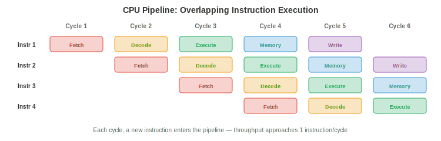
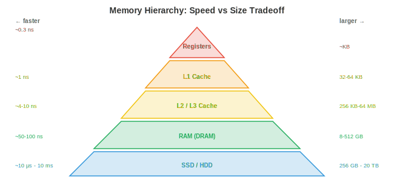

# Архитектура компьютера

*Архитектура компьютера — это то, как мы создаем машины, выполняющие инструкции. В этом файле рассматриваются системы счисления, логические вентили, проектирование CPU, архитектуры наборов команд, конвейеризация, иерархия памяти и виртуальная память — аппаратный фундамент, на котором в конечном итоге работает любая программа, фреймворк и модель ИИ.*

- Каждая нейронная сеть, каждый цикл обучения, каждый вызов инференса в конечном итоге превращается в последовательность электрических сигналов, проходящих через транзисторы. Понимание аппаратного обеспечения не является факультативным для серьезных специалистов по машинному обучению: оно объясняет, почему матричное умножение выполняется быстро, почему память является «узким местом», почему GPU доминируют в обучении ИИ и почему код, дружественный к кешу, может быть в 100 раз быстрее наивного кода.

## Системы счисления

- Компьютеры представляют всё в **двоичном виде** (основание 2): последовательности нулей и единиц. Каждая цифра — это **бит**. Группа из 8 бит составляет **байт**. Значение двоичного числа $b_{n-1} b_{n-2} \ldots b_1 b_0$ равно $\sum_{i=0}^{n-1} b_i \cdot 2^i$.

- Например, $1011_2 = 1 \cdot 8 + 0 \cdot 4 + 1 \cdot 2 + 1 \cdot 1 = 11_{10}$.

- **Шестнадцатеричная система** (основание 16) — это компактная запись двоичных данных. Каждая шестнадцатеричная цифра представляет 4 бита: $0\text{-}9$ соответствуют $0000\text{-}1001$, а $A\text{-}F$ соответствуют $1010\text{-}1111$. Таким образом, $\text{0xFF} = 1111\,1111_2 = 255_{10}$. Адреса памяти и цветовые коды обычно записываются в шестнадцатеричном виде.

- **Дополнительный код** (two's complement) используется для представления знаковых целых чисел. Для $n$-битного числа старший значащий бит имеет вес $-2^{n-1}$ вместо $+2^{n-1}$. 8-битный дополнительный код охватывает диапазон от $-128$ до $+127$. Чтобы инвертировать знак числа: инвертируйте все биты и прибавьте 1. Такое представление позволяет использовать одну и ту же аппаратную схему для сложения и вычитания, поэтому оно является универсальным.

- **Числа с плавающей запятой IEEE 754** представляют вещественные числа в виде $(-1)^s \times 1.m \times 2^{e-\text{bias}}$, где $s$ — знаковый бит, $m$ — мантисса (дробная часть), а $e$ — смещенный порядок (экспонента).


    - **float32** (одинарная точность): 1 знак + 8 экспонента + 23 мантисса = 32 бита. Диапазон: $\approx \pm 3.4 \times 10^{38}$, точность: $\approx 7$ десятичных знаков.
    - **float64** (двойная точность): 1 знак + 11 экспонента + 52 мантисса = 64 бита. Диапазон: $\approx \pm 1.8 \times 10^{308}$, точность: $\approx 15$ десятичных знаков.
    - **float16** (половинная точность): 1 + 5 + 10 = 16 бит. Ограниченный диапазон и точность, но требует вдвое меньше памяти и пропускной способности. Широко используется в обучении ИИ (смешанная точность, глава 6).
    - **bfloat16**: 1 + 8 + 7 = 16 бит. Тот же диапазон экспоненты, что и у float32, но меньшая точность. Разработан Google специально для машинного обучения: полный диапазон экспоненты предотвращает переполнение во время обучения, а сниженная точность приемлема для обновлений градиента.

- Арифметика с плавающей запятой **не является точной**. $0.1 + 0.2 \neq 0.3$ в float64 (результат равен $0.30000000000000004$). Это происходит потому, что $0.1$ не имеет точного двоичного представления, точно так же, как $1/3$ не имеет точного десятичного представления. Накопление этих ошибок в ходе миллионов операций (например, при градиентном спуске) может привести к численной нестабильности, поэтому существуют такие методы, как масштабирование потерь (глава 6) и суммирование по Кахану.

## Логические вентили

- Все вычисления сводятся к **логическим вентилям**: физическим схемам, реализующим булевы операции (пропозициональную логику из файла 1).

- Основные вентили:
    - **AND** (И): выход равен 1, только если оба входа равны 1.
    - **OR** (ИЛИ): выход равен 1, если хотя бы один вход равен 1.
    - **NOT** (НЕ, инвертор): инвертирует входной сигнал.
    - **NAND** (И-НЕ): универсальный вентиль. Любой другой вентиль можно построить только из вентилей NAND. Именно поэтому NAND является фундаментальным строительным блоком цифровых схем.
    - **XOR** (исключающее ИЛИ): выход равен 1, если входы различаются. Необходим для сложения (бит суммы при двоичном сложении — это XOR) и криптографии.

- **Полусумматор** складывает два отдельных бита, используя XOR (сумма) и AND (перенос). **Полный сумматор** складывает два бита плюс бит переноса, объединяясь в цепочку для создания $n$-битного сумматора. Именно так CPU выполняют сложение целых чисел: каскад простых логических вентилей.

- **Мультиплексор** (MUX) выбирает один из нескольких входов на основе управляющего сигнала. С $n$ управляющими битами он выбирает один из $2^n$ входов. Мультиплексоры — это аппаратный эквивалент цепочки if-else, они широко используются в путях передачи данных (datapath) CPU для маршрутизации данных.

- Современные процессоры содержат миллиарды транзисторов, каждый из которых работает как крошечный переключатель. Транзистор либо включен (проводит ток, представляя 1), либо выключен (не проводит ток, представляя 0). Вентили строятся из транзисторов, сумматоры — из вентилей, АЛУ — из сумматоров, а CPU — из АЛУ. Вся иерархия вычислений покоится на этом фундаменте.

## Архитектура CPU

- **Центральный процессор (CPU)** выполняет инструкции. Его основные компоненты:

    - **АЛУ** (Арифметико-логическое устройство): выполняет целочисленную арифметику (сложение, вычитание, умножение) и логические операции (AND, OR, XOR, сдвиг). Именно здесь происходят реальные вычисления, реализованные на описанных выше логических вентилях.

    - **Регистры**: крошечные сверхбыстрые ячейки памяти внутри CPU. Современный CPU имеет десятки регистров общего назначения, каждый из которых хранит одно слово (64 бита на 64-битном CPU). Регистры — это самая быстрая память в системе: доступ занимает ~0.3 наносекунды.

    - **Счетчик команд (PC)**: хранит адрес в памяти следующей инструкции для выполнения.

    - **Устройство управления**: декодирует инструкции и координирует путь передачи данных, сообщая АЛУ, какую операцию выполнить и какие регистры использовать.

- **Цикл выполнения инструкции** (выборка-декодирование-исполнение) повторяется миллиарды раз в секунду:

    1. **Выборка (Fetch)**: чтение инструкции из памяти по адресу, хранящемуся в PC.
    2. **Декодирование (Decode)**: определение того, что делает инструкция (сложение? загрузка из памяти? переход?) и какие операнды она использует.
    3. **Исполнение (Execute)**: выполнение операции (вычисление в АЛУ, доступ к памяти или переход).
    4. Инкремент PC (если инструкция не является переходом/прыжком).

- CPU, работающий на частоте 4 ГГц, выполняет 4 миллиарда циклов в секунду. Каждый цикл занимает 0.25 наносекунды. За это время свет проходит около 7.5 сантиметров, поэтому физический размер чипа имеет значение: сигналы не могут пересечь большой чип за один цикл.

## Архитектуры набора команд (ISA)

- **Архитектура набора команд (ISA)** — это контракт между аппаратным и программным обеспечением: она определяет инструкции, которые понимает процессор, набор регистров, модель памяти и формат кодирования.

- **CISC** (Complex Instruction Set Computer): инструкции могут быть сложными, иметь переменную длину и могут напрямую обращаться к памяти. Одна инструкция может умножить два значения из памяти и сохранить результат. **x86** (Intel/AMD) — доминирующая ISA типа CISC, на которой работают большинство настольных компьютеров и серверов. Её обратная совместимость (современные процессоры x86 до сих пор выполняют код 1980-х годов) является одновременно и её силой, и её бременем.

- **RISC** (Reduced Instruction Set Computer): инструкции простые, имеют фиксированную длину и работают только с регистрами. Доступ к памяти требует отдельных инструкций загрузки/сохранения (load/store). Более простые инструкции позволяют достичь более высоких тактовых частот и упрощают конвейеризацию.

    - **ARM**: доминирующая ISA типа RISC для мобильных устройств, а также всё чаще для серверов и ноутбуков (чипы Apple M-серии — это ARM). Энергоэффективность ARM делает её идеальной для устройств с питанием от батареи и ограниченным тепловыделением.
    - **RISC-V**: ISA типа RISC с открытым исходным кодом. Любой может разработать чип RISC-V без лицензионных отчислений. Растущее внедрение во встраиваемых системах, исследованиях и ускорителях ИИ.

- Различие между CISC и RISC стало размытым: современные процессоры x86 внутренне декодируют сложные инструкции CISC в более простые микрооперации (по сути, RISC внутри), получая преимущества обоих миров.

## Конвейеризация

- Без конвейеризации процессор полностью завершает одну инструкцию, прежде чем приступить к следующей. Это неэффективно использует оборудование: пока работает АЛУ, блоки выборки и декодирования простаивают.



- **Конвейеризация** перекрывает выполнение инструкций, подобно сборочной линии. Пока выполняется инструкция 1, инструкция 2 декодируется, а инструкция 3 выбирается из памяти. 5-стадийный конвейер (выборка, декодирование, выполнение, доступ к памяти, запись результата) может одновременно обрабатывать 5 инструкций.

- Пропускная способность приближается к одной инструкции за такт (даже если на выполнение каждой инструкции уходит 5 тактов). Это тот же принцип, что и конвейеризация в машинном обучении: параллелизм данных перекрывает вычисления и передачу данных (глава 6).

- **Конфликты (hazards)** — это ситуации, в которых конвейеризация нарушается:

    - **Конфликт по данным (data hazard)**: инструкции 2 нужен результат, который инструкция 1 еще не успела подготовить. Например, «Add R1, R2, R3» за которой следует «Sub R4, R1, R5» — второй инструкции нужен R1, который первая еще вычисляет. **Пересылка (forwarding)** (или обход) решает эту проблему путем передачи результата напрямую с одной стадии конвейера на другую, не дожидаясь стадии записи результата.

    - **Конфликт по управлению (control hazard)**: инструкция перехода (if-else) означает, что процессор не знает, какую инструкцию выбирать следующей, пока переход не будет разрешен. **Предсказание переходов (branch prediction)** угадывает направление перехода и спекулятивно выбирает инструкции вдоль предсказанного пути. Современные предсказатели имеют точность >95%, используя таблицы истории и сопоставление паттернов, подобное нейронным сетям. Ошибочное предсказание стоит примерно 15 тактов (конвейер должен быть очищен и перезапущен).

    - **Структурный конфликт (structural hazard)**: две инструкции одновременно требуют один и тот же аппаратный ресурс (например, обеим нужен порт памяти). Решается дублированием ресурсов или вставкой простоя.

## Иерархия памяти

- Фундаментальное противоречие в компьютерной памяти: быстрая память дорога и мала, дешевая память медленна и велика. **Иерархия памяти** преодолевает этот разрыв, используя **локальность**: программы склонны обращаться к одним и тем же данным повторно (временная локальность) и обращаться к данным, расположенным рядом (пространственная локальность).



- Иерархия, от самой быстрой к самой медленной:

    - **Регистры**: доступ ~0,3 нс, общий объем ~КБ. Внутри процессора.
    - **Кеш L1**: ~1 нс, 32-64 КБ на ядро. Разделен на кеш инструкций и кеш данных.
    - **Кеш L2**: ~4 нс, 256 КБ-1 МБ на ядро.
    - **Кеш L3**: ~10 нс, 8-64 МБ, общий для всех ядер.
    - **ОЗУ (DRAM)**: ~50-100 нс, 8-512 ГБ. Основная память.
    - **SSD**: ~10-100 мкс, 256 ГБ-8 ТБ. Энергонезависимое хранилище.
    - **HDD**: ~5-10 мс, 1-20 ТБ. Механический, очень медленный для произвольного доступа.

- Разрыв в скорости между регистрами и ОЗУ составляет ~300 раз. Между регистрами и диском — ~30 000 000 раз. Иерархия кешей скрывает этот разрыв: если данные, нужные процессору, находятся в кеше L1 (**попадание в кеш**), доступ происходит быстро. Если нет (**промах кеша**), процессор простаивает, пока данные извлекаются с более медленного уровня.

- **Ассоциативность кеша** определяет, где в кеше может храниться адрес памяти:
    - **Прямое отображение (direct-mapped)**: каждый адрес отображается ровно на одну строку кеша. Просто, но вызывает конфликты.
    - **Полностью ассоциативный**: любой адрес может быть где угодно. Гибко, но дорого в поиске.
    - **Множественно-ассоциативный (set-associative)** ($k$-канальный): каждый адрес отображается на набор из $k$ ячеек. Практический компромисс, используемый в реальных процессорах (обычно 4- или 8-канальный).

- **Когерентность кеша** гарантирует, что все ядра процессора видят согласованное состояние памяти. Когда ядро 1 записывает данные по адресу, который кеширован ядром 2, протокол когерентности (например, MESI) делает копию ядра 2 недействительной или обновляет её. Это критически важно для конкурентного программирования (файл 4) и является одной из причин, почему параллелизм с общей памятью сложен.

- Для специалистов по машинному обучению иерархия памяти объясняет, почему:
    - Матричные операции должны обращаться к памяти последовательно (важен порядок обхода: по строкам или по столбцам).
    - Размер батча влияет на производительность: большие батчи амортизируют задержку памяти.
    - Смешанная точность (float16/bfloat16) удваивает эффективную пропускную способность памяти, которая часто является узким местом.

## Виртуальная память

- **Виртуальная память** дает каждому процессу иллюзию наличия собственного большого непрерывного пространства памяти, даже если физическая оперативная память ограничена и разделяется между процессами.

- Адресное пространство делится на **страницы** фиксированного размера (обычно 4 КБ). **Таблица страниц** отображает номера виртуальных страниц на номера физических фреймов. Когда программа обращается к виртуальному адресу 0x1234, процессор транслирует его в физический адрес, выполняя поиск в таблице страниц.

- **TLB (Translation Lookaside Buffer)** — это кеш для записей таблицы страниц. Поскольку таблица страниц находится в оперативной памяти (что медленно), TLB хранит недавно использованные трансляции в быстродействующем аппаратном обеспечении. Промах TLB требует обхода таблицы страниц в памяти, что обходится в сотни тактов процессора.

- **Страничное исключение (page fault)** происходит, когда программа обращается к странице, которой нет в физической оперативной памяти. ОС загружает страницу с диска (свопинг), что занимает миллионы тактов. Чрезмерное количество страничных исключений (**трешинг**) катастрофически снижает производительность. Именно поэтому для обучения моделей машинного обучения требуется достаточно оперативной памяти, чтобы вместить модель, состояния оптимизатора и адекватный батч данных.

- Алгоритмы **замещения страниц** определяют, какую страницу вытеснить, когда оперативная память заполнена:
    - **LRU** (Least Recently Used): вытесняет страницу, к которой дольше всего не было обращений. На практике оптимален для большинства рабочих нагрузок. Аппаратно аппроксимируется с помощью **алгоритма часов** (циклический список с битами обращения).
    - **FIFO**: вытесняет самую старую страницу. Прост, но может вытеснить часто используемые страницы.
    - **Оптимальный** (алгоритм Белади): вытесняет страницу, которая не будет использоваться дольше всего. Невозможно реализовать (требует знания будущего), но полезен как теоретический эталон.

- Виртуальная память также обеспечивает **изоляцию**: каждый процесс имеет собственное виртуальное адресное пространство. Ошибка в одном процессе не может повредить память другого процесса, так как их виртуальные адреса отображаются на разные физические фреймы. Это основа безопасности и стабильности ОС.

## Ввод-вывод, прерывания и DMA

- Процессору необходимо взаимодействовать с внешним миром: дисками, сетевыми картами, клавиатурами, GPU. Это **подсистема ввода-вывода**.

- **Программный ввод-вывод** (опрос/polling): процессор циклически проверяет регистр состояния устройства в цикле, ожидая готовности данных. Это просто, но тратит такты процессора на «вращение» вместо выполнения полезной работы.

- **Ввод-вывод по прерываниям**: устройство посылает аппаратное **прерывание**, когда данные готовы. Процессор продолжает нормальное выполнение до тех пор, пока не поступит прерывание, после чего запускает **обработчик прерывания** (функцию ядра) для обработки данных. Это гораздо эффективнее опроса, так как процессор не простаивает в ожидании.

- Механизм прерываний:
    1. Устройство сигнализирует о прерывании через аппаратную линию.
    2. Процессор завершает текущую инструкцию, сохраняет текущее состояние (регистры, счетчик команд) в стеке.
    3. Процессор ищет адрес обработчика прерывания в **таблице векторов прерываний** (таблица указателей на функции, по одной на каждый тип прерывания).
    4. Обработчик выполняется в режиме ядра, обрабатывает ввод-вывод и возвращает управление.
    5. Процессор восстанавливает сохраненное состояние и возобновляет прерванную программу.

- Это тот же шаблон сохранения/восстановления, что и при переключении контекста (файл 3), но инициируемый аппаратным обеспечением, а не таймером.

- **DMA** (Direct Memory Access, прямой доступ к памяти): для передачи больших объемов данных (чтение с диска, сетевые пакеты, копирование памяти GPU) копирование данных процессором побайтово неэффективно. **Контроллер DMA** передает данные напрямую между устройством и оперативной памятью без участия процессора. Процессор настраивает передачу (источник, назначение, размер), контроллер DMA выполняет её, а процессор получает прерывание по завершении.

- DMA критически важен для машинного обучения: когда вы вызываете `model.to('cuda')`, данные передаются из системной оперативной памяти в память GPU через DMA по шине PCIe. Во время обучения синхронизация градиентов между GPU использует RDMA (Remote DMA) на базе DMA для высокоскоростной передачи с низкой задержкой (глава 6).

- **Шина** соединяет процессор с памятью и устройствами ввода-вывода. Современные системы используют **PCIe** (Peripheral Component Interconnect Express) для высокоскоростных устройств (GPU, NVMe SSD, сетевые карты). PCIe 4.0 обеспечивает ~32 ГБ/с на слот x16; PCIe 5.0 удваивает этот показатель. Пропускная способность шины часто является узким местом при обучении на GPU: GPU может вычислять быстрее, чем данные поступают на него.

- **MMIO** (Memory-Mapped I/O, ввод-вывод с отображением в память): регистры устройств отображаются на адреса памяти. Процессор читает и пишет по этим адресам, используя обычные инструкции загрузки/сохранения, а аппаратное обеспечение направляет доступ к устройству вместо оперативной памяти. Это объединяет доступ к памяти и вводу-выводу в единый механизм, упрощая как аппаратное, так и программное обеспечение.

## Задачи по программированию (используйте CoLab или ноутбук)

1. Изучите представление чисел с плавающей запятой IEEE 754. Преобразуйте число с плавающей запятой в его двоичное представление и рассмотрите поля знака, экспоненты и мантиссы.
```python
import struct

def float_to_bits(f):
    """Show the IEEE 754 binary representation of a float32."""
    packed = struct.pack('>f', f)
    bits = ''.join(f'{byte:08b}' for byte in packed)
    sign = bits[0]
    exponent = bits[1:9]
    mantissa = bits[9:]
    return sign, exponent, mantissa

for val in [1.0, -1.0, 0.1, 0.5, 3.14, float('inf'), float('nan')]:
    s, e, m = float_to_bits(val)
    print(f"{val:>10}  sign={s}  exp={e} ({int(e, 2) - 127:>4d})  mantissa={m[:10]}...")
```

2. Смоделируйте кеш с прямым отображением. Отслеживайте попадания и промахи для последовательности обращений к памяти.
```python
def simulate_cache(accesses, cache_size=8, block_size=1):
    """Simulate a direct-mapped cache."""
    cache = [None] * cache_size
    hits, misses = 0, 0

    for addr in accesses:
        cache_line = addr % cache_size
        if cache[cache_line] == addr:
            hits += 1
            status = "HIT "
        else:
            misses += 1
            cache[cache_line] = addr
            status = "MISS"
        print(f"  Access {addr:3d} → line {cache_line}: {status}")

    print(f"\nHits: {hits}, Misses: {misses}, Hit rate: {hits/(hits+misses):.1%}")

# Sequential access (good locality)
print("Sequential access:")
simulate_cache([0, 1, 2, 3, 4, 5, 6, 7, 0, 1, 2, 3])

# Strided access (conflict misses)
print("\nStrided access (stride = cache size):")
simulate_cache([0, 8, 0, 8, 0, 8])
```

3. Продемонстрируйте, почему арифметические операции с плавающей запятой не обладают свойством ассоциативности. Покажите случаи, где $(a + b) + c \neq a + (b + c)$.
```python
import jax.numpy as jnp

a = jnp.float32(1e8)
b = jnp.float32(1.0)
c = jnp.float32(-1e8)

left = (a + b) + c   # (1e8 + 1) + (-1e8)
right = a + (b + c)  # 1e8 + (1 + (-1e8))

print(f"(a + b) + c = {left}")   # should be 1.0
print(f"a + (b + c) = {right}")  # might lose the 1.0
print(f"Equal: {left == right}")
print(f"\nThe 1.0 is lost when added to 1e8 because float32 has only ~7 digits of precision")
```
