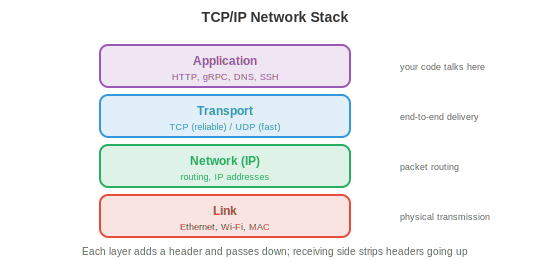
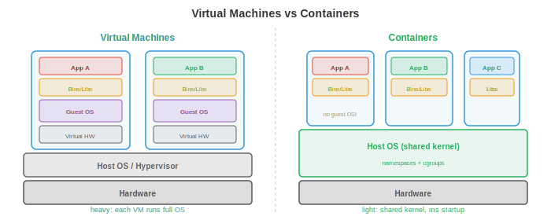

# Операционные системы

*Операционная система — это программный слой между оборудованием и приложениями, который управляет ресурсами, предоставляет абстракции и обеспечивает изоляцию. В этом файле рассматриваются функции ОС, процессы, потоки, планирование CPU, управление памятью, файловые системы и системные вызовы.*

- Компьютер без операционной системы подобен кухне без шеф-повара: ингредиенты (оборудование) есть, но некому координировать, кто пользуется плитой, куда ставить посуду или как сделать так, чтобы два человека не схватились за один и тот же нож. **ОС** и есть этот координатор.

- Для специалистов в области машинного обучения концепции ОС объясняют: почему `nvidia-smi` показывает использование памяти GPU для каждого процесса, почему обучение прерывается с ошибкой "out of memory", почему `fork()` дублирует ваш Python-процесс и почему Docker-контейнеры предоставляют изолированные среды.

## Что делает операционная система

- У ОС есть три основные обязанности:

    - **Абстракция**: скрытие сложности оборудования за понятными интерфейсами. Программы читают и записывают «файлы», не зная, является ли базовое хранилище SSD, HDD или сетевым диском. Они выделяют «память», не управляя физическими чипами RAM. Они работают на «CPU», не беспокоясь о прерываниях и когерентности кеша.

    - **Управление ресурсами**: несколько программ совместно используют CPU, память, диск и сеть. ОС решает, кто, что, когда и как долго получает. Стратегия справедливого и эффективного распределения поддерживает отзывчивость системы.

    - **Изоляция и защита**: программы не должны мешать друг другу. Ошибка в веб-браузере не должна приводить к сбою ядра. Вредоносная программа не должна иметь возможности прочитать пароли другой программы. ОС обеспечивает границы, используя аппаратную поддержку (уровни привилегий, виртуальную память).

## Процессы

- **Процесс** — это запущенная программа. Это фундаментальная единица работы в ОС. Каждый процесс имеет:

    - **Код** (инструкции программы, только для чтения).
    - **Данные** (глобальные переменные, выделения в куче).
    - **Стек** (фреймы вызовов функций, локальные переменные).
    - **Состояние** (значения регистров, счетчик команд, открытые файлы и т. д.).

- **Блок управления процессом (PCB)** — это структура данных ОС для отслеживания процесса. В нем хранятся идентификатор процесса (PID), состояние, счетчик команд, содержимое регистров, карты памяти, дескрипторы открытых файлов и приоритет планирования. Когда ОС переключается с одного процесса на другой, она сохраняет состояние текущего процесса в его PCB и загружает состояние следующего процесса. Это называется **переключением контекста**.

- Переключение контекста — затратная операция: сохранение и восстановление регистров, очистка кешей и инвалидация записей TLB занимают микросекунды. В системе, где запущены тысячи процессов, накладные расходы могут быть значительными. Именно поэтому серверные архитектуры «процесс на запрос» (как в старом Apache) были заменены архитектурами на основе потоков или событийными архитектурами.

- **Создание процесса** в Unix использует `fork()` и `exec()`:

    - `fork()` создает **копию** текущего процесса. Дочерний процесс получает дубликат памяти, дескрипторов файлов и состояния родителя. Оба процесса продолжают выполнение с одной и той же точки, но `fork()` возвращает 0 в дочернем процессе и PID дочернего процесса в родительском.

    - `exec()` заменяет код текущего процесса новой программой. После `fork()` дочерний процесс обычно вызывает `exec()` для запуска другой программы.

    - Эта модель «fork-then-exec» элегантна: создание нового процесса (fork) и загрузка новой программы (exec) — это отдельные операции, которые можно настраивать независимо. Между fork и exec дочерний процесс может перенаправить ввод-вывод, изменить переменные окружения или сбросить привилегии.


- **Состояния процесса**: процесс находится в одном из нескольких состояний:
    - **Выполняется (Running)**: в данный момент исполняется на ядре CPU.
    - **Готов (Ready)**: ожидает ядро CPU (готов к запуску, но еще не запланирован).
    - **Заблокирован (Blocked)** (ожидание): не может продолжать работу, пока не произойдет какое-либо событие (завершение ввода-вывода, получение блокировки, истечение таймера).
    - **Завершен (Terminated)**: закончил выполнение, ожидает, пока родитель заберет его статус выхода.

## Потоки

- **Поток** — это легковесная единица исполнения внутри процесса. Все потоки в процессе совместно используют один и тот же код, данные и кучу, но каждый имеет свой собственный стек и состояние регистров.

- Преимущество перед несколькими процессами: потоки совместно используют память, поэтому обмен данными между ними происходит быстро (достаточно просто читать/записывать общие переменные). Процессы требуют межпроцессного взаимодействия (каналы, сокеты, отображения общей памяти), что медленнее и сложнее.

- Недостаток: общая память опасна. Два потока, одновременно записывающие данные в одну и ту же переменную, вызывают **состояние гонки** (результат зависит от того, какой поток выполнится первым). Это подводит нас к синхронизации, рассматриваемой в файле 4.

- **Потоки ядра** управляются планировщиком ОС. Каждый поток независимо планируется на ядрах CPU. Создание и переключение потоков ядра требует системных вызовов с накладными расходами, аналогичными (но меньшими), чем при переключении контекста процесса.

- **Пользовательские потоки** (зеленые потоки) управляются библиотекой времени выполнения в пространстве пользователя и невидимы для ОС. Их дешевле создавать и переключать (системный вызов не требуется), но блокирующая операция одного пользовательского потока блокирует все потоки в процессе (потому что ОС видит только один поток ядра).

- Современные системы используют **гибридные модели**: множество пользовательских потоков отображаются на меньшее количество потоков ядра (M:N потоковая модель). Горутины в Go и процессы в Erlang — это потоки пользовательского уровня, планируемые средой выполнения языка на потоки ОС.

- **Пулы потоков** заранее создают фиксированное количество потоков, которые ожидают задач. Когда задача поступает, она назначается простаивающему потоку. Это позволяет избежать накладных расходов на создание и уничтожение потоков для каждой задачи. Веб-серверы, движки баз данных и серверы инференса ML используют пулы потоков.

## Планирование CPU

- **Планировщик** решает, какой процесс/поток будет выполняться на каком ядре CPU в каждый момент времени. Цели: максимизация использования CPU, минимизация времени отклика (для интерактивных задач), максимизация пропускной способности (для пакетных задач) и обеспечение справедливости.

- **First Come First Served (FCFS)**: процессы выполняются в порядке поступления. Простой алгоритм, но подвержен **эффекту конвоя** (convoy effect): длительный процесс блокирует все более короткие, стоящие за ним в очереди.

- **Shortest Job First (SJF)**: сначала выполняется самый короткий процесс. Доказано, что этот алгоритм минимизирует среднее время ожидания, но требует знания длительности задач заранее (что в общем случае невозможно). Вытесняющая версия, **Shortest Remaining Time First (SRTF)**, прерывает выполняемую задачу, если поступает более короткая.

- **Round Robin (RR)**: каждому процессу выделяется фиксированный **квант времени** (например, 10 мс), после чего он вытесняется и перемещается в конец очереди. Справедливый и отзывчивый алгоритм, но выбор кванта времени критичен: слишком малый квант приводит к избыточному переключению контекста, слишком большой — вырождается в FCFS.

- **Планирование по приоритетам**: каждому процессу присваивается приоритет. Процессы с более высоким приоритетом выполняются первыми. Опасность заключается в **голодании** (starvation): низкоприоритетные процессы могут никогда не выполниться, если постоянно поступают высокоприоритетные задачи. **Старение** (aging) решает эту проблему: приоритет процесса увеличивается по мере того, как он дольше ожидает выполнения.

- **Многоуровневые очереди с обратной связью (MLFQ)**: несколько очередей с разными приоритетами и квантами времени. Новые процессы попадают в очередь с наивысшим приоритетом (короткий квант). Если процесс использует весь свой квант (процессорно-ориентированный), он понижается в очереди с более низким приоритетом (более длинный квант). Интерактивные процессы естественным образом остаются в очередях с высоким приоритетом (они блокируются для ввода-вывода до того, как исчерпают свой квант). Это позволяет адаптироваться к нагрузке без необходимости заранее знать тип задач.

- **Completely Fair Scheduler (CFS)**: планировщик Linux. Он поддерживает красно-черное дерево (сбалансированное бинарное дерево поиска) процессов, отсортированных по «виртуальному времени выполнения» — количеству процессорного времени, которое они потребили. Следующим выполняется процесс с наименьшим виртуальным временем выполнения. Это гарантирует, что со временем каждый процесс получает свою справедливую долю ресурсов. CFS работает с временной сложностью $O(\log n)$ для принятия решения о планировании.

## Управление памятью

- ОС управляет физической оперативной памятью (RAM), распределяя её между процессами и освобождая, когда она больше не нужна.

- **Страничная организация памяти (Paging)** (из файла 2) делит виртуальную память на страницы фиксированного размера, а физическую память — на кадры. Таблица страниц отображает страницы на кадры. Страничная организация устраняет внешнюю фрагментацию (потеря пространства между выделенными блоками), так как все страницы имеют одинаковый размер.

- **Страничная организация по требованию (Demand paging)** загружает страницы в RAM только при первом обращении к ним (а не при запуске процесса). Это экономит память: программа с кодом размером 1 ГБ может использовать лишь 50 МБ во время типичного запуска. Остальная часть никогда не загружается.

- Когда RAM заполнена и требуется новая страница, ОС должна **вытеснить** существующую страницу. Алгоритмы **замещения страниц** (LRU, FIFO, clock, из файла 2) решают, какую страницу вытеснить. Хорошее замещение минимизирует количество страничных ошибок; плохое замещение приводит к трэшингу (thrashing).

- **Сегментная организация памяти (Segmentation)** делит память на сегменты переменного размера (код, данные, стек, куча), каждый из которых имеет свой базовый адрес и длину. Сегменты обеспечивают логическую организацию, в то время как страничная организация обеспечивает физическое управление. Современные системы используют сегментацию минимально (в основном для защиты) и полагаются на страничную организацию для управления памятью.

- **Куча (heap)** — это область, где находится динамически выделяемая память (`malloc`/`free` в C, `new` в Java, неявно в Python). ОС предоставляет процессу большие блоки памяти, а **аллокатор памяти** (например, `glibc malloc`, `jemalloc`, `tcmalloc`) разбивает эти блоки на более мелкие выделения. Проектирование аллокатора влияет на производительность: фрагментация тратит пространство, а конкуренция между потоками тратит время.

## Файловые системы

- **Файловая система** организует данные на постоянном хранилище (SSD, HDD) в виде иерархии именованных файлов и директорий.

- **Инод (inode)** (индексный дескриптор) хранит метаданные файла: размер, владельца, права доступа, временные метки и указатели на блоки данных на диске. Имя файла хранится в директории, которая сопоставляет имена с номерами инодов. Такое разделение означает, что файл может иметь несколько имен (**жесткие ссылки**), указывающих на один и тот же инод.

- **FAT** (File Allocation Table): простая файловая система, используемая на USB-накопителях и SD-картах. Таблица сопоставляет каждый кластер (блок) со следующим кластером в файле, формируя связный список. Проста, но не поддерживает права доступа, журналирование или работу с большими файлами должным образом.

- **ext4**: файловая система по умолчанию в Linux. Использует иноды с прямыми, косвенными, дважды косвенными и трижды косвенными указателями на блоки для работы с файлами любого размера. Поддерживает **экстенты** (непрерывные диапазоны блоков) для эффективности при работе с большими файлами. Максимальный размер файла: 16 ТБ, максимальный размер раздела: 1 ЭБ.

- **Журналирование** защищает от повреждений при сбоях. Перед изменением структур файловой системы изменения записываются в **журнал** (log). Если система дает сбой в процессе операции, журнал воспроизводится при перезагрузке, чтобы завершить или отменить операцию. Без журналирования сбой во время записи может оставить файловую систему в несогласованном состоянии (блоки данных файла обновлены, а его инод — нет, или наоборот).

- **Файловые системы на основе B-деревьев** (Btrfs, ZFS) используют B-деревья (сбалансированные деревья поиска) для организации данных и метаданных, обеспечивая эффективный поиск, снимки состояния (snapshots) с копированием при записи (copy-on-write) и встроенные контрольные суммы для целостности данных. Это те же самые B-деревья, что используются в индексах баз данных.

## Системные вызовы и режим ядра

- **Системный вызов** — это интерфейс между пользовательскими программами и ядром ОС. Когда программе нужно выполнить привилегированное действие (прочитать файл, выделить память, создать процесс, отправить сетевой пакет), она делает системный вызов.

- Процессор работает в двух режимах:
    - **Пользовательский режим (User mode)**: ограниченный. Программы могут выполнять свой код и обращаться к своей памяти, но не могут напрямую обращаться к оборудованию, памяти других процессов или структурам данных ОС.
    - **Режим ядра (Kernel mode)**: неограниченный. Ядро ОС может обращаться ко всему оборудованию и памяти. Системные вызовы являются контролируемым шлюзом из пользовательского режима в режим ядра.

- Когда программа вызывает `read()`, происходит следующее:
    1. Программа помещает аргументы в регистры и инициирует **ловушку (trap)** (программное прерывание).
    2. Процессор переключается в режим ядра и переходит к обработчику системных вызовов.
    3. Ядро проверяет аргументы, выполняет операцию ввода-вывода и копирует данные в буфер пользователя.
    4. Ядро переключается обратно в пользовательский режим и возвращает результат.

- Распространенные системные вызовы: `open`, `read`, `write`, `close` (файлы), `fork`, `exec`, `wait`, `exit` (процессы), `mmap`, `brk` (память), `socket`, `bind`, `listen`, `accept` (сети).

- **Прерывания** — это аппаратные сигналы, которые заставляют CPU временно приостановить текущую задачу и выполнить обработчик прерывания (в ядре). Нажатие клавиши, приход сетевого пакета или сигнал таймера — всё это генерирует прерывания. Таймерное прерывание особенно важно: именно оно позволяет ОС вытеснять выполняющийся процесс и переключаться на другой (вытесняющая многозадачность).

## Основы работы сетей

- Сетевой стек — это подсистема ОС, обеспечивающая связь между машинами. Понимание его работы объясняет, как распределенное обучение синхронизирует градиенты, как инференс моделей обрабатывает запросы и почему важна задержка.



- **Модель TCP/IP** организует работу сети по уровням, каждый из которых предоставляет абстракцию для вышележащего уровня:

    - **Уровень канала (Link layer)**: управляет обменом данными через отдельный физический канал (Ethernet, Wi-Fi). Работает с MAC-адресами и кадрами.
    - **Сетевой уровень (IP)**: маршрутизирует пакеты через несколько сетей от источника к получателю. Каждая машина имеет **IP-адрес** (например, 192.168.1.1 для IPv4 или 128-битный адрес IPv6). Маршрутизаторы пересылают пакеты пошагово, основываясь на IP-адресе назначения.
    - **Транспортный уровень (TCP/UDP)**: обеспечивает сквозную связь между приложениями.
    - **Прикладной уровень**: протоколы вроде HTTP, DNS, gRPC, которые приложения используют напрямую.

- **TCP** (Transmission Control Protocol) обеспечивает надежную доставку в заданном порядке. Он устанавливает соединение (трехстороннее рукопожатие: SYN, SYN-ACK, ACK), гарантирует, что все данные приходят в нужном порядке (используя порядковые номера и подтверждения), повторно передает потерянные пакеты и контролирует скорость отправки, чтобы не перегружать сеть (**управление перегрузками**). Платой за это является задержка: рукопожатие добавляет один цикл обмена данными, а повторные передачи увеличивают время ожидания.

- **UDP** (User Datagram Protocol) обеспечивает ненадежную доставку без гарантии порядка. Нет рукопожатия, нет повторных передач, нет гарантии порядка. Задержка значительно ниже, чем у TCP. Используется там, где скорость важнее надежности: потоковое видео, онлайн-игры, DNS-запросы. В машинном обучении некоторые протоколы синхронизации градиентов используют RDMA на базе UDP для снижения задержки.

- **Сокеты** — это API ОС для сетевого взаимодействия. **Сокет** — это конечная точка, идентифицируемая парой (IP-адрес, номер порта). Сервер создает сокет, привязывает его к порту (например, 80 для HTTP), ожидает соединений и принимает их. Клиент создает сокет и подключается к адресу:порту сервера. После этого данные читаются и записываются через сокет точно так же, как из файла.

- **DNS** (Domain Name System) преобразует понятные человеку имена (google.com) в IP-адреса (142.250.80.46). Это распределенная иерархическая база данных: ваша машина обращается к локальному резолверу, который опрашивает корневые серверы, а те делегируют запрос авторитетным серверам конкретного домена.

- **HTTP** (HyperText Transfer Protocol) — это протокол «запрос-ответ» в интернете. Клиент отправляет запрос (метод + URL + заголовки + опциональное тело), а сервер отправляет ответ (код состояния + заголовки + тело). Инференс моделей (например, TensorFlow Serving, Triton) предоставляет модели через HTTP или gRPC-эндпоинты.

- **Задержка против пропускной способности**: задержка — это время, необходимое одному пакету для прохождения пути от источника до получателя (определяется физическим расстоянием и количеством сетевых узлов). Пропускная способность — это скорость передачи данных (сколько байт в секунду). Соединение с высокой пропускной способностью, но высокой задержкой (спутниковый интернет) может передавать много данных, но каждый байт будет идти долго. Для распределенного обучения **задержка** важна при барьерах синхронизации (все GPU должны ждать самого медленного), тогда как **пропускная способность** важна для передачи больших тензоров градиентов (глава 6).

## Виртуализация и контейнеры

- **Виртуализация** позволяет запускать несколько операционных систем на одной физической машине. **Гипервизор** (VMware, KVM, Xen) создает **виртуальные машины (VM)**, каждая из которых имеет собственный виртуальный CPU, память, диск и сетевой интерфейс. Каждая VM запускает полноценную ОС (гостевую ОС), которая «считает», что обладает выделенным оборудованием.

- Виртуальные машины обеспечивают строгую изоляцию (сбой одной VM не влияет на другие) и гибкость (запуск Linux и Windows на одной машине, миграция VM между физическими хостами). Платой за это являются накладные расходы: каждая VM запускает полное ядро ОС, потребляя память и CPU на операции ОС, которые дублируют функции хостовой ОС.



- **Контейнеры** (Docker, Podman) предоставляют более легковесную альтернативу. Вместо виртуализации всего оборудования контейнеры используют общее ядро хостовой ОС и задействуют функции ядра для изоляции процессов:

    - **Пространства имен (Namespaces)** изолируют то, что «видит» процесс: каждый контейнер получает собственное представление дерева процессов (PID namespace), сетевых интерфейсов (network namespace), точек монтирования файловой системы (mount namespace) и имени хоста (UTS namespace). Процесс внутри контейнера не может видеть процессы в других контейнерах.

    - **Cgroups** (control groups) ограничивают ресурсы, которые может использовать процесс: время CPU, память, дисковый ввод-вывод, пропускную способность сети. Контейнер не может потреблять больше ресурсов, чем разрешено его cgroup, что предотвращает ситуацию, когда один контейнер «отнимает» ресурсы у других.

- Контейнеры запускаются за миллисекунды (нет загрузки ОС), имеют минимальные накладные расходы (общее ядро) и описываются с помощью **Dockerfile**, который определяет базовый образ, зависимости и команды. Это делает их воспроизводимыми: `docker build` создает одинаковую среду в любом месте.

- В машинном обучении контейнеры решают проблему «на моей машине работает». Среда обучения с конкретными версиями CUDA, cuDNN, PyTorch и Python упаковывается в образ контейнера. Любой может воспроизвести точную среду на любой машине. Облачные платформы для обучения (AWS SageMaker, GCP Vertex AI) запускают задачи обучения в контейнерах.

- **Kubernetes** (K8s) оркестрирует контейнеры в масштабе: он планирует размещение контейнеров на кластере машин, перезапускает упавшие контейнеры, масштабирует их количество в зависимости от нагрузки и управляет сетью между контейнерами. Крупномасштабный инференс моделей (тысячи реплик моделей, обрабатывающих миллионы запросов) работает на Kubernetes.

## Основы безопасности

- ОС обеспечивает безопасность с помощью нескольких механизмов:

- **Права доступа**: у каждого файла есть владелец, группа и биты прав доступа (чтение/запись/выполнение для владельца, группы и остальных). Процесс выполняется с идентификатором (UID) пользователя, который его запустил, и может обращаться только к тем файлам, которые разрешают биты прав доступа. Пользователь **root** (UID 0) обходит все проверки прав доступа, поэтому запуск от имени root опасен.

- **Разделение привилегий**: процессы выполняются с минимально необходимыми привилегиями. Веб-серверу не нужен доступ root; он должен запускаться от имени ограниченного пользователя, который может только читать веб-файлы и привязываться к порту 80. Если сервер будет скомпрометирован, доступ злоумышленника будет ограничен тем, что может делать этот ограниченный пользователь.

- **Песочница (Sandboxing)**: ограничение действий процесса сверх прав доступа к файлам. **seccomp** (Linux) ограничивает системные вызовы, которые может делать процесс. **AppArmor** и **SELinux** определяют политики принудительного контроля доступа. Контейнеры объединяют пространства имен (namespaces), cgroups и seccomp для многоуровневой изоляции.

- **Рандомизация размещения адресного пространства (ASLR)**: рандомизация расположения стека, кучи и библиотек в памяти при каждом запуске программы. Это затрудняет использование злоумышленниками ошибок повреждения памяти (переполнение буфера), поскольку они не могут предсказать, где в памяти будут находиться код или данные.

- Безопасность — это задача системного уровня: цепь прочна настолько, насколько прочно её самое слабое звено. Система инференса моделей требует безопасной сетевой передачи данных (TLS/HTTPS), аутентифицированного доступа к API (API-ключи, OAuth), валидации входных данных (предотвращение состязательных входных данных) и изолированного выполнения (контейнеры с минимальными привилегиями).

## Задачи по программированию (используйте CoLab или ноутбук)

1. Исследуйте создание процессов. Используйте `os.fork()` в Python (только для Unix), чтобы создать дочерний процесс, и убедитесь, что и родительский, и дочерний процессы продолжают выполнение с одной и той же точки.
```python
import os

pid = os.fork()

if pid == 0:
    # Child process
    print(f"Child: my PID is {os.getpid()}, parent PID is {os.getppid()}")
else:
    # Parent process
    print(f"Parent: my PID is {os.getpid()}, child PID is {pid}")
    os.wait()  # wait for child to finish
```

2. Смоделируйте планирование по алгоритму карусели (round-robin). Для заданного списка процессов с временем выполнения смоделируйте планирование и вычислите среднее время ожидания.
```python
def round_robin(processes, quantum=3):
    """Simulate round-robin scheduling.
    processes: list of (name, burst_time) tuples.
    """
    queue = [(name, burst, 0) for name, burst in processes]  # (name, remaining, wait)
    time = 0
    log = []

    while queue:
        name, remaining, waited = queue.pop(0)
        waited += (time - waited - (processes[[p[0] for p in processes].index(name)][1] - remaining))
        run_time = min(quantum, remaining)
        log.append(f"  t={time:3d}: {name} runs for {run_time} (remaining: {remaining - run_time})")
        time += run_time
        remaining -= run_time

        if remaining > 0:
            queue.append((name, remaining, time))
        else:
            log.append(f"  t={time:3d}: {name} DONE (turnaround: {time})")

    for line in log:
        print(line)

print("Round Robin (quantum=3):")
round_robin([("P1", 10), ("P2", 4), ("P3", 6)], quantum=3)
```

3. Смоделируйте замещение страниц с помощью алгоритма LRU. Для заданной последовательности обращений к страницам и фиксированного количества кадров подсчитайте количество страничных ошибок (page faults).
```python
def lru_page_replacement(pages, n_frames):
    """Simulate LRU page replacement."""
    frames = []
    faults = 0

    for page in pages:
        if page in frames:
            frames.remove(page)
            frames.append(page)  # move to most recently used
            status = "HIT "
        else:
            faults += 1
            if len(frames) >= n_frames:
                evicted = frames.pop(0)  # remove least recently used
                status = f"MISS (evict {evicted})"
            else:
                status = "MISS (cold)"
            frames.append(page)
        print(f"  Page {page}: {status}  frames={frames}")

    print(f"\nTotal faults: {faults}/{len(pages)} ({faults/len(pages):.0%})")

print("LRU with 3 frames:")
lru_page_replacement([1, 2, 3, 4, 1, 2, 5, 1, 2, 3, 4, 5], n_frames=3)
```
