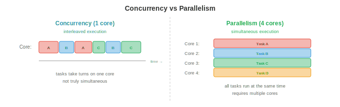
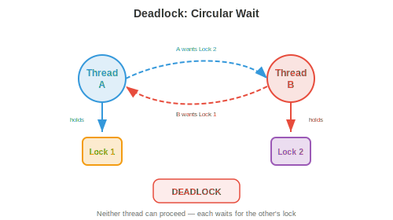
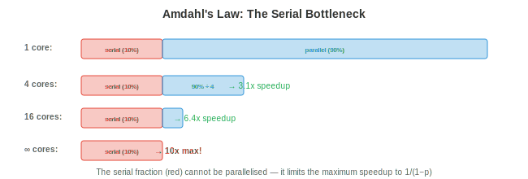

# 并发与并行

*并发与并行是程序同时处理多件事的方式。本文件涵盖并发与并行的区别、同步原语、经典并发问题、deadlock、无锁数据结构、并行编程模型、异步编程和扩展定律，这些概念是多线程服务器、分布式训练以及每个现代应用的基础。*

- 单个 CPU 核一次执行一条指令。但现代系统有 8、64 甚至数千个核（GPU）。即便在单核上，我们也想同时处理多个任务：一边下载文件、一边渲染 UI、一边处理用户输入。**concurrency（并发）**和**parallelism（并行）**是管理多种活动的两种策略。

## 并发 vs 并行



- **concurrency** 关注的是*管理*多个任务。任务通过交错取得进展：任务 A 运行一会儿，然后任务 B，再回到 A。在单核上，concurrency 创造同时执行的错觉。任务并非真正同时；它们轮流执行。

- **parallelism** 关注的是*同时执行*多个任务。有 $n$ 个核时，$n$ 个任务可以真正同时运行。parallelism 需要多个硬件执行单元。

- 打个比方：concurrency 是一位厨师在切菜和搅锅之间来回切换。parallelism 是两位厨师，各自同时做一件事。一个系统可以是并发的但非并行的（单核、交错任务），可以是并行的但非并发的（多核运行互不交互的独立程序），也可以两者兼具（多核运行相互交互的交错任务）。

- 在 ML 中，concurrency 出现在数据加载中（让数据预处理与 GPU 计算重叠），而 parallelism 出现在分布式训练中（多个 GPU 同时计算梯度，第 6 章）。

## 同步原语

- 当多个 thread 共享数据时，**同步**防止竞态条件。当结果取决于 thread 执行的不可预测顺序时，就发生竞态条件。

- 考虑两个 thread 都在自增一个共享计数器：`counter += 1`。这实际上是三个操作：(1) 读 counter，(2) 加 1，(3) 写 counter。如果两个 thread 都读到同一个值（比如 5），都加 1，都写 6，计数器最终是 6 而不是正确的 7。一次自增丢失了。

- **mutex（互斥锁）**保证同一时刻只有一个 thread 访问临界区。一个 thread 在进入临界区前**获取**锁，退出后**释放**它。任何其他试图获取已被持有锁的 thread 会阻塞，直到锁被释放。

```
lock.acquire()
counter += 1      # only one thread at a time here
lock.release()
```

- mutex 正确但引入**争用**：如果许多 thread 竞争同一把锁，它们把时间花在等待而非计算上。这限制了可扩展性。极端情形下，所有 thread 都想要同一把锁，会把整个程序串行化。

- **semaphore（信号量）**推广了 mutex。一个计数 semaphore 维护一个计数器：`wait()` 递减计数器（如果会变负则阻塞），`signal()` 递增它。初始化为 1 的 semaphore 行为像 mutex。初始化为 $n$ 的 semaphore 允许最多 $n$ 个 thread 同时进入临界区（对数据库连接这类资源池有用）。

- **条件变量**让一个 thread 等到某个特定条件满足。该 thread 释放锁，在条件变量上等待，当另一个 thread 发信号通知该条件时被唤醒。这避免了忙等（在循环中反复检查条件，浪费 CPU）。

- **管程**把 mutex、条件变量和共享数据打包成单一抽象。Java 的 `synchronized` 关键字和 Python 的 `threading.Condition` 实现了类似管程的语义。

- **读写锁**区分读者（可以共享访问，因为读不修改数据）和写者（需要独占访问）。多个读者可以同时持有锁，但一个写者会阻塞所有读者和其他写者。当读远多于写时（例如一个提供预测的 cache 模型），这是最优的。

## 经典并发问题

- **生产者-消费者**（有界缓冲区）：生产者生成数据项放入定长缓冲区；消费者取走数据项。挑战在于：缓冲区满时生产者必须等待，空时消费者必须等待，且两者都必须避免损坏缓冲区。

- 解法使用两个 semaphore（一个计数空槽，一个计数满槽）加上一个用于缓冲区本身的 mutex。这是大多数消息队列、日志系统和数据流水线背后的模式。

- **读者-写者**：多个读者可以同时读，但写者需要独占访问。挑战在于公平性：如果读者不断到来，写者可能饥饿（永远得不到访问）。解法要么优先读者，要么优先写者，要么公平交替。

- **就餐哲学家**：五位哲学家围坐一桌，中间有五把叉子。每人需要两把叉子才能进餐。如果五人同时拿起左边的叉子，没人能拿起右边的叉子，所有人都饥饿（deadlock）。解法包括：原子地拿起两把叉子、引入不对称性（某位哲学家先拿右边的叉子）、或使用服务员（一个 semaphore 把就餐人数限制为 4）。

## 死锁

- **deadlock**在一组 thread 中每个都在等待该组中另一个 thread 持有的资源时发生，形成依赖环。谁都无法继续。



- deadlock 的四个**必要条件**（必须同时成立）：

    1. **互斥**：资源只能由一个 thread 持有。
    2. **占有并等待**：一个 thread 持有一个资源的同时等待另一个。
    3. **不可抢占**：资源不能从 thread 处被强行夺走。
    4. **循环等待**：等待图中存在环。

- **死锁预防**打破四个条件之一：
    - 消除循环等待：对资源施加全序。所有 thread 按相同顺序获取资源。如果每个 thread 总是先获取锁 A 再获取锁 B，环就不可能形成。
    - 消除占有并等待：要求 thread 一次性（原子地）请求所有资源。

- **死锁避免**动态地决定授予一个资源请求是否会导致 deadlock。**银行家算法**维护每个 thread 的最大可能需求，只授予那些使系统留在“安全状态”（所有 thread 最终都能完成的状态）的请求。该算法每次请求耗时 $O(n^2 m)$（$n$ 个 thread，$m$ 种资源类型），对大多数真实系统而言太昂贵。

- **死锁检测**让 deadlock 发生，然后检测它们（通过在等待图中找环）并恢复（杀死一个 thread 或回滚一个事务）。

- 在实践中，大多数系统对常见情形使用预防（资源排序），对罕见情形使用检测。数据库系统是经典例子：它检测事务之间的 deadlock 并中止其中一个来打破环。

## 无锁与无等待数据结构

- 锁引入争用、优先级反转和 deadlock 风险。**无锁**数据结构完全避免锁，使用硬件提供的**原子操作**。

- 关键的原子操作是**比较并交换（CAS）**：原子地检查某个内存位置是否持有期望的值，若是则用新值替换它。伪代码如下：

```
CAS(address, expected, new_value):
    if *address == expected:
        *address = new_value
        return true
    else:
        return false
```

- CAS 作为单条硬件指令实现，所以即使没有锁也是原子的。无锁算法在重试循环中使用 CAS：读取当前值，计算新值，尝试 CAS。如果在此期间另一个 thread 修改了该值，CAS 失败，该 thread 重试。

- **无锁**：至少一个 thread 在有限步内取得进展（不会 deadlock，但单个 thread 在争用下可能无限重试）。

- **无等待**：每个 thread 在有界步数内取得进展（最强保证，但最难实现）。

- 无锁的栈、queue 和 hash table 广泛用于高性能系统。Java 的 `ConcurrentHashMap` 和 Go 的原子操作都建立在 CAS 之上。

## 并行编程模型

- **共享内存**并行：所有 thread 访问同一内存空间。同步由程序员负责。**OpenMP** 提供编译器指令来并行化循环：

```c
#pragma omp parallel for
for (int i = 0; i < n; i++) {
    result[i] = compute(data[i]);
}
```

- 编译器把循环迭代拆分到可用核上。OpenMP 对数据并行工作负载（同一运算作用于许多数据点）很有效，在科学计算中广泛使用。

- **消息传递**并行：每个 process 有自己的内存。通信通过发送和接收消息完成。**MPI**（消息传递接口）是跨节点分布式计算的标准：

```c
MPI_Send(data, count, MPI_FLOAT, dest, tag, MPI_COMM_WORLD);
MPI_Recv(data, count, MPI_FLOAT, src, tag, MPI_COMM_WORLD, &status);
```

- MPI 能扩展到数千节点，因为没有需要同步的共享状态。分布式深度学习（第 6 章）使用 `MPI_AllReduce`（环归约）这类集合操作在 GPU 间同步梯度。

- **GPU 并行**遵循 **SIMT**（单指令多线程）模型：数千个 thread 对不同数据执行同一条指令。这对矩阵运算（第 2 章）很理想，因为同一种乘加被施加到每个元素。我们将在后续章节详细介绍 GPU 编程。

## 异步与事件驱动编程

- 并非所有 concurrency 都需要 thread。**异步**编程用单个 thread 借助**事件循环**处理大量 I/O 密集型任务。

- 事件循环维护一个任务队列。当一个任务需要等待 I/O（网络响应、文件读取）时，它注册一个回调并交出控制权。事件循环选取下一个就绪的任务。当 I/O 完成时，回调被入队并最终执行。等待期间没有 thread 被阻塞。

- **协程**是可以挂起和恢复的函数。`async/await` 语法（Python、JavaScript、Rust）让协程看起来像常规的顺序代码：

```python
async def fetch_data(url):
    response = await http_get(url)  # suspends here, event loop runs other tasks
    return process(response)         # resumes when response arrives
```

- `await` 关键字挂起协程并把控制权返回给事件循环。当被等待的操作完成时，协程从它挂起的地方恢复。这是协作式多任务：协程自愿让出，而抢占式多任务由 OS 强行切换 thread。

- async 适用于有大量并发连接的 **I/O 密集型**工作负载（处理数千客户端的 Web 服务器）。它不适合 **CPU 密集型**工作（单线程事件循环无法利用多核）。对 CPU 密集型工作，应使用 thread 或 process。

- Python 的**全局解释器锁（GIL）**阻碍了用 thread 实现真正的 parallelism：同一时刻只有一个 thread 能执行 Python 字节码。这就是为什么 Python 对 CPU 并行使用多 process（每个 process 有自己的解释器），对 I/O 并发使用 async。GIL 正在 Python 3.13+ 中被移除（自由线程的 Python），这将启用真正的多线程 parallelism。

## 扩展定律

- **Amdahl 定律**描述并行化一个程序所获得的理论加速比。如果程序中有比例 $p$ 可并行，其余 $1 - p$ 是串行的：

$$\text{Speedup}(n) = \frac{1}{(1-p) + \frac{p}{n}}$$



- 其中 $n$ 是处理器数。当 $n \to \infty$ 时，最大加速比趋近 $\frac{1}{1-p}$。如果程序的 95% 可并行，则最大加速比为 $\frac{1}{0.05} = 20\times$，无论你加多少核。串行部分是瓶颈。

- 这对 ML 有深远含义：如果数据加载占训练时间的 10% 且是串行的，那么增加更多 GPU 最多把训练加速 10 倍。10% 的串行瓶颈限制了一切（这就是为什么高效的数据流水线和让计算与 I/O 重叠很重要，第 6 章）。

- **Gustafson 定律**提供了更乐观的视角。它不是固定问题规模再加处理器，而是固定总时间并问能多做多少工作。如果并行部分随问题规模扩展：

$$\text{Speedup}(n) = 1 - p + p \cdot n$$

- 这对 $n$ 是线性的。论据是：有了更多处理器，我们求解更大的问题，而不是更快地求解同一个问题。在 ML 中，这对应于随 GPU 增多而增大批量（弱扩展），而不是保持批量固定（强扩展）。

## 编程任务（使用 CoLab 或 notebook）

1. 演示竞态条件。两个 thread 在无同步的情况下自增一个共享计数器，观察丢失的更新。
```python
import threading

counter = 0

def increment(n):
    global counter
    for _ in range(n):
        counter += 1  # NOT atomic: read, add, write

threads = [threading.Thread(target=increment, args=(100000,)) for _ in range(4)]
for t in threads: t.start()
for t in threads: t.join()

print(f"Expected: {4 * 100000}")
print(f"Actual:   {counter}")
print(f"Lost updates: {4 * 100000 - counter}")
```

2. 用锁修复竞态条件，并测量开销。
```python
import threading
import time

lock = threading.Lock()
counter = 0

def increment_locked(n):
    global counter
    for _ in range(n):
        with lock:
            counter += 1

start = time.time()
threads = [threading.Thread(target=increment_locked, args=(100000,)) for _ in range(4)]
for t in threads: t.start()
for t in threads: t.join()
elapsed = time.time() - start

print(f"Counter: {counter} (correct: {4 * 100000})")
print(f"Time with lock: {elapsed:.3f}s")
```

3. 可视化 Amdahl 定律。对不同的并行比例，绘制加速比随处理器数的变化。
```python
import jax.numpy as jnp
import matplotlib.pyplot as plt

n_procs = jnp.arange(1, 65)

for p, color in [(0.5, "#e74c3c"), (0.9, "#f39c12"), (0.95, "#27ae60"), (0.99, "#3498db")]:
    speedup = 1 / ((1 - p) + p / n_procs)
    plt.plot(n_procs, speedup, color=color, linewidth=2, label=f"p={p}")
    # Max speedup line
    plt.axhline(1 / (1 - p), color=color, linestyle="--", alpha=0.3)

plt.xlabel("Number of processors")
plt.ylabel("Speedup")
plt.title("Amdahl's Law: Serial Fraction Limits Speedup")
plt.legend()
plt.grid(True)
plt.show()
```
