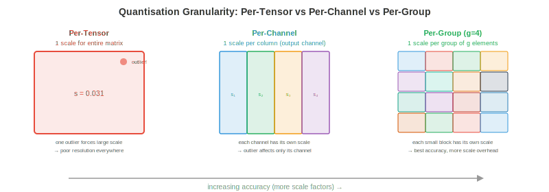

# 量化

*量化（quantization）通过降低模型权重和激活值的精度，使模型更小、更快、运行成本更低。本文件涵盖数值格式、训练后量化、量化感知训练、仅权重量化方法（GPTQ、AWQ）、激活量化、混合精度以及 KV-cache 量化*

- 一个 70B 参数的模型以 float16 存储需要 140 GB 显存，超过任何单张 GPU 的容量。量化到 INT4 后只需 35 GB（一张 A100），甚至在 20 GB 内即可（消费级 RTX 4090 配合 offloading）。量化并非锦上添花的优化，而是让大模型部署在经济上可行的关键。

- 根本性权衡：更低精度意味着更少显存、更高吞吐、更低功耗，但会引入**量化误差**，可能损害模型质量。量化的艺术在于尽量减小这种质量损失。

## 为何量化

- **减少显存**：INT8 比 FP16 小 2 倍，INT4 小 4 倍。对于 LLM，模型权重占据主要显存。精度减半，显存需求也随之减半。

- **吞吐提升**：更低精度意味着每秒可执行更多运算。NVIDIA Tensor Cores（第 16 章）在 FP16 下相比 FP32 有 2 倍吞吐，INT8 相比 FP16 又有 2 倍，INT4 相比 INT8 再有 2 倍。H100 在 FP8 下可达 989 TFLOPS，而 FP32 下仅 67 TFLOPS —— 相差 15 倍。

- **带宽节省**：LLM 推理通常是**内存带宽受限**的（第 16 章 roofline 模型）。瓶颈在于从显存加载权重，而非用权重做计算。权重更小意味着需要传输的字节更少，直接提高每秒 token 数。这也是为什么量化常常给 LLM 推理带来近乎线性的加速。

- **能耗节省**：更低精度每次运算耗能更少。在数据中心规模（数千张 GPU）下，这意味着可观的电费缩减。

## 数值格式

- 我们在第 13 章（计算机体系结构）介绍过 IEEE 754 浮点数。以下是 ML 完整的精度版图：


| 格式 | 位数 | 指数 | 尾数 | 范围 | 用途 |
|--------|------|----------|----------|-------|----------|
| FP32 | 32 | 8 | 23 | ±3.4×10³⁸ | 训练（黄金标准） |
| TF32 | 19 | 8 | 10 | ±3.4×10³⁸ | Tensor Core 训练（A100+） |
| FP16 | 16 | 5 | 10 | ±65504 | 混合精度训练 |
| BF16 | 16 | 8 | 7 | ±3.4×10³⁸ | 训练（与 FP32 同范围） |
| FP8 E4M3 | 8 | 4 | 3 | ±448 | 前向传播（Hopper+） |
| FP8 E5M2 | 8 | 5 | 2 | ±57344 | 梯度（更宽范围） |
| INT8 | 8 | — | — | -128 到 127 | PTQ 推理 |
| INT4 | 4 | — | — | -8 到 7 | 仅权重量化 |
| INT2/三值 | 2 | — | — | {-1, 0, 1} | 极限压缩 |

- **FP8** 有两种变体：**E4M3**（4 位指数、3 位尾数，范围更窄但精度更高）用于前向传播，**E5M2**（5 位指数、2 位尾数，范围更宽但精度更低）用于梯度。Transformer Engine（第 16 章）会按张量自动在两者之间切换。

- **BF16 vs FP16**：BF16 与 FP32 指数范围相同（无溢出风险），但尾数精度更低。FP16 精度更高但范围较窄（最大 65504），训练时需要 loss scaling。推理阶段两者都好用；训练阶段 BF16 更安全。

- **整数格式**没有指数位 —— 它们表示定点值。在浮点与整数之间转换需要**缩放因子**和（可选）**零点**：$x_{\text{float}} = \text{scale} \times (x_{\text{int}} - \text{zero\_point})$。

## 量化公式

- 所有量化方法都是将浮点值映射到整数再映射回来：

$$x_q = \text{clamp}\left(\text{round}\left(\frac{x}{\text{scale}}\right) + \text{zero\_point}, \; q_{\min}, \; q_{\max}\right)$$

$$\hat{x} = \text{scale} \times (x_q - \text{zero\_point})$$

- **scale** 决定分辨率：$\text{scale} = \frac{x_{\max} - x_{\min}}{q_{\max} - q_{\min}}$。对 INT8：$q_{\min} = -128$，$q_{\max} = 127$。

- **对称量化**令 $\text{zero\_point} = 0$，于是 $\text{scale} = \frac{\max(|x|)}{127}$。更简单也更省算（推理时无需减去零点）。

- **非对称量化**使用非零 $\text{zero\_point}$ 处理非对称分布（例如 ReLU 输出全部非负）。将 $[x_{\min}, x_{\max}]$ 映射到无符号 INT8 的 $[0, 255]$。



- **量化粒度**：多少个值共享同一个缩放因子：
    - **Per-tensor**：整个张量共用一个 scale。最简单但精度最低（一个离群值就会扭曲整个张量的 scale）。
    - **Per-channel**：每个输出通道（卷积）或每行（线性层）一个 scale。精度大幅提升且开销极小。
    - **Per-group**：每 $g$ 个元素一组共用一个 scale（例如 $g = 128$）。精度最好，用于现代仅权重量化（GPTQ、AWQ）。
    - **Per-token**：激活的每个 token 一个 scale。用于应对不同 token 的激活幅值差异极大的情况。

## 训练后量化（PTQ）

- **PTQ** 在不重新训练的情况下量化已训练好的模型。你将一个**校准集**（一个有代表性的小数据集，通常 128-512 个样本）喂给模型以收集激活统计量，然后计算最优缩放因子。

### 校准方法

- **Min-max**：按观测到的最小/最大值设定 scale。简单但对离群值敏感（一个极端值会让大部分量化范围浪费在极少使用的值上）。

- **Percentile**：使用 99.99 分位数代替绝对最大值。截断极端离群值，让大多数值获得更好的分辨率。被截断的值会饱和到 $q_{\min}$ 或 $q_{\max}$。

- **MSE-optimal**：寻找使原始张量与量化张量之间均方误差最小的 scale。这是一维优化（在可能的截断值上搜索），通常能给出最好的 PTQ 精度。

- **基于熵**（KL 散度）：寻找使原始分布与量化分布之间 KL 散度最小的 scale。用于 TensorRT 的 INT8 校准。

### PTQ 实践

```python
# Simplified PTQ with PyTorch (conceptual)
import torch

def quantise_tensor_symmetric(tensor, bits=8):
    qmax = 2 ** (bits - 1) - 1  # 127 for INT8
    scale = tensor.abs().max() / qmax
    quantised = torch.clamp(torch.round(tensor / scale), -qmax, qmax).to(torch.int8)
    return quantised, scale

def dequantise(quantised, scale):
    return quantised.float() * scale

# Quantise a weight matrix
weight = torch.randn(512, 512)  # pretrained weight
weight_q, scale = quantise_tensor_symmetric(weight, bits=8)
weight_reconstructed = dequantise(weight_q, scale)

# Quantisation error
error = (weight - weight_reconstructed).abs().mean()
print(f"Mean absolute error: {error:.6f}")
print(f"Compression: {weight.numel() * 4 / (weight_q.numel() * 1 + 4):.1f}x")  # +4 bytes for scale
```

- PTQ 在大多数模型上做 INT8 效果良好，精度损失 <1%。对 INT4，PTQ 质量显著下降 —— 仅权重量化方法（见下文）在 INT4 上效果好得多。

## 量化感知训练（QAT）

- **QAT** 在训练图中插入伪量化操作：前向传播时权重和激活被量化和反量化，但梯度按未发生量化般流过（**直通估计器**）。

$$\text{Forward: } \hat{W} = \text{dequant}(\text{quant}(W))$$
$$\text{Backward: } \frac{\partial L}{\partial W} \approx \frac{\partial L}{\partial \hat{W}}$$

- 模型在训练中学会对量化噪声保持鲁棒。QAT 通常能恢复 PTQ 损失的全部或大部分精度，尤其在低位宽（INT4、INT2）下。

- **代价**：QAT 需要重新训练（或微调）模型，对大模型而言代价不菲。对一个 70B 参数的模型，QAT 大约要花费 $10,000-$100,000 算力。而 PTQ 几乎无成本（只需校准）。

- **何时使用 QAT**：当 PTQ 质量不可接受时（通常是 INT4 或更低），当部署到对 latency 有严格预算的边缘设备时，或当模型将被量化数百万次时（一次性的 QAT 成本被摊薄）。

## 仅权重量化

- 对 LLM 推理，瓶颈是从显存加载权重而非用权重做计算（内存带宽受限场景）。**仅权重量化**把权重量化到 INT4 或 INT3，同时激活保持在 FP16。计算在 FP16 下进行（在飞行中反量化权重），但显存占用和带宽需求降低 4-8 倍。

### GPTQ

- **GPTQ**（Frantar et al., 2022）每次量化权重的一列，通过调整后续列来补偿每列引入的误差。它利用 **Hessian**（来自校准集的二阶信息）确定最优量化顺序和误差补偿：

$$\hat{W}_{:,j} = \text{quant}(W_{:,j}), \quad W_{:,j+1:} \mathrel{-}= \frac{(\hat{W}_{:,j} - W_{:,j}) \cdot H_{j,j+1:}}{H_{j,j}}$$

- 关键洞察：量化第 $j$ 列引入误差。GPTQ 立即调整所有剩余列进行补偿，使该层整体输出（$XW$）变化尽量小。这是应用于 transformer 的**最优脑量化**（OBQ）。

- GPTQ 配合 4 位 group 量化（group size 128）在大多数 LLM 上困惑度损失 <1%。70B 模型在单卡 GPU 上量化耗时约 1 小时。

### AWQ

- **AWQ**（Activation-Aware Weight Quantisation，Lin et al., 2023）观察到一小部分权重通道（1-3%）远比其他通道重要 —— 它们对应幅值较大的激活通道。保护这些显著通道可大幅降低量化误差。

- AWQ 在量化前将这些重要通道乘以因子 $s$（让它们更大，从而更少受舍入影响），并将对应激活乘以 $1/s$（保持输出不变）。scale $s$ 按 group 优化，以最小化整体量化误差。

- AWQ 比 GPTQ 更简单（无需计算 Hessian）、运行更快、质量相当。它已成为许多开源 LLM 量化流程的默认选择。

### GGUF / llama.cpp 量化

- **GGUF**（GGML Universal Format）是 llama.cpp 用于 CPU 推理的格式。它支持多种量化方案：
    - **Q4_0**：4 位，32 元素分块，对称。
    - **Q4_K_M**：4 位并对重要通道使用混合精度（k-quants）。
    - **Q5_K_M**：5 位 k-quants（质量更高）。
    - **Q8_0**：8 位，简单且快速。

- "K" 变体（k-quants）对重要权重块分配更多位数，思路类似 AWQ 的洞察，但在格式层面实现。Q4_K_M 是大多数模型的甜点：平均 4 位且质量损失极小。

### QuIP 和 QuIP#

- **QuIP**（Chee et al., 2023）引入**非相干化处理**：在量化前用随机正交变换旋转权重矩阵。这把信息摊到所有权重上，防止少数离群权重主导量化误差。

- 直觉：若某个权重为 100 而其余约为 1，用同一 scale 量化它们会让 INT4 大部分范围浪费在那个离群值上。经过保持矩阵数学性质的正交旋转后，所有权重幅值相近，均匀量化效果大幅提升。

- **QuIP#** 在此基础上引入**格码本**：不映射到均匀整数网格，而是映射到最优格（8D 的 E8 格）中的点。格码在相同位数下能塞进更多量化点，在相同码率下失真更低。QuIP# 在 **2 位**精度下即可达到可用质量 —— 仅典型 INT4 方法位数的一半。

### SpQR

- **SpQR**（Dettmers et al., 2023）观察到极少数权重（0.1-1%）是**离群值**，对输出质量贡献不成比例地大。SpQR 不把所有权重都量化到同一精度，而是：

    1. 用敏感性分析识别离群权重（量化该权重会让该层输出变化多少？）。
    2. 将离群权重以**全精度**（FP16）稀疏存储。
    3. 把其余权重量化到 INT3 或 INT4。

- 结果：约 99% 的权重被激进量化（更小），而关键的 1% 保留全精度（准确）。稀疏离群存储的额外开销极小（<5% 总大小）。

### HQQ

- **HQQ**（Half-Quadratic Quantisation，Badri & Shaji, 2023）是一种**零样本**权重量化方法，完全不需要校准数据。它把量化表述为一个半二次优化问题，迭代求解最优量化权重与缩放因子。

- 优势：无需校准集意味着无数据依赖、可即时量化、不存在校准数据不匹配的风险。HQQ 尤其适用于无法获取有代表性校准数据或数据敏感的模型。

### AQLM

- **AQLM**（Egiazarian et al., 2024）将**加性量化**（多码本向量量化）应用于 LLM。AQLM 不独立量化每个权重，而是将权重分组为向量，每个向量表示为多个学习得到的码本条目之和：

$$\mathbf{w} \approx \mathbf{c}_1^{(1)} + \mathbf{c}_2^{(2)} + \cdots + \mathbf{c}_M^{(M)}$$

- 其中 $\mathbf{c}_i^{(m)}$ 是码本 $m$ 中的一个条目。使用 $M = 2$ 个各含 256 条目的码本时，一个 8 元素向量被编码为两个 8 位索引 = 2 字节编码 8 个权重 = 有效 **2 位每权重**。AQLM 在 2 位精度下达到业界最佳质量，在这一极限压缩级别上优于 GPTQ 和 AWQ。

### BitNet 与 1 位 LLM

- **BitNet**（Wang et al., 2023）把量化推到极致：权重为三值（$\{-1, 0, +1\}$），每个权重仅需约 1.58 位。矩阵乘法退化为**只有加减法** —— 不需要浮点乘法。

- **BitNet b1.58**（Ma et al., 2024）把每个权重约束为 $\{-1, 0, +1\}$。"1.58 位" 来自 $\log_2(3) \approx 1.58$。在此精度下，70B 模型仅需约 15 GB，推理无需乘法 —— 只有加法、减法和符号翻转。

- matmul 变为：

$$y_j = \sum_i W_{ij} \cdot x_i = \sum_{i: W_{ij}=+1} x_i - \sum_{i: W_{ij}=-1} x_i$$

- 这在任何硬件上都比 FP16 matmul 便宜得多，可能让没有浮点单元的设备也能跑 LLM 推理。对当前模型而言质量损失仍显著，但随规模扩大和训练期量化感知而改善。

### Microscaling (MX) 格式

- **Microscaling**（MX）格式是新的行业标准（由 AMD、Arm、Intel、Meta、Microsoft、NVIDIA、Qualcomm 支持），采用**块浮点**：一组元素共享单个指数，每个元素有各自的尾数。

| 格式 | 共享指数 | 元素位 | 每元素总位 | 等价于 |
|--------|----------------|-------------|--------------------|----|
| MXFP8 | 每块 8 位 | 8（E4M3/E5M2） | ~8 | 类似 FP8 但范围更优 |
| MXFP6 | 每块 8 位 | 6 | ~6.5 | 介于 FP8 和 INT4 之间 |
| MXFP4 | 每块 8 位 | 4 | ~4.5 | 类似 INT4 但行为像浮点 |
| MXINT8 | 每块 8 位 | 8（整数） | ~8.5 | INT8 + 共享缩放 |

- 共享指数把指数成本摊薄到一个块（通常 16-32 个元素）上。每个元素保留的尾数位比独享指数时更多，每位的精度更高。MX 格式预计将在未来硬件中取代独立的 FP8 和 INT8 格式。

### FP8 训练

- 在 NVIDIA Hopper 与 Blackwell GPU 上，FP8 训练（不仅是推理）现已可行。配方为：

    - **前向传播**：权重和激活用 E4M3（精度更高、范围更窄）。Transformer Engine 用延迟缩放动态计算 per-tensor 的 scale（跟踪上一轮迭代的统计量，应用于当前迭代）。

    - **反向传播**：梯度用 E5M2（范围更宽、精度更低）。梯度的取值范围比权重/激活更宽，多一位指数可防止溢出。

    - **主权重**：以 FP32 维护，用于优化器状态（类似第 6 章 FP16 的标准混合精度训练）。FP8 计算只用于 matmul，不用于权重更新。

    - **Loss scaling**：FP8 仍需 loss scaling，与 FP16 一样。动态 loss scaler 调整 scale，使梯度值落在 FP8 可表示范围内。

- FP8 训练在大多数模型规模上达到与 BF16 训练相当的质量，吞吐约 2 倍提升。它是 H100 集群上新型大规模训练的默认选择。

## 激活量化

- 激活（层间流动的中间张量）也可以被量化，从而实现完全 INT8 计算（权重和激活都是 INT8，用 INT32 累加）。

- **动态量化**：在运行时根据实际激活值计算 scale。更精确（适配每个输入）但有额外开销（每层都要算 min/max 或分位数）。

- **静态量化**：在校准时一次性算好 scale 并固定。推理更快（无运行时统计），但若校准数据不具代表性则精度较差。

- **Per-token 量化**：为序列中每个 token 单独计算 scale。对 LLM 至关重要，因为不同 token 的激活幅值可能相差悬殊（某些 token 的激活比其他大 100 倍）。

- 激活量化比权重量化更难，因为激活依赖数据（随每个输入变化），而权重固定不变。"离群值" 问题尤甚：少数激活通道有极端值（均值 100 倍），与普通通道用同一 scale 量化会浪费精度。

- **SmoothQuant**（Xiao et al., 2022）通过数学上把量化难度从激活（因离群值难量化）迁移到权重（易量化）来应对离群值：把激活乘以 $1/s$、权重乘以 $s$，其中 $s$ 平衡难度。输出 $XW = (X \cdot \text{diag}(s^{-1})) \cdot (\text{diag}(s) \cdot W)$ 不变。

## 混合精度量化

- 并非所有层对量化同样敏感。attention 层常能容忍 INT4，而 embedding 层和最终分类器需要更高精度。

- **敏感性分析**：逐层单独量化并测量精度影响。高敏感层给更多位，不敏感层给更少位。

- Transformer Engine（第 16 章 NVIDIA Hopper）在算子级实现动态混合精度：每个 matmul 根据张量统计在 FP8 和 FP16 之间选择，在保持质量的同时最大化吞吐。

## KV-cache 量化

- LLM 生成时，**KV-cache** 存储所有先前 token 的 key 和 value 张量。对长序列，它主导显存占用：

$$\text{KV-cache size} = 2 \times n_{\text{layers}} \times n_{\text{heads}} \times d_{\text{head}} \times \text{seq\_len} \times \text{bytes\_per\_element}$$

- 70B 模型，80 层，64 头，128 维 head，序列长度 128K，FP16 下：$2 \times 80 \times 64 \times 128 \times 131072 \times 2 = 330$ GB。这超过 GPU 显存。

- **KV-cache 量化**通过以 INT8 或 INT4 而非 FP16 存储缓存的 key 和 value 来降低占用。量化误差沿序列累积（每个新 token 都 attend 到所有已缓存的 K/V），但采用 per-channel 或 per-head 量化时损失可接受。

- **KV-cache 量化收益是乘性叠加的**：它允许更长序列（更多上下文）、更大 batch（更多并发用户）、更快推理（更少内存带宽用于加载 cache）。这是 LLM serving 中最具影响力的优化之一。

## 编程练习（使用 CoLab 或 notebook）

1. 从零实现对称 INT8 量化。量化一个权重矩阵、反量化，并作为值分布的函数测量重建误差。
```python
import jax.numpy as jnp
import jax

def quantise_int8(tensor):
    scale = jnp.max(jnp.abs(tensor)) / 127.0
    quantised = jnp.clip(jnp.round(tensor / scale), -127, 127).astype(jnp.int8)
    return quantised, scale

def dequantise(quantised, scale):
    return quantised.astype(jnp.float32) * scale

# Normal weights (typical for trained models)
key = jax.random.PRNGKey(0)
weights = jax.random.normal(key, (1024, 1024)) * 0.02

q, s = quantise_int8(weights)
recon = dequantise(q, s)

print(f"Original:     {weights.nbytes / 1024:.0f} KB")
print(f"Quantised:    {q.nbytes / 1024:.0f} KB ({weights.nbytes / q.nbytes:.0f}x smaller)")
print(f"Mean abs err: {jnp.abs(weights - recon).mean():.6f}")
print(f"Max abs err:  {jnp.abs(weights - recon).max():.6f}")
print(f"Relative err: {jnp.abs(weights - recon).mean() / jnp.abs(weights).mean():.4%}")
```

2. 演示离群值问题。构造带少数极端通道的激活，展示 per-tensor 量化如何失败、per-channel 如何成功。
```python
import jax.numpy as jnp
import jax

key = jax.random.PRNGKey(42)

# Activations: most channels are normal, 2 channels have 100x outliers
activations = jax.random.normal(key, (32, 512)) * 0.1
activations = activations.at[:, 0].set(activations[:, 0] * 100)   # outlier channel
activations = activations.at[:, 1].set(activations[:, 1] * 50)    # outlier channel

# Per-tensor quantisation (one scale for entire tensor)
scale_tensor = jnp.max(jnp.abs(activations)) / 127.0
q_tensor = jnp.clip(jnp.round(activations / scale_tensor), -127, 127)
recon_tensor = q_tensor * scale_tensor

# Per-channel quantisation (one scale per channel)
scales_channel = jnp.max(jnp.abs(activations), axis=0) / 127.0
q_channel = jnp.clip(jnp.round(activations / scales_channel), -127, 127)
recon_channel = q_channel * scales_channel

err_tensor = jnp.abs(activations - recon_tensor).mean()
err_channel = jnp.abs(activations - recon_channel).mean()

print(f"Per-tensor error: {err_tensor:.6f}")
print(f"Per-channel error: {err_channel:.6f}")
print(f"Per-channel is {err_tensor / err_channel:.1f}x better")
print(f"\nOutlier channels waste {(activations.shape[1] - 2) / activations.shape[1]:.0%} "
      f"of the quantisation range for {2 / activations.shape[1]:.1%} of channels")
```

3. 计算不同模型规模和序列长度下的 KV-cache 显存。说明为何 KV-cache 量化对长上下文模型至关重要。
```python
def kv_cache_gb(n_layers, n_heads, d_head, seq_len, bytes_per_elem):
    return 2 * n_layers * n_heads * d_head * seq_len * bytes_per_elem / 1e9

models = [
    ("Llama-7B",  32, 32, 128),
    ("Llama-70B", 80, 64, 128),
    ("GPT-4 (est)", 120, 96, 128),
]

print(f"{'Model':<15} {'SeqLen':>8} {'FP16 (GB)':>10} {'INT8 (GB)':>10} {'INT4 (GB)':>10}")
print("-" * 60)

for name, layers, heads, d_head in models:
    for seq_len in [4096, 32768, 131072]:
        fp16 = kv_cache_gb(layers, heads, d_head, seq_len, 2)
        int8 = kv_cache_gb(layers, heads, d_head, seq_len, 1)
        int4 = kv_cache_gb(layers, heads, d_head, seq_len, 0.5)
        print(f"{name:<15} {seq_len:>8} {fp16:>9.1f}  {int8:>9.1f}  {int4:>9.1f}")
    print()
```
