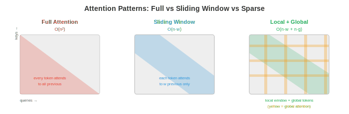
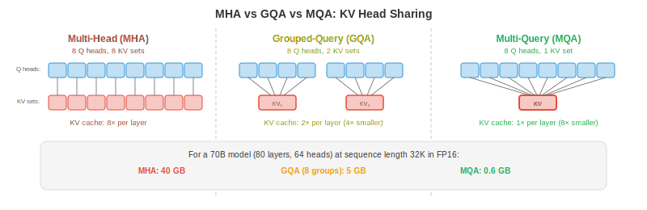

# 高效架构

*让模型更快不仅靠降低精度，还要靠更聪明的架构 —— 让每个 token 做更少的活。本文件涵盖 StreamingLLM、稀疏与线性 attention、multi-query 与 grouped-query attention、推理时的 Mixture of Experts、知识 distillation、pruning 与神经架构搜索*

- 量化（文件 1）让每次运算更便宜。本文件则让运算次数本身更少。两者互补：一个既架构高效又量化的模型可以比原模型快 10-100 倍。

## StreamingLLM：无限长度生成

- 标准 transformer 把所有先前 token 存入 KV-cache，其大小随序列长度线性增长。到某一点，cache 会超出 GPU 显存，生成失败。**StreamingLLM**（Xiao et al., 2023）用固定大小的**滚动 KV-cache** 解决此问题。

- 关键观察：序列前几个 token 无论内容如何，都获得不成比例的高 attention 分数。这些被称为 **attention sinks**。若把它们从 cache 中驱逐，attention 分布会塌陷，生成质量急剧恶化。

- StreamingLLM 的方案：在 cache 中永久保留少量 **sink token**（前 1-4 个 token），再加上最近 $w$ 个 token 的**滚动窗口**。总 cache 大小为 $\text{sink} + w$，与已生成 token 数量无关，保持固定。

$$\text{Cache} = [\text{token}_0, \text{token}_1, \text{token}_{t-w+1}, \ldots, \text{token}_t]$$

- attention sink 锚定 softmax 分布，滚动窗口提供近期上下文。这实现了常量显存下的**无限长度生成**，代价是无法访问序列中段的上下文。

- 对于自然形成 attention sink 的模型（大多数预训练 LLM 都是），StreamingLLM 无需重新训练即可工作。对于不满足此条件的模型，在训练时添加一个可学习的 sink token 即可修复。

## 稀疏 Attention

- 完整 self-attention 的复杂度是序列长度 $n$ 的 $O(n^2)$，因为每个 token 都要 attend 到其他所有 token。对 $n = 128K$，attention 矩阵有 $128K^2 = 160$ 亿个元素。**稀疏 attention** 模式通过限制哪些 token attend 哪些 token 来降低开销。



- **滑动窗口 attention**（Mistral、Gemma）：每个 token 只 attend 前 $w$ 个 token（例如 $w = 4096$）。attention 为 $O(n \cdot w)$ 而非 $O(n^2)$。信息通过多层传播跨越窗口：经 $L$ 层后，有效上下文为 $L \times w$。

- **局部 + 全局 attention**（Longformer、BigBird）：大多数 token 用滑动窗口 attention（局部），但少数指定 token（如 [CLS]、每 512 个 token 中的一个）attend 到所有 token（全局）。这样既捕获局部模式，又捕获长程依赖。

- **膨胀 attention**：在窗口内只 attend 每第 $k$ 个 token，形成稀疏模式，在相同 attention 分数数量下覆盖更大范围。跨层增大膨胀率会形成类似膨胀卷积（第 8 章）的层次化模式。

- 现代 LLM 的实用赢家是**滑动窗口 + 全 attention 交替**：部分层用滑动窗口（便宜、处理局部上下文），部分层用全 attention（昂贵、捕获长程）。Mistral/Mixtral 采用此模式。

## 线性 Attention 与状态空间模型

- 能否彻底替换 $O(n^2)$ 的 attention？**线性 attention** 与**状态空间模型（SSM）**通过避免显式 attention 矩阵，以 $O(n)$ 时间处理序列。

- **线性 attention** 用核近似替换 softmax attention：

$$\text{Standard: } O = \text{softmax}(QK^T / \sqrt{d}) V$$
$$\text{Linear: } O = \phi(Q) (\phi(K)^T V)$$

- 先计算 $K^T V$ 乘积（其维度为 $d \times d$，与序列长度无关），计算量变为 $O(n \cdot d^2)$ 而非 $O(n^2 \cdot d)$。对 $n \gg d$ 的长序列，节省巨大。

- **RWKV** 结合了 RNN 与 transformer 的思想。它采用递归形式，按顺序处理 token（像 RNN），但训练时可以并行（像 transformer）。推理时每 token 为 $O(1)$（常量显存，KV-cache 不增长）。

- **Mamba**（Gu & Dao, 2023）是选择性状态空间模型。它通过学习得到的状态转移处理序列：

$$h_t = \bar{A} h_{t-1} + \bar{B} x_t, \quad y_t = C h_t$$

- 其中 $\bar{A}$ 和 $\bar{B}$ 依赖输入（选择性），使 Mamba 能动态聚焦或忽略输入的某些部分。不同于固定 SSM，这种选择性让 Mamba 在语言任务上与 transformer 抗衡，同时保持 $O(n)$ 复杂度。

- **权衡**：线性 attention 与 SSM 在长序列上更快，但通常在需要精确长程检索的任务上不如全 attention。混合架构（部分 transformer 层 + 部分 Mamba 层）常常兼得两者之长。

## Multi-Query 与 Grouped-Query Attention

- 标准多头 attention（MHA，第 7 章）为每个 head 用独立的 $K$、$V$ 投影。对 $h$ 个 head，KV-cache 中有 $h$ 组独立的 key 和 value 张量。**Multi-Query Attention（MQA）** 与 **Grouped-Query Attention（GQA）** 用于降低此开销。

- **MQA**（Shazeer, 2019）：所有 head 共享一组 $K, V$ 投影。每个 head 仍有自己的 $Q$ 投影。KV-cache 缩减 $h$ 倍（如 32 个 head 时为 32 倍）。

- **GQA**（Ainslie et al., 2023）：折中方案。head 被分组，每组共享一组 $K, V$ 投影。$h = 32$ 个 head、$g = 8$ 组时，每 4 个 head 共享一组 K/V。KV-cache 缩减 $h/g = 4$ 倍。

$$\text{MHA: } h \text{ heads, } h \text{ K/V sets} \quad \to \quad \text{GQA: } h \text{ heads, } g \text{ K/V sets} \quad \to \quad \text{MQA: } h \text{ heads, } 1 \text{ K/V set}$$



- 大多数现代 LLM 使用 GQA（Llama 2/3、Gemma、Mistral）。它降低了 KV-cache 显存和推理 latency，且相比 MHA 质量损失可忽略。

### Multi-head Latent Attention (MLA)

- **MLA**（DeepSeek-V2, 2024）比 GQA 更进一步，把 KV-cache 压缩到**低秩潜在空间**。MLA 不缓存完整的 key 和 value 向量，而是为每个 token 缓存一个压缩的潜在向量 $\mathbf{c}_t$，并在 attention 时在飞行中重建 K/V：

$$\mathbf{c}_t = W_{\text{compress}} \cdot [\mathbf{k}_t; \mathbf{v}_t], \quad \mathbf{k}_t = W_K^{\text{up}} \cdot \mathbf{c}_t, \quad \mathbf{v}_t = W_V^{\text{up}} \cdot \mathbf{c}_t$$

- 压缩向量 $\mathbf{c}_t$ 比原始 K 和 V 合并后小得多。DeepSeek-V2 相比 MHA 实现 **93.3% 的 KV-cache 缩减**，甚至优于 MQA，同时保持 MHA 级别的质量。

- 权衡：从潜在向量重建 K/V 会给每次 attention 操作增加少量计算。但 LLM 解码是内存带宽受限（而非计算受限），所以这是净收益：加载的显存更少 > 每 token 稍多一点计算。

### Flash Attention

- **Flash Attention**（Dao et al., 2022，第 16 章文件 05 有详细介绍）不是架构变更，而是属于高效 attention 讨论的实现优化。它计算精确的标准 attention，具备：

    - **O(n) 显存** 而非 O(n²)（attention 矩阵从不物化到 HBM）。
    - **比标准 attention 快 2-4 倍**（通过 tiling 和 online softmax 让数据留在 SRAM）。
    - **零质量损失** —— 输出与标准 attention 在数学上完全一致。

- Flash Attention 现已成为 PyTorch（`torch.nn.functional.scaled_dot_product_attention`）、JAX 及所有主流推理框架的默认 attention 实现。2024 年以后你跑 attention，几乎肯定在用 Flash Attention。

### Ring Attention

- **Ring Attention**（Liu et al., 2023）把 attention 计算分布到多台设备上，针对即使使用 Flash Attention 也无法塞进单卡 GPU 显存的超长序列。

- 思路：把序列分到 $N$ 台设备上。每台设备持有 $n/N$ 个 token 的 Q、K、V。设备排成一个环。每一步：
    1. 每台设备计算本地 attention（自己的 Q 对自己的本地 K/V）。
    2. 每台设备把 K/V 块发给环中下一台设备。
    3. 每台设备从上一台设备接收 K/V，对其计算 attention。
    4. 经 $N$ 步后，每台设备都已 attend 到所有 K/V 块。

- 通信与计算**重叠**：在计算当前 K/V 块 attention 的同时，下一块正在传输。这几乎完全隐藏了通信延迟。

- Ring Attention 通过把 KV-cache 分布到一环 GPU 上，实现**百万级 token 的上下文窗口**。每台设备显存为 O(n/N)，使任意长序列可行（仅受设备数量限制）。

## 推理时的 Mixture of Experts

- MoE 模型（第 7 章）每个 token 只激活一小部分参数（典型为 8 个 expert 中激活 2 个）。推理时，独特挑战是**expert 缓存**：所有 expert 必须都在显存里（因为任意 token 可能路由到任意 expert），但每 token 只激活 2 个。

- 对 Mixtral 8x7B 模型：总参数 = 47B（8 × 7B expert，但有共享组件）。每 token 激活参数约 13B（2 个 expert + 共享层）。该模型以 LLM-13B 级推理成本达到 LLM-70B 级质量，但显存里需放 47B 参数。

- **Expert offloading**：对 GPU 显存受限的部署，把非激活 expert 留在 CPU 或 SSD 上，按需加载。这之所以可行，是因为 token 路由可预测性足够强，能预取可能的 expert。

- **Expert 缓存**：在 GPU 显存里维护最近使用 expert 的 LRU cache。若相同的 expert 反复被激活（同领域数据常见），cache 命中率很高。

## 知识 Distillation

- **Distillation**（第 6 章）训练一个小 "学生" 模型来模仿大 "教师" 模型。学生从教师的软预测（类别上的概率分布）学习，其中蕴含的信息比仅硬标签更多。

$$\mathcal{L} = \alpha \cdot \text{KL}(p_{\text{teacher}}^{T} \| p_{\text{student}}^{T}) + (1 - \alpha) \cdot \mathcal{L}_{\text{CE}}(y, p_{\text{student}})$$

- 其中 $T$ 是温度（$T$ 越高分布越软，揭示教师的不确定性），$\alpha$ 平衡 distillation 损失与标准交叉熵损失。

- **对 LLM**：distillation 用于从大而强模型制造小而快的模型。GPT-4 → 一个 7B 学生，在特定任务上捕获 GPT-4 大部分行为。学生 serving 成本可低 10-100 倍。

- **任务专属 distillation**：只在与部署任务相关的数据上做 distillation。从 70B 教师在医学问答上 distill 出的 7B 模型，在该具体任务上可超越 70B 模型（因为学生有限的容量完全聚焦于目标领域）。

## Pruning

- **Pruning** 移除不必要的权重（置零），减小模型体积与计算量。

- **非结构化 pruning**（基于幅值）：移除绝对值最小的单个权重。这产生稀疏权重矩阵。对压缩简单有效，但当前硬件（GPU）无法高效加速稀疏运算，除非稀疏遵循特定模式。

- **结构化 pruning**：移除整组单元 —— attention head、MLP 神经元或层。这产生更小的稠密模型，在标准硬件上易于加速。代价是粒度更粗（移除整组 head 可能一并移除有用和无用的权重）。

- **2:4 稀疏**（NVIDIA Ampere+）：硬件支持的稀疏模式 —— 每 4 个权重中 2 个为零。GPU 的稀疏 Tensor Core 跳过零乘法，获得约 2 倍加速。这是当今唯一有实用硬件加速的稀疏模式。

- **彩票假设**（Frankle & Carlin, 2019）：在一个随机初始化的网络中，存在一个子网络（"中奖彩票"），可独立训练达到与完整网络相当的性能。找到这些子网络（通过训练、pruning、回退权重）开销不菲，但这一洞察推动了 pruning 研究。

## 神经架构搜索（NAS）

- **NAS** 通过在可能的架构空间中搜索，自动化架构设计，找出在硬件约束（latency、显存、功耗）下精度最大化的架构。

- **EfficientNet**（第 8 章）就是 NAS 找到的：复合缩放规则（平衡 depth、width、resolution）源自搜索而非人类直觉。

- 为推理效率服务，NAS 能找到针对特定硬件目标优化的架构："找一个在 iPhone Neural Engine 上 latency <5ms 且在 ImageNet 上精度 >80% 的模型。" 搜索空间包括层类型、宽度、激活函数和 attention 模式。

- **一次成型网络** 训练单一过参数化网络，并为不同部署目标抽取子网络。一次训练即产出适配云 GPU、移动 GPU 和 CPU 的模型，各自针对其目标优化。

## 编程练习（使用 CoLab 或 notebook）

1. 实现滑动窗口 attention，并与 full attention 比较显存占用。
```python
import jax
import jax.numpy as jnp

def full_attention(Q, K, V):
    """Standard O(n^2) attention."""
    scores = Q @ K.T / jnp.sqrt(Q.shape[-1])
    weights = jax.nn.softmax(scores, axis=-1)
    return weights @ V

def sliding_window_attention(Q, K, V, window_size=128):
    """Sliding window attention: each token attends to window_size previous tokens."""
    n = Q.shape[0]
    d = Q.shape[-1]
    output = jnp.zeros_like(Q)

    for i in range(n):
        start = max(0, i - window_size + 1)
        k_window = K[start:i+1]
        v_window = V[start:i+1]
        scores = Q[i] @ k_window.T / jnp.sqrt(d)
        weights = jax.nn.softmax(scores)
        output = output.at[i].set(weights @ v_window)

    return output

n, d = 512, 64
key = jax.random.PRNGKey(0)
Q = jax.random.normal(key, (n, d))
K = jax.random.normal(jax.random.PRNGKey(1), (n, d))
V = jax.random.normal(jax.random.PRNGKey(2), (n, d))

print(f"Full attention memory:    O(n^2) = {n*n} entries")
print(f"Window (w=128) memory:   O(n*w) = {n*128} entries")
print(f"Reduction: {n*n / (n*128):.1f}x")
```

2. 比较 MHA、GQA、MQA 的 KV-cache 大小。说明为何 GQA 是实用甜点。
```python
def kv_cache_size(n_heads, n_kv_heads, d_head, seq_len, bytes=2):
    """KV-cache size in MB."""
    return 2 * n_kv_heads * d_head * seq_len * bytes / 1e6

n_heads = 32
d_head = 128
seq_len = 32768

mha = kv_cache_size(n_heads, n_heads, d_head, seq_len)       # 32 KV heads
gqa = kv_cache_size(n_heads, 8, d_head, seq_len)              # 8 KV heads
mqa = kv_cache_size(n_heads, 1, d_head, seq_len)              # 1 KV head

print(f"MHA (32 KV heads): {mha:.0f} MB per layer")
print(f"GQA (8 KV heads):  {gqa:.0f} MB per layer ({mha/gqa:.0f}x smaller)")
print(f"MQA (1 KV head):   {mqa:.0f} MB per layer ({mha/mqa:.0f}x smaller)")
```

3. 通过从随机 attention 层移除最不重要的 attention head 来模拟结构化 pruning，并测量输出变化。
```python
import jax
import jax.numpy as jnp

key = jax.random.PRNGKey(0)
n_heads, seq_len, d_head = 8, 64, 32

# Random multi-head attention output (one per head)
head_outputs = jax.random.normal(key, (n_heads, seq_len, d_head))

# Full output: concatenate all heads
full_output = head_outputs.reshape(seq_len, n_heads * d_head)

# Importance: measure each head's contribution by its norm
head_norms = jnp.linalg.norm(head_outputs, axis=(1, 2))
print("Head importance (by norm):", jnp.round(head_norms, 2))

# Prune least important heads
for n_keep in [8, 6, 4, 2]:
    top_heads = jnp.argsort(head_norms)[-n_keep:]
    pruned = head_outputs[top_heads].reshape(seq_len, n_keep * d_head)

    # Pad to original size for comparison (zero out pruned heads)
    full_pruned = jnp.zeros_like(head_outputs)
    full_pruned = full_pruned.at[top_heads].set(head_outputs[top_heads])
    full_pruned = full_pruned.reshape(seq_len, n_heads * d_head)

    error = jnp.linalg.norm(full_output - full_pruned) / jnp.linalg.norm(full_output)
    print(f"Keep {n_keep}/{n_heads} heads: relative error = {error:.4f}, "
          f"memory = {n_keep/n_heads:.0%}")
```
