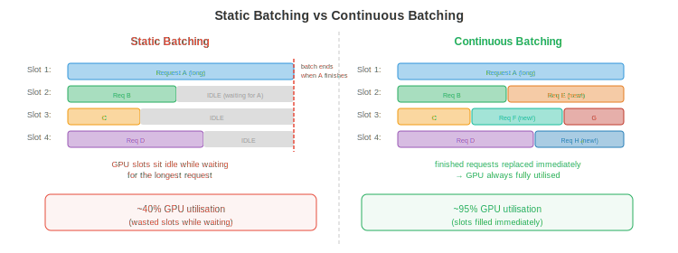

# Serving 与 Batching

*把 LLM serving 给数千并发用户需要的远不止加载模型跑推理。本文件涵盖 prefill-decode 分离、continuous batching、PagedAttention 与 vLLM、调度策略、disaggregated serving、多模型与 LoRA serving，以及关键指标*

- 单个 LLM 推理请求很简单：喂入 token，生成输出 token。但把 LLM 以低 latency、高 throughput serving 给 10,000 并发用户，则是一个系统问题。朴素做法（一次处理一个请求）会浪费 90%+ 的 GPU 算力。聪明的 batching 和调度可以在不加硬件的情况下把 throughput 提升 10-50 倍。

## Prefill vs Decode：截然不同的两个阶段

- LLM 推理有两个阶段，计算特性截然不同：

- **Prefill**（prompt 处理）：同时处理所有输入 token。这是一次大型矩阵乘法：$O(\text{prompt\_length} \times d_{\text{model}}^2)$。prompt 可并行处理（所有 token 都已知）。Prefill 是**计算受限**的：瓶颈在 GPU 的 ALU。

- **Decode**（token 生成）：自回归地一次生成一个 token。每个新 token 需通过 KV-cache attend 到之前所有 token。Decode 是**内存带宽受限**的：GPU 大部分时间用于从显存加载模型权重和 KV-cache，而非计算。每个 decode 步只产出一个 token，却要加载整个模型（70B 模型 FP16 约 140 GB）。

- 影响：

| | Prefill | Decode |
|--|---------|--------|
| 处理的 token | 一次性全部（并行） | 一次一个（顺序） |
| 瓶颈 | 计算（FLOPS） | 内存带宽 |
| 算术强度 | 高 | 极低 |
| GPU 利用率 | 高（50-80%） | 无 batching 时低（1-10%） |
| Latency 指标 | **Time to First Token (TTFT)** | **Time Per Output Token (TPOT)** |

- TTFT 影响用户体验（响应开始流式输出要等多久）。TPOT 决定感知到的生成速度。用户可容忍较高的 TTFT（1-5 秒），但期望较快的 TPOT（对话应用 30-100 ms 每 token）。

## 静态 Batching（朴素）

- 最简单的 batching：收集 $B$ 个请求，pad 到相同长度，作为单个 batch 处理。

- **问题 1**：请求有不同的 prompt 长度，生成的输出 token 数也不同。短请求早早完成，却必须等 batch 中最长的请求完成才能启动下一个 batch。GPU 在为那唯一剩余的长请求生成时空转。

- **问题 2**：padding 浪费算力。若最长 prompt 为 2000 token、最短为 50，batch 会被 pad 到 2000。GPU 为短请求多算了 1950 个 padding token —— 纯浪费。



## Continuous Batching

- **Continuous batching**（又称迭代级 batching）在单个 decode 步的粒度而非整个请求的粒度上运作，解决了上述两个问题。

- 每个 decode 步：
    1. 所有在途请求并行生成一个 token（作为一个 batch）。
    2. 完成（生成 EOS token）的请求被立即从 batch 中**移除**。
    3. 队列中的新请求被立即**插入**到空出的槽位。

- batch 大小每步动态变化。GPU 从不因等待拖尾请求而空闲，也没有 padding 浪费（每个请求只占它需要的槽位）。

- **影响**：continuous batching 通常比静态 batching 提升 throughput 2-10 倍，模型质量不变，latency 也无明显上升。

## PagedAttention 与 vLLM

- KV-cache 带来内存管理噩梦。每个请求都有一个随生成 token 增长的 KV-cache。不同请求处于不同阶段（cache 大小不同）。为每个请求分配连续显存会浪费空间（必须为最大可能长度分配，即便请求只生成几个 token）。


- **PagedAttention**（Kwon et al., 2023）把 OS 的虚拟内存概念（第 13 章）应用于 KV-cache。cache 被分成固定大小的**页**（token 位置的块）。页按需分配，在物理 GPU 显存中可以非连续。

- 收益：
    - **无碎片**：页大小统一，请求之间没有浪费显存的"空洞"。
    - **惰性分配**：只在 token 实际生成时分配显存，而非按最大长度预分配。
    - **写时复制**：共享公共前缀（如系统 prompt）的请求共享相同 KV-cache 页。只有当请求分叉时才复制页。

- **vLLM** 是围绕 PagedAttention 构建的推理引擎。它通过几乎消除 KV-cache 显存浪费，比静态分配的 serving（如不带 paged attention 的 HuggingFace text-generation-inference）实现 2-4 倍更高 throughput。

## 调度策略

- 当多个请求等待而 GPU 只能处理有限 batch 时，**调度**决定服务哪些请求：

- **先到先服务（FCFS）**：按到达顺序处理请求。简单但不公平：提交一个 10K token 生成请求的用户会阻塞身后所有用户。

- **最短作业优先（SJF）**：先处理最快完成的请求。最小化平均 latency，但惩罚长请求（它们可能饿死）。实际中输出长度估计未知，SJF 用启发式（prompt 长度、用户历史）。

- **抢占**：若高优先级请求到来，暂停低优先级的进行中请求（把其 KV-cache 换出到 CPU 显存或 SSD），服务高优先级请求，再恢复被暂停的。vLLM 支持此机制。

- **基于优先级**：为用户或请求类型分配优先级。实时交互查询获得比批处理任务更高的优先级。配合抢占，可确保高优先级流量的 latency SLO。

- **Token 预算**：限制活跃 batch 中的 token 总数。防止少数长请求独占 GPU 显存而饿死新请求。

## Disaggregated Serving

- Prefill 与 decode 的计算画像相反。在同一 GPU 上跑两者意味着 GPU 在计算受限（prefill）和内存带宽受限（decode）之间反复切换，两类资源都没充分利用。

- **Disaggregated serving** 把两者分开：
    - **Prefill 节点**：为计算优化的 GPU（高 FLOPS，可能显存较少）。处理所有到来的 prompt。
    - **Decode 节点**：为内存带宽优化的 GPU（大 KV-cache 容量、高显存带宽）。处理所有 token 生成。

- Prefill 节点计算初始 KV-cache 并发送给 decode 节点（通过 NVLink 或网络）。Decode 节点用收到的 cache 生成 token。

- 这是 **Mooncake**（Moonshot AI）的架构，多个 LLM serving 团队也在探索。收益：每种 GPU 类型与其工作负载特征匹配，整体利用率提升。

## 多模型与 LoRA Serving

- 生产环境中，你常常 serving 多个模型（不同层级用不同大小、不同任务用不同微调变体）。

- **模型多路复用**：在同一 GPU 上加载多个模型，把请求路由到相应模型。GPU 显存共享：一张 40 GB GPU 可同时持有一个 13B 模型（26 GB）和一个 7B 模型（14 GB）。

- **LoRA serving**：不部署独立的微调模型，而是部署一个 base model 配多个 **LoRA adapter**（第 6 章）。每个 adapter 增加的参数 <1%。推理时把请求路由到相应 adapter。

- **S-LoRA**（Sheng et al., 2023）：从单个 base model serving 数千个 LoRA adapter。adapter 存在 CPU 上，按需换入 GPU 显存。Base model 的 KV-cache 和权重共享；每个请求只有小的 LoRA 矩阵不同。

- **Punica**（Chen et al., 2023）：通过自定义 CUDA kernel 把不同 LoRA 矩阵应用到同一 batch 内的不同请求，从而跨不同 LoRA adapter 批处理请求。避免了逐请求切换 adapter 的开销。

## 约束式与引导式生成

- 许多应用需要 LLM 产生特定格式的输出：合法 JSON、SQL 查询、特定语言的代码或遵循 schema 的响应。**约束式生成** 保证输出符合某种语法或 schema。

- **语法约束解码**：在每个解码步，把违反语法的 token 屏蔽掉。若目前为止输出是 `{"name": "Alice", "age":` 而语法要求下一个是整数，则屏蔽除数字外的所有 token。LLM 的概率分布在合法 token 上重新归一化。

- **Outlines**（Willard & Louf, 2023）：把 JSON schema 或正则表达式编译成有限状态机（FSM）。每个解码步由 FSM 决定哪些 token 是合法后继。非法 token 概率为 0。这保证 100% 符合 schema，零重试。

- **SGLang** 原生集成约束式生成：你在 Python 中指定输出结构，引擎高效处理 token 屏蔽与缓存。它与 RadixAttention（前缀缓存）结合，让结构化输出复用缓存的前缀。

- **为何重要**：没有约束式生成，你会自由生成然后解析输出，失败时重试。复杂 JSON schema 的重试率常见 10-30%，浪费算力。约束式生成彻底消除重试。

## 请求路由

- 并非每个查询都需要最大模型。**请求路由** 按估计难度把查询导向不同模型：

- **级联**：先试小模型。若小模型的置信度低于阈值（如 top token 的 softmax 概率 < 0.8），升级到大模型。简单查询（80%+ 流量）由小模型便宜地服务；只有难查询才用昂贵模型。

- **学习式路由**：训练一个轻量分类器（或用小模型的困惑度）预测查询需要哪个模型层级。把 "What is 2+2?" 路由到 3B 模型，把 "解释量子纠缠的数学基础" 路由到 70B 模型。

- **影响**：若 80% 的查询可由成本低 10 倍的模型处理，每查询平均成本下降约 70%。这是多模型部署中影响最大的成本优化之一。

- **端侧 + 云端混合路由**：**Cactus**（[github.com/cactus-compute/cactus](https://github.com/cactus-compute/cactus)）在设备层面实现请求路由。它通过自定义 ARM SIMD kernel 在设备（手机、笔记本、可穿戴）上跑小模型，并在本地模型置信度低或查询超出设备能力时自动路由到云端模型。应用对两条路径都使用 OpenAI 兼容 API —— 路由是透明的。这是基础设施层面的级联：第一层免费（端侧），第二层收费（云 API）。对大多数查询简单的应用（助手问答、自动补全、转录），端侧处理能以零边际成本覆盖 70-90% 的流量。

## 推理指标

- 合适的指标取决于用例：

| 指标 | 度量什么 | 目标（对话式） | 目标（批处理） |
|--------|-----------------|------------------------|-----------------|
| **TTFT** | 首 token 时间 | <1 s | 不重要 |
| **TPOT** | 每输出 token 时间 | <100 ms | 不重要 |
| **Throughput** | token/秒（总量） | 不重要 | 最大化 |
| **p99 Latency** | 最差的 1% 请求 | <5 s | <30 s |
| **每 token 成本** | $/1M token | 最小化 | 最小化 |
| **SLO 达标率** | 满足 latency 目标的请求占比 | >99% | >95% |

- **TTFT vs TPOT 权衡**：激进 batching 提升 throughput（总 token/s 更高）但增加 TPOT（每 token 耗时更长，因为 GPU 要处理更多请求）。调度策略必须在 throughput（收入）和 latency（用户体验）之间平衡。

- **每 token 成本** 是生产的终极指标。它综合了硬件成本（GPU 租金）、throughput（token/s）和利用率。一个 GPU 利用率 50% 的系统每 token 成本是 100% 利用率系统的 2 倍。这也是为什么 batching、调度和 PagedAttention 如此重要 —— 它们提升利用率。

## 编程练习（使用 CoLab 或 notebook）

1. 模拟 continuous vs 静态 batching，测量 throughput 差异。
```python
import random
import time

def simulate_static_batching(requests, batch_size=8):
    """Process requests in fixed batches. Wait for all to finish."""
    total_tokens = 0
    total_time = 0

    for i in range(0, len(requests), batch_size):
        batch = requests[i:i + batch_size]
        max_len = max(r['output_len'] for r in batch)
        # All requests in the batch take as long as the longest
        batch_time = max_len * 0.01  # 10ms per token
        total_time += batch_time
        total_tokens += sum(r['output_len'] for r in batch)

    return total_tokens / total_time  # tokens per second

def simulate_continuous_batching(requests, max_batch=8):
    """Process with continuous batching. Remove finished, add new."""
    total_tokens = 0
    total_time = 0
    active = []
    queue = list(requests)

    while active or queue:
        # Fill batch
        while len(active) < max_batch and queue:
            active.append({'remaining': queue.pop(0)['output_len']})

        if not active:
            break

        # One decode step: all active requests generate 1 token
        for req in active:
            req['remaining'] -= 1
        total_tokens += len(active)
        total_time += 0.01  # 10ms per step

        # Remove finished requests
        active = [r for r in active if r['remaining'] > 0]

    return total_tokens / total_time

# Generate requests with varied output lengths
random.seed(42)
requests = [{'output_len': random.randint(10, 500)} for _ in range(100)]

static_tps = simulate_static_batching(requests)
continuous_tps = simulate_continuous_batching(requests)

print(f"Static batching:     {static_tps:.0f} tokens/s")
print(f"Continuous batching: {continuous_tps:.0f} tokens/s")
print(f"Speedup: {continuous_tps / static_tps:.1f}x")
```

2. 计算 PagedAttention 带来的 KV-cache 显存节省。比较预分配（最坏情况）与分页（实际使用）。
```python
def paged_vs_preallocated(n_requests, max_seq_len, avg_seq_len, page_size, kv_per_token_bytes):
    """Compare memory usage: preallocated vs paged KV-cache."""
    # Preallocated: every request gets max_seq_len slots
    preallocated_gb = n_requests * max_seq_len * kv_per_token_bytes / 1e9

    # Paged: allocate only what is used (with page granularity)
    import math
    avg_pages = math.ceil(avg_seq_len / page_size)
    paged_gb = n_requests * avg_pages * page_size * kv_per_token_bytes / 1e9

    waste_preallocated = (max_seq_len - avg_seq_len) / max_seq_len
    waste_paged = (avg_pages * page_size - avg_seq_len) / (avg_pages * page_size)

    print(f"Requests: {n_requests}, Max seq: {max_seq_len}, Avg seq: {avg_seq_len}")
    print(f"  Preallocated: {preallocated_gb:.1f} GB (waste: {waste_preallocated:.0%})")
    print(f"  Paged:        {paged_gb:.1f} GB (waste: {waste_paged:.0%})")
    print(f"  Savings:      {preallocated_gb - paged_gb:.1f} GB ({preallocated_gb/paged_gb:.1f}x)")
    print()

# Llama-70B: ~1.3 KB per token per layer, 80 layers = ~100 KB per token total
kv_bytes = 100_000

# Scenario 1: short requests, large max
paged_vs_preallocated(256, max_seq_len=4096, avg_seq_len=256, page_size=16, kv_per_token_bytes=kv_bytes)

# Scenario 2: varied lengths
paged_vs_preallocated(256, max_seq_len=8192, avg_seq_len=1024, page_size=16, kv_per_token_bytes=kv_bytes)

# Scenario 3: long context
paged_vs_preallocated(64, max_seq_len=131072, avg_seq_len=16000, page_size=16, kv_per_token_bytes=kv_bytes)
```
