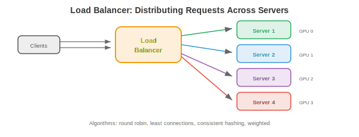
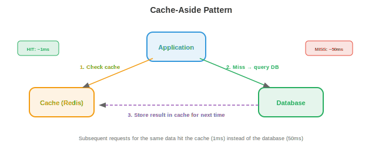

# 系统设计基础

*系统设计（systems design）是指如何构建可在大规模场景下可靠运行的软件。本文件涵盖客户端-服务器架构、网络协议、DNS、代理、负载均衡、缓存、数据库、消息队列、一致性模型与容错模式*

- 生产环境中的每一个 ML 系统都是分布式系统。一个推荐引擎不只是一个模型——它是一个 API 服务器、一个 feature store、一个 model registry、一个缓存层、一个消息队列以及一套监控栈，它们全部通过网络通信。理解系统设计，正是区分“我训练了一个模型”与“我做了一个产品”的关键。

- 顶级科技公司（Google、Meta、Amazon、OpenAI）的系统设计面试考察的就是你能否设计这类系统。本章为你提供构建基础（本文件）、云基础设施（第 02 篇）、扩展模式（第 03 篇）、ML 专属设计（第 04 篇）以及完整示例（第 05 篇）。

## 客户端-服务器架构

- 基本模式：**客户端**（client）发送请求，**服务器**（server）处理并返回响应。你的浏览器（客户端）向 google.com（服务器）发送 HTTP 请求，后者返回 HTML。

- **请求-响应模型**：同步的。客户端等待响应。简单但会形成瓶颈：客户端在等待时处于空闲，服务器必须先处理完当前请求再继续。

- **无状态服务器**（stateless servers）：服务器不记得之前的请求。每个请求都自带处理所需的全部信息。这让扩展变得容易：任何服务器都能处理任何请求，因此可以在负载均衡器后加更多服务器。

- **有状态服务器**（stateful servers）：服务器在请求之间维护状态（例如用户会话）。更难扩展，因为来自同一用户的请求必须发往同一服务器（会话亲和性，session affinity）。现代系统通过把状态存到数据库或缓存（Redis）中来规避服务器端状态。

## 网络协议

- 我们在第 13 章讲过网络（TCP/IP 分层、套接字）。这里我们关注系统设计中使用的应用层协议：

- **HTTP/HTTPS**：Web 与大多数 API 的协议。请求方法：GET（读取）、POST（创建/预测）、PUT（更新）、DELETE（删除）。HTTPS 在其上加入 TLS 加密（第 13 章安全部分）。REST API（第 15 章第 03 篇）就建立在 HTTP 之上。

- **WebSockets**：客户端与服务器之间持久的双向连接。不同于 HTTP（请求 → 响应 → 连接关闭），WebSocket 保持连接打开以进行实时流式传输。用途包括：LLM token 流式传输（生成一个 token 就发送一个）、实时仪表盘、聊天应用。

- **gRPC**：Google 的 RPC 框架。在 HTTP/2 之上使用 Protocol Buffers（二进制序列化，比 JSON 小且快约 10 倍）。支持流式传输（服务端、客户端、双向）。用于对性能有要求的内部服务间通信。Triton Inference Server（第 15 章）与 TensorFlow Serving 都使用 gRPC。

- **Protocol Buffers**：在 `.proto` 文件中定义消息 schema：

```protobuf
message PredictRequest {
    repeated float features = 1;
    string model_version = 2;
}

message PredictResponse {
    float prediction = 1;
    float confidence = 2;
}

service ModelService {
    rpc Predict(PredictRequest) returns (PredictResponse);
}
```

- 该 schema 可被编译成任意语言（Python、C++、Go、Java）的客户端与服务器代码。类型安全、向后兼容与性能都水到渠成。

## DNS

- **DNS**（Domain Name System，域名系统）把人类可读的名字翻译成 IP 地址（第 13 章）。就系统设计而言，DNS 还提供：

- **基于 DNS 的负载均衡**（load balancing）：对同一域名返回不同 IP 地址，把流量分摊到多台服务器。简单但粒度较粗（DNS 结果会被缓存几分钟到几小时，因此流量不会快速重新均衡）。

- **地理路由**：根据客户端位置返回最近数据中心的 IP。东京的用户拿到日本数据中心，伦敦的用户拿到欧洲数据中心。

- **故障转移**（failover）：如果某台服务器宕机，DNS 不再返回其 IP。新客户端会走向健康的服务器。但被缓存的 DNS 条目意味着部分客户端会在几分钟内继续访问已死的服务器（即 TTL 问题）。

## 代理

- **代理**（proxy）是客户端与服务器之间的中介：

- **反向代理**（reverse proxy，位于服务器前）：客户端连接到代理，由代理把请求转发到后端服务器。客户端不知道是哪台服务器处理的请求。**Nginx** 与 **HAProxy** 是标准反向代理。它们提供：负载均衡（分发请求）、SSL 终止（在代理处解密 HTTPS，向后端发送明文 HTTP）、缓存、限流与压缩。

- **API 网关**（API gateway）：一种专用于 API 的反向代理。处理认证、限流、请求路由（不同路径 → 不同服务）以及 API 版本管理。**Kong**、**AWS API Gateway** 与 **Envoy** 是常见选择。

- 对 ML serving 而言：API 网关位于你的模型服务器之前。它认证 API key、对免费层用户限流、把 `/v1/predict` 路由到模型服务器 A，把 `/v2/predict` 路由到模型服务器 B，并收集使用指标。

## 负载均衡

- 当你有多台服务器时，**负载均衡器**（load balancer）会把进入的请求分摊到各台服务器。



- **算法**：
    - **轮询**（round robin）：按顺序把请求发给服务器（1、2、3、1、2、3……）。简单、公平，但不考虑服务器负载。
    - **最少连接**（least connections）：发给当前活跃连接最少的服务器。更适合处理时间差异较大的请求（某些 LLM 请求只生成 10 个 token，另一些生成 1000 个）。
    - **加权轮询**（weighted round robin）：容量更大的服务器拿到更多请求。一台带 80 GB GPU 显存的服务器处理的请求量是 40 GB 服务器的 2 倍。
    - **一致性哈希**（consistent hashing）：把请求键哈希到一台特定服务器。相同的键总是去同一台服务器。适用于：缓存（对同一用户的请求命中同一缓存）、会话亲和，以及前缀缓存（第 17 章：带有相同 system prompt 的请求被发到持有该 prompt 的 KV cache 的服务器）。

- **L4 与 L7 负载均衡**：
    - **L4**（传输层）：基于 IP 与端口路由。快，但无法检查请求内容。
    - **L7**（应用层）：基于 HTTP 路径、头部或正文内容路由。可以把 `/api/chat` 路由到聊天服务器，把 `/api/embed` 路由到 embedding 服务器。更慢但更灵活。

## 缓存

- **缓存**（caching）把频繁访问的数据存放在快速存储层（RAM）中，以避免重复计算或重复抓取。



- **缓存模式**：
    - **Cache-aside**（懒加载）：应用先查缓存。未命中时，从数据库取回，写入缓存并返回。最常见的模式。
    - **Write-through**：每次写入同时进入缓存与数据库。保证缓存始终最新，但会拖慢写入。
    - **Write-back**：只写入缓存；缓存异步刷新到数据库。写入最快，但如果缓存在刷新前崩溃则有丢失数据的风险。

- **淘汰策略**（eviction policies，缓存满时）：
    - **LRU**（Least Recently Used，最近最少使用）：淘汰最久未被访问的条目。最常见策略。
    - **LFU**（Least Frequently Used，最不常使用）：淘汰访问次数最少的条目。当某些项长期热门时更合适。
    - **TTL**（Time To Live，存活时间）：条目在固定时长后过期。用于会过期的数据（模型预测缓存 5 分钟，特征值缓存 1 小时）。

- **CDN**（Content Delivery Network，内容分发网络）：面向静态内容（图片、JavaScript、CSS）的全球分布式缓存。服务器遍布全球 100 多个地点，从离用户最近的位置提供缓存内容。对 ML 而言：模型权重可缓存于 CDN 以便快速下载。

- **Redis**：标准的内存缓存/数据库。支持 strings、lists、sets、sorted sets、hashes 与 streams。亚毫秒级 latency。用途：缓存模型预测、存储会话数据、限流（按用户按分钟统计请求数）以及实时特征 serving。

- 对 ML serving：对重复输入缓存预测。如果许多用户都问“法国的首都是什么？”，计算一次答案后用缓存结果返回即可。对聊天机器人工作负载，20-40% 的缓存命中率很常见，能按比例降低 GPU 成本。

## 数据库

### SQL（关系型）

- **SQL 数据库**（PostgreSQL、MySQL）把数据存储在由行和列组成的表中。表与表之间的关系通过外键表达。查询使用 SQL。**ACID** 保证：

    - **原子性**（Atomicity）：一个事务要么全部完成，要么全部回滚。不存在部分更新。
    - **一致性**（Consistency）：数据库从一个有效状态迁移到另一个有效状态。约束（唯一键、外键）始终满足。
    - **隔离性**（Isolation）：并发事务互不干扰。
    - **持久性**（Durability）：已提交数据在崩溃后依然存活（在确认前已写入磁盘）。

- SQL 数据库擅长：带关系结构的结构化数据、复杂查询（join、聚合）、严格一致性要求以及数据完整性。

### NoSQL

- **NoSQL 数据库**用部分 ACID 保证换取可扩展性与灵活性：

    - **键值存储**（Redis、DynamoDB）：最简单模型。按键快速查找。用于缓存、会话存储与 feature store。
    - **文档存储**（MongoDB、Firestore）：存储类 JSON 文档。灵活 schema（每个文档可有不同字段）。用于用户画像、产品目录与配置。
    - **列族存储**（Cassandra、HBase）：针对写密集型工作负载与时序数据优化。用于事件日志、指标与分析。
    - **图数据库**（Neo4j）：存储节点与边。针对遍历查询优化。用于社交网络、知识图谱与推荐系统。
    - **向量数据库**（Pinecone、Milvus、Weaviate、FAISS）：存储高维 embedding，支持近似最近邻（ANN）搜索。是语义搜索、RAG（检索增强生成）与推荐系统的核心。

### CAP 定理

- 在分布式数据库中，三项特性最多同时满足两项：

    - **一致性**（Consistency）：每次读都返回最近的写。
    - **可用性**（Availability）：每个请求都收到响应（即使部分节点宕机）。
    - **分区容错性**（Partition tolerance）：即便发生网络分区（节点之间无法通信），系统仍继续运行。


- 由于网络分区在分布式系统中不可避免，真正的选择是 **CP**（一致但分区期间可能不可用——例如 PostgreSQL）对 **AP**（可用但分区期间可能返回旧数据——例如 Cassandra、DynamoDB）。

- 对 ML：feature store 通常选 AP（一个略旧的特征值好过没有预测）。model registry 选 CP（serving 错误的模型版本是灾难性的）。

### 分片

- **分片**（sharding）把数据库拆分到多台机器上。每个分片持有一部分数据。

- **哈希分片**：对键做哈希以决定分片。`shard = hash(user_id) % num_shards`。分布均匀但无法做范围查询。

- **范围分片**：每个分片持有一个键范围（用户 A-G 在分片 1，H-N 在分片 2）。支持范围查询，但可能产生热点（如果许多用户姓名以 "S" 开头）。

- **重新分片问题**：新增一个分片会让哈希映射失效。**一致性哈希**最小化数据迁移：新增第 n 个分片时只需迁移约 1/n 的键。

### 数据库索引

- **索引**（index）是一种用额外存储和更慢写入换取更快查询的数据结构。没有索引时，一次查询要扫描每一行（**O(n)**）。有索引时，可在 **O(log n)** 内找到目标。

- **B 树索引**（默认）：一种平衡树（第 13 章、第 14 章），每个节点包含多个键与指针。B 树对缓存友好（宽节点能放进缓存行）并支持范围查询（`WHERE age BETWEEN 20 AND 30`）。多数 SQL 数据库使用 B 树。

- **哈希索引**：用哈希函数把键映射到行位置。$O(1)$ 查找但不支持范围查询。用于精确匹配查找（`WHERE id = 12345`）。

- **复合索引**：在多列上建立索引。`CREATE INDEX ON users(country, city)` 能加速按 country，或按 country + city 过滤的查询，但不能仅按 city 过滤（最左列必须出现在查询中）。

- **权衡**：每个索引都加快读但拖慢写（每次 insert/update/delete 都要更新索引）并占用存储（每个索引约表大小的 10-30%）。不要给所有列都建索引——只给你频繁查询的列建。

- **对 ML 系统**：feature store 的在线数据库需要针对实体键（user_id、item_id）建索引以便快速查找特征。实验追踪数据库需要对 (experiment_id, metric_name) 建索引以支持仪表盘查询。

### API 设计

- 系统之间通过 API 通信。好的 API 设计让系统可用、可演进、可调试：

- **REST 约定**：用名词表示资源（`/users`、`/models`），用 HTTP 方法表示动作（GET = 读取，POST = 创建，PUT = 更新，DELETE = 删除），用状态码表示结果（200 = OK，201 = 已创建，400 = 错误请求，404 = 未找到，429 = 限流，500 = 服务器错误）。

- **分页**：对返回列表的端点，永远不要一次性返回全部结果。使用游标分页（`GET /items?cursor=abc&limit=50`）或偏移分页（`GET /items?offset=100&limit=50`）。对大数据集而言游标分页更高效（偏移分页需要跳过若干行）。

- **版本管理**：在 API 路径前加版本前缀（`/v1/predict`、`/v2/predict`）。这样可以在不破坏现有客户端的情况下演进 API。客户端按自己的节奏迁移到 v2；v1 被废弃但在流量下降前不会被移除。

- **错误响应**：返回结构化错误，带足够的调试信息：

```json
{
    "error": {
        "code": "INVALID_INPUT",
        "message": "Feature 'user_age' must be a positive integer",
        "details": {"field": "user_age", "value": -5}
    }
}
```

## 消息队列

- **消息队列**（message queues）把生产者（生成工作的服务）与消费者（处理工作的服务）解耦。生产者把消息发到队列；消费者在就绪时拉取。

- **队列为何重要**：没有队列时，如果消费者慢或宕机，生产者会被阻塞。有了队列，生产者发完即忘；队列把消息缓存起来直到消费者就绪。

- **Apache Kafka**：分布式、持久化、高吞吐的消息队列。消息存放在 **topics** 中，每个 topic 跨多个 broker 分区。消费者从分区读取，并跟踪自己的位置（**offset**）。Kafka 保证分区内有序，并可重放消息（日志是持久化的）。

- **发布/订阅**（pub/sub）：发布者把消息发到某个 topic；该 topic 的所有订阅者各收到一份副本。用于事件驱动架构：“一个新模型已部署”会同时触发监控服务、A/B testing 服务和日志服务。

- 对 ML：一个预测请求经 HTTP 到达，被放入 Kafka 队列，由 GPU worker 处理，结果通过回调或 WebSocket 返回。队列缓冲流量突发，并确保 GPU worker 崩溃时不会丢失请求。

## 一致性模型

- 在分布式系统中，不同节点对数据可能有不同视图。**一致性模型**（consistency models）定义系统提供何种保证：

- **强一致性**（strong consistency）：一次写之后，所有后续读（来自任何节点）都看到新值。易于推理但慢（需要节点间协调）。

- **最终一致性**（eventual consistency）：一次写之后，读可能在一段时间内看到旧数据，但最终会看到新值。快（无需协调）但要求应用处理旧读。

- **因果一致性**（causal consistency）：如果操作 A 因果上先于 B（例如“先写 X 再读 X”），系统保证 B 能看到 A 的结果。但无因果关系的操作可以以任意顺序被看到。

- **读己之写**（read-your-writes）：用户总是能立即看到自己的写入，即便其他用户看到的是旧数据。这是大多数应用所需的最小一致性。

## 容错模式

- **限流**（rate limiting）：限制每个用户每个时间窗口的请求数。防止滥用并保证公平访问。用 Redis 中的令牌桶或滑动窗口计数实现。

- **熔断器**（circuit breaker）：如果下游服务开始失败（错误率超过阈值），熔断器“打开”并停止向其发送请求（立即返回兜底响应）。超时后它“半开”并发送一个测试请求。如果测试成功，则关闭（恢复正常运行）。这能防止级联失败：如果 feature store 宕机，模型服务器会返回不带特征的预测，而不是每次请求都超时。

- **背压**（backpressure）：当系统被压垮时，它向上游发出信号让其放慢。它不会接受请求后再失败，而是提前拒绝多余请求（返回 429 或 503 状态码）。客户端以指数退避重试。

- **指数退避重试**（retry with exponential backoff）：如果请求失败，等 1 秒重试。如果再失败，等 2 秒。然后 4、8……加入抖动（随机延迟）以防所有客户端同时重试（惊群问题）。

- **幂等性**（idempotency）：一个操作如果做两次的效果与做一次相同，就是幂等的。`PUT /user/123 {"name": "Alice"}` 是幂等的（把名字设成 "Alice" 两次也没问题）。`POST /payments` 不是幂等的（支付两次很糟）。让操作幂等可保证重试安全。
