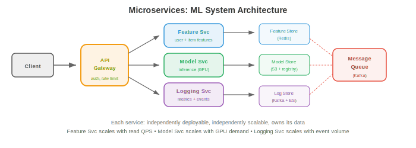
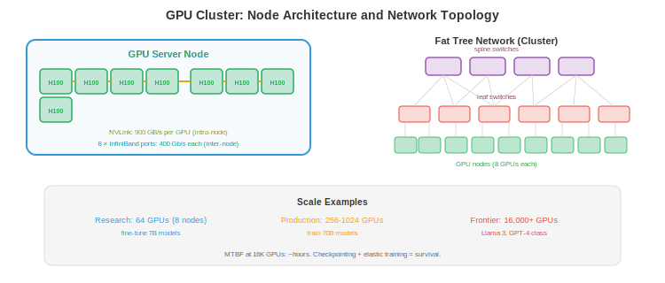

# 大规模基础设施

*为数百万用户构建系统需要的远不止一台服务器。本文件涵盖可扩展性模式、分布式系统基础、微服务、数据流水线、数据库扩展、搜索与向量系统、可观测性、可靠性工程与 CI/CD*

- 每秒处理 1 个请求的模型可以跑在笔记本上。要以 99.9% 可用性每秒处理 100,000 个请求，需要分布式系统、自动故障转移与精心设计的数据流水线。本文件覆盖打通这一鸿沟的各种模式。

## 可扩展性

- **垂直扩展**（vertical scaling，scale up）：换一台更大的机器。更多 CPU、更多 RAM、更大 GPU。简单但有硬性上限（可用的最大机器）且存在单点故障。

- **水平扩展**（horizontal scaling，scale out）：加更多机器。每台处理一部分流量。没有单机上限，但需要：负载均衡（第 01 篇）、数据分区以及处理分布式状态。

- **无状态服务**默认可水平扩展。在负载均衡器后加更多实例即可。一个在启动时加载权重、独立处理请求的模型 inference 服务器是无状态的——任何实例都能处理任何请求。

- **有状态服务**（数据库、KV cache、feature store）更难扩展。状态必须跨机器分区（分片，第 01 篇）并复制以容错。

- **可扩展性方程**：对一个有 $n$ 台服务器的系统：
    - **理想情况**：throughput 线性扩展（$n$ 台服务器 → $n\times$ throughput）。
    - **实际情况**：来自协调、负载均衡与数据传输的开销使 throughput 次线性扩展。Amdahl 定律（第 13 章）适用：串行部分（共享状态、协调）限制了加速比。

## 分布式系统

- **分布式系统**是一组协同提供服务的机器。根本挑战：

- **网络分区**：机器之间不一定总能通信。网线被切断、交换机故障、数据中心断电。系统必须能处理部分失败。

- **时钟漂移**：机器有不同的时钟。“事件 A 在机器 1 上发生于 10:00:01”与“事件 B 在机器 2 上发生于 10:00:01”并不意味着它们同时发生。**逻辑时钟**（Lamport 时间戳、向量时钟）在不依赖物理时钟的情况下建立顺序。

- **共识**（consensus）：多台机器如何对一个值达成一致（例如谁是 leader）？**Raft** 是标准共识算法。一组节点选举出 leader。leader 处理所有写。如果 leader 故障，剩余节点选举新 leader。需要多数派（5 个节点中的 3 个）才能运行，因此可容忍 $\lfloor(n-1)/2\rfloor$ 次故障。

- **分布式锁**：确保只有一台机器执行关键操作。**Redlock**（基于 Redis）跨多个 Redis 实例获取锁。如果多数实例授权，则锁被获取。用于：防止重复部署模型、确保只有一个训练作业写入 checkpoint。

## 微服务



- **微服务**（microservices）把系统拆成多个小而可独立部署的服务。每个服务拥有一个领域：

```
┌─────────────┐  ┌──────────────┐  ┌─────────────┐
│ API Gateway │→ │ Feature Svc  │→ │ Feature DB  │
└─────────────┘  └──────────────┘  └─────────────┘
       │
       ├────────→ ┌──────────────┐  ┌─────────────┐
       │          │ Model Svc    │→ │ Model Store │
       │          └──────────────┘  └─────────────┘
       │
       └────────→ ┌──────────────┐  ┌─────────────┐
                  │ Logging Svc  │→ │ Log Store   │
                  └──────────────┘  └─────────────┘
```

- **优点**：独立部署（更新模型服务而不动特征服务）、独立扩展（按请求负载扩容模型服务器、按 feature store 读取速率扩容特征服务器）、技术自由（模型服务用 Python，特征服务用 Go）。

- **缺点**：网络开销（每次服务调用都是一次网络往返）、复杂度（调试要跨多个服务）、数据一致性（没有跨服务事务）。

- **服务发现**：API 网关如何找到模型服务？选项：基于 DNS（每个服务注册一个 DNS 名）、K8s services（内置），或服务注册中心（Consul、Eureka）。

- **Saga 模式**：对跨多个服务的操作（创建用户 + 分配资源 + 发欢迎邮件），使用 saga：一系列本地事务，任一步失败时执行补偿动作。

## 数据流水线

- ML 系统消耗海量数据。**数据流水线**（data pipelines）负责移动、转换并 serving 这些数据：

### 批处理

- 以固定间隔（每小时、每天）处理大批量数据。

- **MapReduce**：最早的批处理范式。Map（独立变换每条记录）→ Shuffle（按键分组）→ Reduce（按组聚合）。概念上简单但实现起来冗长。

- **Apache Spark**：现代批处理引擎。内存中处理（对迭代算法比 MapReduce 快 100 倍）。支持 SQL、DataFrames 与 ML 流水线。是大规模特征工程的事实标准。

- **示例**：为推荐系统计算用户特征。输入：最近 30 天的 10 亿条用户活动事件。输出：1 亿条用户特征向量。作为 Spark 作业每天运行，输出到 feature store。

### 流处理

- 数据到达时实时处理（亚秒级 latency）。

- **Apache Flink**：领先的流处理引擎。精确一次（exactly-once）处理、事件时间处理（按事件发生时刻而非到达时刻处理）、窗口（tumbling、sliding、session 窗口）。

- **Kafka Streams**：内置于 Kafka 的轻量级流处理。适合无需部署独立集群的较简单变换（过滤、聚合）。

- **示例**：实时欺诈检测。每笔信用卡交易是一个 Kafka 事件。一个 Flink 作业计算滚动统计（交易频率、地点变化）并在 100ms 内标记异常。

### Lambda 架构

- 结合批与流处理。**batch 层**提供准确、全面的结果（但有延迟）。**speed 层**提供近似、实时的结果。**serving 层**合并两者。

- 实践中，许多团队如今使用 **Kappa 架构**：只做流处理，把流视为事实来源。流是可重放的（Kafka 保留事件），因此重放流即可模拟批处理。

## ML 训练基础设施

- 训练一个前沿模型（100B+ 参数）是一个大规模基础设施问题：数千块 GPU 运行数月，消耗兆瓦级电力，产生 PB 级数据，花费数千万美元。基础设施决定训练成败。

### GPU 集群

- 一个训练集群是由高速网络连接的一组 GPU 服务器。关键组件：



- **GPU 服务器（节点）**：每台服务器有 4-8 块 GPU。典型配置：8 × H100 GPU、2 × AMD EPYC CPU、2 TB RAM、30 TB NVMe SSD。节点内 GPU 通过 **NVLink** 连接（H100 上每块 GPU 900 GB/s），比 PCIe 快 30 倍。

- **集群规模**：小型训练集群有 64-256 块 GPU（8-32 个节点）。前沿模型训练集群有 4,000-32,000 块 GPU（500-4000 个节点）。Meta 的 Llama 3 用了 16,384 块 H100。Google 在 8,000+ 芯片的 TPU pod 上训练。

- **粗略估算**：训练一个 70B 模型约需 $2M 算力。训练一个 400B+ 前沿模型约需 $50-100M。集群硬件本身按 H100 价格（每块 GPU $30K × 16,000 = $480M）约 $500M-$1B。

### 网络拓扑

- GPU 节点之间的网络是最关键的基础设施组件。如果 GPU 无法足够快地交换梯度，它们就会在等待通信完成时空闲。

- **InfiniBand** 是 GPU 集群网络的标准。NVIDIA 的 **Quantum-2 InfiniBand** 每端口 400 Gb/s。每个节点通常有 8 个 InfiniBand 端口（每 GPU 一个），每节点 400 GB/s 总二分带宽。

- **RDMA**（Remote Direct Memory Access，远程直接内存访问）：InfiniBand 支持 RDMA，在不同节点的 GPU 显存之间直接传输数据，不经 CPU。这将 latency 从约 100μs（TCP）降到约 1μs，对高效梯度 all-reduce 至关重要（第 6 章）。

- **网络拓扑很关键**：**胖树**（Clos 网络）提供全二分带宽（任一 GPU 都能以全速与任一其他 GPU 通信）。更便宜的拓扑（**rail-optimised**、**3D torus**）带宽更少但成本更低。拓扑必须与并行策略匹配：
    - **数据并行**：跨所有 GPU 的 all-reduce → 需要高二分带宽（胖树）。
    - **张量并行**：节点内通信 → 由 NVLink 处理（无需网络）。
    - **流水线并行**：相邻流水线阶段之间通信 → 只需特定节点对之间的带宽（rail-optimised 即可）。

- **以太网替代方案**：**RoCE v2**（RDMA over Converged Ethernet）在标准以太网基础设施上提供 RDMA。比 InfiniBand 便宜，但 latency 更高、拥塞更多。Google 在某些 TPU pod 网络中使用 RoCE。Ultra Ethernet Consortium 正在为 AI 工作负载开发无损以太网。

### 训练存储

- 训练需要三层存储：

    - **数据集存储**：训练语料（1-100 TB 文本，或多模态 PB 级数据）。存于分布式文件系统或对象存储。必须支持高吞吐顺序读取（数据加载器大批量读取）。**Lustre** 与 **GPFS** 是常见 HPC 文件系统；云端替代包括 **FSx for Lustre**（AWS）与 **Filestore**（GCP）。

    - **Checkpoint 存储**：周期性保存的训练状态（模型权重 + 优化器状态 + scheduler 状态）。对一个混合精度、用 Adam 优化器的 70B 模型：每个 checkpoint 约 560 GB（70B × 4 字节 × 2（优化器））。3 个月训练每小时保存一次 ≈ 2000 个 checkpoint = 1.1 PB。实践中只保留最近 N 个，旧的删除。必须足够快，不致显著拖慢训练。

    - **日志与指标**：实验追踪数据（loss 曲线、学习率调度、梯度范数）。相对较小但必须实时写入。W&B、MLflow 或 TensorBoard 负责这些。

- **存储瓶颈**：一个 16,000-GPU 集群加载一个训练 batch 需要持续读取约 100 GB/s 数据。如果文件系统无法维持这一吞吐，GPU 会在等待数据时空闲。数据流水线优化（预取、缓存、用 WebDataset 或 Mosaic Streaming 优化格式）至关重要。

### 作业调度

- 一个 GPU 集群服务多个团队和项目。**作业调度器**把 GPU 分配给训练作业：

- **SLURM**：标准 HPC 作业调度器。用户提交作业并指定 GPU 数、内存与时间限制。SLURM 分配资源并管理队列。支持基于优先级的调度、抢占与团队间的公平份额分配。

- **带 GPU 调度的 Kubernetes**（第 18 章第 02 篇）：云原生方案。K8s GPU 设备插件把 GPU 暴露为可调度资源。**Volcano** 与 **Run:ai** 加入 ML 专属调度特性：gang 调度（一次性为作业分配所有 GPU，而非逐个）、优先级队列与 GPU 分时共享。

- **调度挑战**：
    - **碎片化**：一个 1000-GPU 集群可能有 200 块空闲，但分散在 50 个节点（每节点 4 块）。一个需要 128 块连续 GPU 的作业无法运行，尽管总量足够。**碎片整理**（迁移作业以聚合空闲 GPU）或**拓扑感知调度**（分配连接良好的 GPU）可解决此问题。
    - **优先级与抢占**：紧急实验应抢占低优先级作业。但抢占一个已运行 2 天的训练作业会浪费算力。调度器必须在优先级与效率间平衡。
    - **公平份额**：各团队随时间应得到其分配的算力比例，即便某团队提交的作业超过其份额。

### 容错

- 在数千块 GPU 连续运行数月的规模下，硬件故障不是异常——而是常态。16,000-GPU 集群的平均故障间隔以小时而非月计。

- **常见故障**：GPU 显存错误（ECC 可纠正与不可纠正）、NVLink 故障（节点内 GPU 间通信）、InfiniBand 链路故障（节点间通信）、节点崩溃（kernel panic、PSU 故障）以及存储故障（磁盘或控制器故障）。

- **Checkpointing** 是首要防线。每 N 步保存完整训练状态（模型、优化器、数据加载器位置）。故障时：定位故障节点，替换或移除它，从最近 checkpoint 重启训练。一次故障的代价是上次 checkpoint 到故障发生之间的算力。

- **Checkpoint 频率权衡**：频繁 checkpoint（每 10 分钟）在故障时浪费算力更少，但会拖慢训练（560 GB 的 checkpoint 耗时）。不频繁 checkpoint（每 2 小时）更快，但故障时最多浪费 2 小时算力。多数团队每 20-60 分钟 checkpoint 一次。

- **弹性训练**：现代框架（PyTorch Elastic、DeepSpeed）支持在不停训的情况下调整训练规模。500 个节点中 2 个故障，训练用 498 个继续。故障节点被替换后，在其重新上线时自动纳入训练。

- **健康监控**：持续监控所有 GPU（温度、显存错误、计算吞吐）、网络链路（丢包、latency）与存储（吞吐、错误率）。异常时自动告警。某些集群会周期性运行 GPU 健康检查（一段短计算测试）以在硬件故障前主动识别退化。

- **规模化视角**：训练 Meta 的 Llama 3（16,384 块 H100、54 天）经历了约 466 次作业中断。有效训练时间只占墙上时间的约 90%——10% 损耗于故障与恢复。能达成 90%（而非 50% 或 70%）的基础设施，正是区分能否训练前沿模型的组织的分水岭。

### 成本与效率

- 训练基础设施成本主要由 GPU 小时构成：

| 组件 | 占总成本比例 |
|-----------|----------------|
| GPU 计算 | 70-80% |
| 网络（InfiniBand） | 10-15% |
| 存储 | 5-10% |
| 散热与电力 | 5-10% |

- **GPU 利用率**（Model FLOPs Utilisation，MFU）衡量 GPU 理论峰值性能中实际用于有用计算的比例。H100 峰值为 989 TFLOPS（FP8）。达到 40-50% MFU 算不错；50-60% 算优秀。差距来自：通信开销（all-reduce、流水线气泡）、显存带宽限制，以及 checkpoint 与数据加载期间的空闲。

- **提升 MFU**：重叠计算与通信（第 6 章）、使用高效 attention（Flash Attention，第 16 章）、优化数据加载（避免 GPU 饥饿）、降低 checkpoint 开销（异步 checkpointing，先写快 NVMe，再后台拷贝到持久存储）。

- **自建 vs 采购**：小规模（<256 GPU）下云更便宜（无前期成本，按小时付费）。大规模（>1000 GPU、持续使用 6 个月以上）下自建硬件更便宜（3 年 TCO 低约 2-3 倍）。多数 AI 公司混搭：自建集群用于持续训练，云用于突发容量与实验。

## 数据库扩展

- **读副本**（read replicas）：把读查询路由到主库的副本。主库处理写，副本处理读。由于多数工作负载是读密集型（95%+ 读），这能随副本数线性扩展读 throughput。

- **分区**（partitioning，即第 01 篇的分片）：把数据拆到多个数据库。每个分区独立，可并行读写。挑战在于跨分区查询（join 不同分片的数据）。

- **连接池**（connection pooling）：数据库连接容量有限。连接池（PostgreSQL 用 PgBouncer）跨请求复用连接，防止数百个服务实例各自尝试连接时连接耗尽。

## 搜索与向量系统

### 文本搜索

- **倒排索引**（inverted index）：文本搜索的基础。对每个词，存储包含该词的文档列表。查询时对每个查询词的列表求交。**Elasticsearch** 是标准方案：分布式、实时，支持全文搜索、聚合与地理查询。

- **BM25**：标准文本检索打分函数。按词频、逆文档频率与文档长度归一化给文档打分。简单但有效——对关键词密集的查询仍可与神经方法竞争。

### 向量搜索

- **向量数据库**存储 embedding（高维向量）并支持快速 **近似最近邻（ANN）**搜索。给定查询 embedding，找出 $k$ 个最相似的已存 embedding。

- **FAISS**（Facebook AI Similarity Search）：用于 ANN 搜索的库（不是数据库）。支持多种索引类型：
    - **Flat**：精确搜索，$O(n)$。用于小数据集或作为基准真值。
    - **IVF**（Inverted File）：把向量划分成簇，只搜索最近的簇。每次查询 $O(n/k)$。
    - **HNSW**（Hierarchical Navigable Small World）：基于图。构建分层图，从粗到细导航。极快且准确，是多数应用的默认选择。
    - **乘积量化（Product Quantisation，PQ）**：把向量压缩成紧凑编码以实现内存高效搜索。用精度换内存。

- **托管向量数据库**：Pinecone、Weaviate、Milvus、Qdrant。它们处理 FAISS 不擅长的扩展、复制与实时更新。

- **对 RAG**（Retrieval-Augmented Generation，检索增强生成）：用户查询 → 用文本编码器 embedding → 在向量数据库中搜索相关文档 → 把检索到的文档前置到 LLM prompt。检索质量直接决定 LLM 响应质量。

## 可观测性

- **可观测性**（observability）是从系统外部输出了解其内部发生了什么的能力。三大支柱：

### 日志

- **结构化日志**（JSON）可搜索、可解析。非结构化日志（"ERROR: something failed"）不行。始终记录：时间戳、服务名、请求 ID（用于跨服务追踪）、严重级别，以及相关上下文。

- **ELK 栈**（Elasticsearch、Logstash、Kibana）：标准日志流水线。Logstash 收集并变换日志，Elasticsearch 建索引，Kibana 可视化与搜索。

### 指标

- **指标**（metrics）是随时间变化的数值测量：请求率、错误率、latency 分位、GPU 利用率、队列深度。**Prometheus** 从服务抓取指标；**Grafana** 在仪表盘中可视化并告警。

- 服务的 **RED 方法**：**R**ate（请求/秒）、**E**rrors（错误率）、**D**uration（latency）。对每个服务都监控这三项。

- 资源的 **USE 方法**：**U**tilisation（使用率百分比）、**S**aturation（队列深度）、**E**rrors。对每个资源（CPU、GPU、内存、磁盘、网络）都监控这三项。

### 链路追踪

- **分布式追踪**（distributed tracing）跟随单个请求跨多个服务。一个用户请求命中 API 网关 → 特征服务 → 模型服务 → 后处理。一条 **trace** 记录每一跳的耗时，显示 latency 花在哪里。

- **OpenTelemetry**：trace、metrics 与日志的开放标准。一次性埋点，导出到任意后端（Jaeger、Zipkin、Datadog）。

## 可靠性

- **SLO**（Service Level Objective，服务等级目标）：目标可靠性。“99.9% 的请求在 <200ms 内完成。”这给出一个具体的错误预算：0.1% 的请求（约每月 43 分钟）可以慢或失败。

- **SLI**（Service Level Indicator，服务等级指标）：度量值。“过去 5 分钟的 99 分位 latency。”

- **SLA**（Service Level Agreement，服务等级协议）：带后果的合同承诺。“如果可用性降到 99.95% 以下，客户获得信用额度。”

- **错误预算**（error budgets）：如果 SLO 是 99.9% 而实际为 99.99%，你就有预算做有风险的变更（部署新模型、迁移数据库）。如果实际为 99.85%，冻结所有变更并专注可靠性。错误预算把可靠性从抽象目标变成可度量的资源。

- **混沌工程**（chaos engineering）：主动注入故障（杀掉一台服务器、加网络 latency、损坏数据）以测试系统能否正确应对。Netflix 的 Chaos Monkey 随机终止生产实例。如果系统仍然存活，它就是有韧性的。如果它倒下，你就在用户之前发现了一个 bug。

## CI/CD

- **持续集成**（Continuous Integration）：自动构建并测试每次代码变更。每次 push 触发：lint、类型检查、单元测试、集成测试。任一失败则变更被拒。这在 bug 进入生产之前就捕获它们。

- **持续部署**（Continuous Deployment）：自动部署通过 CI 的变更。部署策略：

    - **蓝绿**（blue-green）：跑两套相同环境（blue = 当前，green = 新）。瞬时把流量从 blue 切到 green。如果 green 失败，切回 blue（瞬时回滚）。

    - **金丝雀**（canary deployment）：把一小部分流量（1-5%）路由到新版本。监控错误。指标良好则逐步加大流量。这限制了一次坏部署的影响范围。

    - **特性开关**（feature flags）：部署新代码但藏在开关后。对部分用户（内测，然后 beta，然后所有人）开启开关。把部署（代码已上线）与发布（用户看到特性）解耦。

- 对 ML：CI/CD 包含模型专属步骤。一次模型变更触发：单元测试（shape 测试、梯度检查）、在留出集上评估（准确率不得回退）、影子部署（新模型与旧模型并行运行，对比输出），以及逐步放量（canary 从 1% → 100%）。
