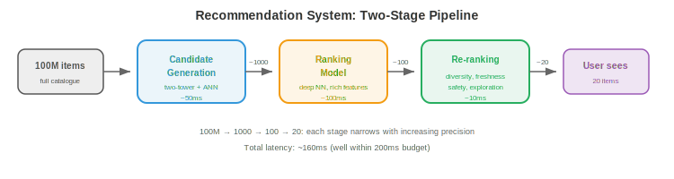

# ML 设计示例

*学习 ML 系统设计最好的方式是看完整范例。本文件走查七个完整设计：推荐系统、搜索排序、广告点击预测、欺诈检测、内容审核、对话式 AI 与大规模图像搜索。*

- 每个示例遵循统一框架：
    1. **问题定义**：我们在建什么、用户是谁、约束是什么？
    2. **数据**：我们有什么数据、如何采集、如何标注？
    3. **特征**：模型需要什么特征？
    4. **模型**：什么架构与训练方法？
    5. **Serving**：模型如何部署与 serving？
    6. **评估**：如何衡量成功？
    7. **迭代**：随时间我们会做哪些改进？

---

## 1. 推荐系统（如 YouTube、Netflix、Spotify）

### 问题定义

- **目标**：向用户展示他们会喜欢的内容，最大化参与度（观看时长、收听次数、点击）。
- **规模**：10 亿+ 用户、1 亿+ 商品、每秒 1 万+ 次推荐。
- **Latency**：完整推荐流水线 < 200ms。
- **关键挑战**：候选空间巨大（1 亿商品）。无法实时对所有用户对所有商品打分。

### 架构：两阶段流水线



```
100M items → Candidate Generation (fast, coarse) → 1000 candidates
          → Ranking (slow, precise) → 100 ranked items
          → Re-ranking (business rules) → 20 shown to user
```

### 候选生成

- **目标**：把 1 亿商品缩减到约 1000 个候选。必须快（< 50ms）。
- **双塔模型**：把用户和商品编码到同一 embedding 空间。用户 embedding 捕捉偏好；商品 embedding 捕捉内容特征。得分 = 用户与商品 embedding 的点积。
- **训练**：在 (user, positive_item, negative_items) 三元组上做对比学习。正样本 = 用户参与过的商品。负样本 = 随机商品 + 困难负样本（用户未参与的热门商品）。
- **Serving**：预计算所有商品 embedding。请求时：计算用户 embedding，做 ANN 搜索（向量数据库中的 HNSW）找出 1000 个最近的商品 embedding。

### 排序

- **目标**：对 1000 个候选精确打分。可承受约 100ms。
- **模型**：一个深度神经网络（MLP 或 transformer），输入丰富特征：用户特征（人口统计、历史、上下文）、商品特征（内容、热度、新鲜度），以及交叉特征（用户-商品交互历史、上下文相关性）。
- **输出**：预测的参与概率（点击、观看 50%+、点赞、分享）。多目标可组合：$\text{score} = w_1 \cdot P(\text{click}) + w_2 \cdot P(\text{watch}) + w_3 \cdot P(\text{like})$。

### 重排

- 应用业务规则：多样性（不要展示同一创作者的 5 个视频）、新鲜度（提升新内容）、安全（过滤被标记的内容），以及个性化探索（展示一些用户可能发现的较低排名商品）。

### 粗略数字

- **商品 embedding 索引**：1 亿商品 × 256 维 × float16 = 50 GB。HNSW 索引额外约 2 倍开销 → 约 100 GB。可放进一台 128 GB RAM 的机器，或分片到 4 × 32 GB 的机器。

- **用户 embedding 计算**：每用户约 5ms（在用户特征上的小 MLP）。10K QPS 下约需 50 个模型副本承担负载。

- **ANN 搜索**：用 HNSW 从 1 亿向量中找 top-1000 约 2ms。10K QPS 下每个索引副本承担约 500 QPS → 需 20 个副本。

- **排序模型**：1000 个候选 × 每候选约 0.1ms = 每请求 100ms。10K QPS 下每秒需 1000 GPU 秒 → 单排序约需 10 块 A10G GPU。

- **基础设施总量**：约 20 个 embedding 索引副本 + 约 50 个用户 embedding 服务器 + 约 10 个排序 GPU + 缓存 + 负载均衡器。成本：云价格下约 $50K-$100K/月。

### 冷启动

- **新用户**（无历史）：使用人口统计特征、设备/位置上下文与基于热度的推荐。5-10 次交互后切换到个性化模型。

- **新商品**（无参与数据）：使用基于内容的特征（标题、描述、缩略图 embedding）。分配探索预算：向部分用户展示新商品以快速收集参与数据。加推期结束后仍无参与的商品被降权。

- **冷启动是系统问题**：feature store 必须优雅处理缺失特征（返回默认值而非报错）。模型必须在带缺失特征的情况下训练（训练时对用户历史特征做 dropout 模拟新用户）。

### 评估

- **离线**：在留出集上算 NDCG（Normalized Discounted Cumulative Gain，归一化折损累计增益）、recall@K、precision@K。
- **在线**：A/B test 测量观看时长、DAU、留存。长期 A/B test（数周）以捕捉短期测试遗漏的对留存的影响。

---

## 2. 搜索排序（如 Google、Bing）

### 问题定义

- **目标**：给定用户查询，从数十亿文档的语料库中返回最相关的结果。
- **Latency**：总计 < 500ms（100ms 召回 + 200ms 排序 + 100ms 渲染 + 开销）。

### 架构：查询理解 → 召回 → 排序

### 查询理解

- 在召回之前，先处理原始查询以改进结果：

- **拼写纠正**："reccomendation systm" → "recommendation system"。用编辑距离模型或在搜索日志的（拼错、纠正）对上训练的序列到序列模型。

- **查询扩展**：加入相关词以提高召回。"Python ML" → "Python machine learning scikit-learn pytorch"。使用同义词词典、词 embedding，或用 LLM 生成扩展。

- **意图分类**：判断用户想要什么。"buy Nike shoes" 是**事务型**（展示商品页）。"How does backpropagation work" 是**信息型**（展示文章）。"facebook.com" 是**导航型**（直达站点）。不同意图应触发不同召回策略与结果布局。

- **实体识别**：从查询中抽取实体。"best restaurants near Times Square" → 位置："Times Square"，实体类型："restaurants"。路由到位置感知的搜索流水线。

### 召回

- **BM25**（传统）：基于倒排索引的词匹配召回。快，对关键词查询有效。无语义理解（"dog food" 不匹配 "canine nutrition"）。

- **稠密召回**（dense retrieval）：把查询与文档编码为 embedding（使用 DPR 或 ColBERT 等双编码器）。通过 ANN 搜索召回。捕捉语义相似（"dog food" 匹配 "canine nutrition"）。比 BM25 慢，但对自然语言查询更好。

- **混合召回**：结合 BM25 与稠密召回。BM25 找精确关键词匹配；稠密召回找语义匹配。合并去重。兼得两者之长。

### 排序

- **Learning to rank**：一个模型为每个 (query, document) 对打分。三种方法：
    - **Pointwise**：独立预测每个文档的相关性得分。简单但忽略相对顺序。
    - **Pairwise**：预测两篇文档哪篇更相关。LambdaMART（梯度提升树）是经典方法。
    - **Listwise**：直接为列表级指标（NDCG）优化整个排序列表。更复杂但效果最好。

- **Cross-encoder**：一个 transformer，以 `[query, document]` 为输入输出相关性得分。比双编码器（独立编码 query 与 document）更准，因为它捕捉细粒度交互。但对整个语料太慢——只用于对召回出的前 100-1000 个候选重排。

### 特征

- **查询特征**：查询长度、语言、意图分类（导航型、信息型、事务型）。
- **文档特征**：PageRank、新鲜度、内容质量分、域名权威度。
- **查询-文档特征**：BM25 得分、embedding 相似度、精确匹配数、历史日志中该 (query, document) 对的点击率。

---

## 3. 广告点击预测

### 问题定义

- **目标**：预测用户点击某条广告的概率。这决定在实时竞价中出多少价。
- **规模**：每秒 10 万+ 次竞价，每次需在 10ms 内出预测。
- **收入影响**：点击预测准确率提升 0.1% 即转化为数百万额外收入。

### 架构

- **特征工程**是广告系统的核心。特征包括：
    - **用户特征**：人口统计、浏览历史、购买历史、设备、位置、时段。
    - **广告特征**：创意（图/文）、广告主、类别、历史 CTR、出价金额。
    - **上下文特征**：页面内容、广告位、设备类型、连接速度。
    - **交叉特征**：user_category × ad_category 交互、user_region × ad_campaign 交互。

- **模型**：历史上用逻辑回归（简单、快、可解释）。现代系统用深度学习：**DLRM**（Deep Learning Recommendation Model），类别特征用 embedding 表、密集特征用 MLP。

- **校准**：预测概率必须准确（若模型说 P(click) = 0.05，则此类曝光中应有 5% 实际被点击）。校准至关重要，因为预测概率直接决定出价金额。

- **探索-利用**（exploration-exploitation）：总展示预测最好的广告长期是次优的（你永远发现不了某条新广告可能更好）。Thompson 采样或 $\epsilon$-greedy 探索确保一部分曝光给较不确定的广告以收集数据。

### 实时竞价

- 当用户加载页面时，一场广告竞价在 < 100ms 内运行：
    1. 发布方向多个广告交易所发送竞价请求（用户信息、页面上下文）。
    2. 每个广告主的竞价服务器对其广告预测 CTR。
    3. 出价 = CTR × value_per_click。出价高者赢得竞价。
    4. 获胜广告被展示；若被点击，广告主付费。

---

## 4. 欺诈检测

### 问题定义

- **目标**：实时检测欺诈交易（信用卡欺诈、账号接管、虚假评论）。
- **Latency**：< 100ms（必须在支付处理前批准或标记该交易）。
- **关键挑战**：极端的类别不平衡（0.1% 欺诈率）。误报会阻挡合法用户；漏报会损失金钱。

### 架构


### 特征

- **交易特征**：金额、币种、商户类别、时段、是否国际。
- **用户特征**：账龄、平均交易金额、最近交易数、设备指纹。
- **速度特征**（实时、来自流式流水线）：最近 5 分钟的交易数、最近 1 小时的不同商户数、与上一笔交易的地理距离。
- **图特征**：该商户是否与已知欺诈团伙相连？该设备是否与被标记账号共享？

### 模型

- **梯度提升树**（XGBoost、LightGBM）是表格型欺诈检测的标准。它们能处理混合特征类型、可解释（特征重要性），且训练快。

- **处理不平衡**：对多数类欠采样、对少数类过采样（SMOTE），或在损失函数中使用类权重。Focal loss（第 8 章）降低简单负样本的权重。

- **代价矩阵**：误报（阻挡合法交易）有代价（用户挫败、流失销售）。漏报（漏掉欺诈）有不同代价（金钱损失）。决策阈值应最小化总期望代价，而非最大化准确率。

### 人机协同

- 不确定预测（模型置信度在 0.3 到 0.7 之间）送人工复核。复核决定成为重训标签。这形成反馈回路：模型随看到更多带标签欺诈案例而改进。

---

## 5. 内容审核

### 问题定义

- **目标**：自动检测并移除平台上的有害内容（仇恨言论、暴力、错误信息、CSAM）。
- **规模**：每日数十亿条帖子（文本、图像、视频）。
- **挑战**：依赖上下文（反讽、讽刺、文化细微差别）。必须在言论自由与安全间平衡。

### 架构

- **多模态分类**：文本、图像、视频分别用各自模型，外加一个融合层合并它们的信号。

- **文本审核**：微调的语言模型把文本分类成若干类别（骚扰、仇恨言论、错误信息、垃圾）。多语言模型处理 100+ 种语言。

- **图像审核**：视觉模型检测：露骨内容（裸露、暴力）、图像中的文字（OCR + 文本分类器），以及已知有害内容（与已知 CSAM 数据库做哈希匹配）。

- **视频审核**：按固定间隔采样帧，对每帧跑图像分类器，再结合音频转写（ASR → 文本分类器）。

- **Policy-as-code**：审核策略定义为结构化规则，把模型输出映射到动作：

```python
if text_model.hate_speech_score > 0.9:
    action = "remove"
elif text_model.hate_speech_score > 0.7:
    action = "human_review"
else:
    action = "allow"
```

- 策略频繁变化（新法规、演变的规范）。把策略与模型分离，确保无需重训即可部署变更。

### 主动 vs 被动审核

- **主动**（发布前）：在内容上线前跑分类器。高置信违规自动阻断。这能防止有害内容被看到，但会给发布增加 latency，且有误报风险（阻断合法内容）。

- **被动**（发布后）：内容立即上线。用户可举报违规。举报触发分类器 + 人工复核。对发布者 latency 更低，但有害内容在被检测到之前是可见的。

- **多数平台两者并用**：对高严重性类别主动（CSAM：零容忍，发布前阻断），对需细致判断的类别被动（错误信息：需人工判断，举报后复核）。

### 哈希匹配

- 对已知有害内容（CSAM、恐怖主义宣传），使用**感知哈希**（perceptual hashing）：为图像/视频计算一个对轻微修改（裁剪、缩放、压缩）稳健的哈希。与已知有害内容数据库比对（NCMEC 的哈希数据库、GIFCT 共享哈希数据库）。命中 → 立即移除，无需分类器。

- **PhotoDNA**（Microsoft）是 CSAM 检测的标准感知哈希。在许多司法辖区这是法律义务，而非仅技术选择。

### 粗略数字

- **规模**：每日 10 亿帖 ≈ 每秒 1.2 万帖。每帖需要：文本分类（约 5ms）、图像分类（约 20ms）、哈希匹配（约 1ms）。1.2 万 QPS 下：约需 60 个文本分类器、240 个图像分类器与 12 个哈希匹配器（外加冗余）。

- **人工复核**：若 2% 的帖子被标记复核 = 每日 2000 万。按每位复核员每日 100 条算，需 20 万名复核员（这正是自动准确率重要的原因：误报每降 0.1% 就省下每日 100 万次复核）。

- **Latency 预算**：主动审核必须在发布流水线内完成（约 500ms）。文本（5ms）+ 图像（20ms）+ 哈希（1ms）+ 开销 = 远在预算内。视频是例外：即便从 10 分钟视频中每秒采样 1 帧也需 600 次分类器调用 → 异步处理。

### 升级工作流

- 自动移除 → 对申诉的人工复核 → 专家复核（法律、文化专家）→ 模糊案例交策略团队。每一级处理更少案例、更细致。

- **反馈给模型**：人工复核决定是重训最高质量的标签。模型与复核员之间的分歧被优先用于主动学习——它们代表模型处理得最差的案例。

---

## 6. 对话式 AI（基于 RAG 的聊天机器人）

### 问题定义

- **目标**：一个用公司文档回答关于其产品问题的聊天机器人。
- **要求**：准确（不幻觉）、引用来源、处理追问、并保持在产品领域内。


### 架构：检索增强生成（RAG）

```
User query → Query Embedding → Vector Search (documentation) → Top-K chunks
                                                                      ↓
User query + Retrieved chunks → LLM → Response (with citations)
```

### 组件

- **文档摄入**：把文档分块并 embed。**分块策略**（chunking strategy）影响显著：

    - **定长分块**：每 N 个 token 切一次（如 500），带 M token 重叠（如 50）。简单、块大小可预测，但可能从句中或段中切断，丢失上下文。

    - **语义分块**：在段落或小节边界切分。每块是一个连贯的信息单元。大小可变（有的块 100 token，有的 800），这要求召回系统处理变长。

    - **递归分块**：先尝试在段落边界切。若段落过长，在句子边界切。若句子过长，按定长切。在连贯性与大小一致性间取得最佳平衡。

    - **Embedding**：用文本编码器（如 E5、BGE、Cohere embed）embed 每块。存入向量数据库。

- **召回**：embed 用户查询，在向量数据库中搜索 $k$ 个最相似的块（通常 $k = 5$-$10$）。可选地用 cross-encoder 重排以获得更高精度。

- **生成**：用检索到的块作为上下文构造 prompt：

```
System: You are a helpful assistant. Answer based ONLY on the provided context.
If the answer is not in the context, say "I don't know."

Context:
[chunk 1]
[chunk 2]
...

User: {question}
```

- **护栏**（guardrails）：防止 LLM 回答产品领域外的问题、生成有害内容，或与检索到的上下文相矛盾。实现为：输入过滤（拒主题外查询）、输出过滤（对照检索上下文检查响应），以及 constitutional prompting（指示模型拒绝某些请求）。

- **对话记忆**：保留最近 $n$ 轮对话。把它们放进 prompt 让模型理解追问（“价格怎么样？”→ 需要之前关于哪个产品的上下文）。

### 查询重写

- 用户常提出模糊的追问：“价格怎么样？”（什么的价格？）。**查询重写**用对话历史生成一个独立查询：
    - 输入：对话历史 + “价格怎么样？”
    - 重写为：“产品 X 的企业版定价是多少？”

- 这个重写后的查询才是被 embed 并在向量数据库中搜索的对象。不重写的话，召回会脱离上下文搜索“价格”并返回无关块。

- 查询重写可用一次小 LLM 调用（约 50ms）或一个微调过的序列到序列模型（约 5ms）完成。

### 粗略数字

- **文档语料**：1 万页，平均每页 2000 token = 2000 万 token。按 500 token/块、50 重叠 = 约 4.4 万块。
- **Embedding 索引**：4.4 万块 × 768 维 × float16 = 约 65 MB。轻而易举放进内存。即便 1000 万块也只有约 15 GB。
- **Latency 拆解**：查询 embedding（5ms）+ 向量搜索（2ms）+ cross-encoder 重排（top-50 约 20ms）+ LLM 生成（500-2000ms）= 总计约 600-2100ms。LLM 占主导。用流式输出降低感知 latency。
- **成本**：按 $3/百万 token（Claude/GPT-4 API），每日 1000 次查询、每次约 2K token = 约 $6/天。规模化时（每日 100 万次），在 2 块 A10G GPU 上自托管 7B 模型（约 $50/天）可降本 100 倍。

### 评估

- **召回质量**：Recall@K（top-K 块中是否包含答案？）、MRR（Mean Reciprocal Rank，平均倒数排名）。
- **生成质量**：事实准确度（响应是否与检索上下文一致？）、有据可循（响应是否引用正确块？）、答案相关性。
- **端到端**：用户满意度（顶/踩）、升级到人工客服的比例。

---

## 7. 大规模图像搜索

### 问题定义

- **目标**：给定一张图像，从 10 亿+ 图像的语料库中找出视觉相似的图像。
- **应用**：以图搜图、商品搜索（照片 → 匹配商品）、重复检测。
- **Latency**：< 500ms，含网络往返。

### 架构

```
Query image → Embedding Model (ViT/CLIP) → 512-dim vector → ANN Search → Top-K results
```

### Embedding 提取

- **模型**：一个预训练视觉编码器（ViT、CLIP 的图像编码器、DINOv2）。如有需要在特定领域微调（时尚、电商、医学影像）。

- **训练**：对比学习（第 10 章）。正对 = 同一图像的不同视图（或图像 + 匹配文本）。负对 = 随机图像。模型学会为相似图像产生相似 embedding，为不同图像产生不相似 embedding。

### 索引

- **离线**：embed 全部 10 亿图像并建 ANN 索引。对 HNSW（第 03 篇）而言，建索引耗时数小时且索引驻留内存（10 亿 × 512 维 × float16 + 图开销约 128 GB）。

- **分片**：把索引拆到多机。每机持有一个分片。查询时并行搜索所有分片并合并 top-K。

- **增量更新**：新图像（上传、新商品）必须加入索引。HNSW 支持增量插入而无需重建。向量数据库（Milvus、Pinecone）原生处理。

### Serving

- **Embedding 服务**：一台跑 ViT 模型的 GPU 服务器。Latency：每图约 20ms。批量化多查询以提升 throughput。

- **搜索服务**：ANN 索引服务器。Latency：对 10 亿向量做 top-100 搜索约 10ms（用 HNSW）。

- **缓存**：对热门查询缓存结果。对重复检测，缓存最近上传图像的 embedding，先把新上传与缓存比对，再搜索完整索引。

### 评估

- **Precision@K**：top-K 结果是否真的相似？
- **Recall@K**：语料中所有真正相似的图像里，有多少进入了 top-K？
- **平均精度均值（mAP）**：precision-recall 曲线下面积。
- **人工评估**：对于主观的相似性，由人工评判检索图像是否相关。

---

## 面试框架

- 遇到系统设计题时，遵循此框架：

1. **澄清需求**（2-3 分钟）：问规模、latency、一致性要求与边界情况。“多少用户？可接受 latency？故障时如何？”

2. **高层设计**（5-7 分钟）：画出主要组件及其交互。先从快乐路径开始。使用第 01-03 篇中的模式。

3. **深入**（15-20 分钟）：选最有趣/最有挑战的组件详细设计。这是你展现深度的地方。对 ML 系统而言，深入往往是：模型架构、特征流水线，或 serving 架构。

4. **评估与监控**（3-5 分钟）：如何衡量成功？会出什么问题？如何检测与响应？

5. **迭代**（2-3 分钟）：有更多时间/资源你会改进什么？这显示你理解权衡并能排优先级。

- **面试官看重**：结构化思考（不直接跳到方案）、权衡意识（每个选择都有代价）、实践知识（你确实构建过系统），以及沟通（你能把设计讲清楚吗？）。
